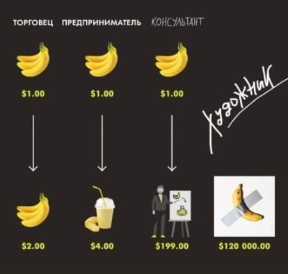
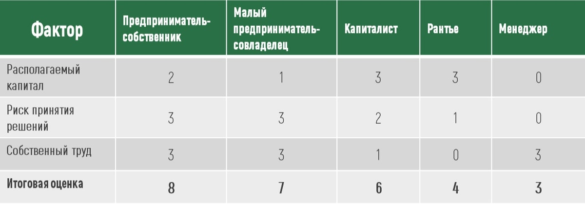
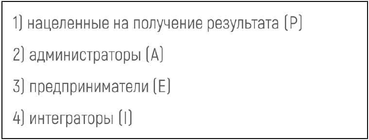
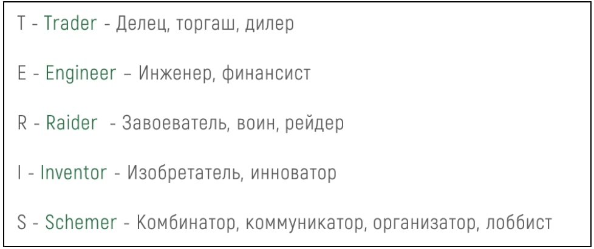
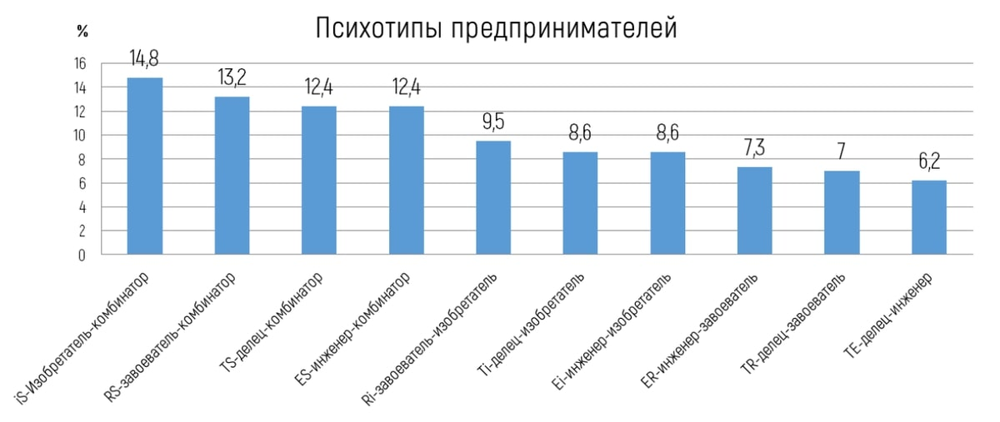
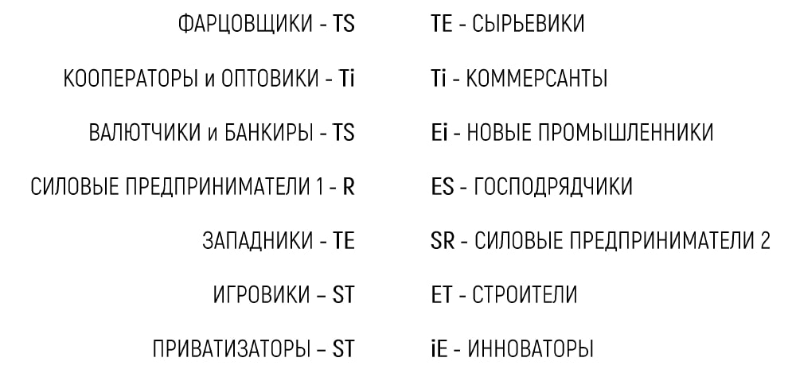
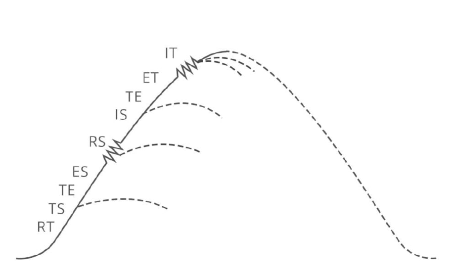

## О терминологии

Сегодня все чаще приходится сталкиваться со смешением терминов "бизнесмен", "предприниматель" и "топ-менеджер" в деловой литературе. С позиций классического менеджмента любой руководитель коммерческой организации - бизнесмен и топ-менеджер. Но не любой бизнесмен - топ-менеджер. Например, предприниматель-собственник, не связанный с управлением компанией, не является менеджером. Равно как и бизнесмен - руководитель гос. компании не является предпринимателем.

Проблема нас интересующая, впрочем, не в терминах, а в понимании того, кто и как создаёт в компании то самое предпринимательское вещество, которое определяет развитие и конкурентоспособность бизнеса. Как следствие вопрос лидерства транслируется на модификацию прав на прибыль и ответственность за убытки собственников и менеджеров. В частном бизнесе активно происходит размывание понятия "предприниматель", связанное с заимствованной из западной деловой практики демократизацией отношений между собственником и менеджером. Во-первых, участие менеджмента в прибыли создаёт видимость партнёрства. Во-вторых, многие собственники сознательно увлекаются модными техниками управления вроде построения "бирюзовых организаций" Фредерика Лалу. В рамках этой корпоративной культуры формируются команда единомышленников и стираются грани между собственником и менеджментом. Кроме этого существует ситуация, в которой предприниматель устраняется от фактического руководства компанией, делегируя все полномочия и превращаясь в "спящего" собственника. Означает ли все вышесказанное, что скоро можно будет поставить знак равенства между понятием топ-менеджер и предприниматель?

Казалось бы, какая разница как называть роли и функции, лишь бы была прибыль. Но это только до тех пор, пока есть прибыль. Гражданский кодекс РФ указывает, что "предпринимательской деятельностью является самостоятельная, осуществляемая на свой риск деятельность, направленная на систематическое получение прибыли...". А что с убытками? С точки зрения корпоративного права, топ-менеджер в отличие от собственника должен нести ответственность за нарушение законодательства. Однако многочисленные мошенничества привели к тому, что в правоприменительной практике силовые органы всё чаще используют термин "контролирующее лицо". По аналогичному пути идут и банки, чётко отделяющие для целей управления рисками менеджеров, номинальных собственников и реальных бенефициаров бизнеса. Таким образом, общества с ограниченной ответственностью фактически становятся обществами с неограниченной ответственностью собственника. Лицо, контролирующее компанию, собственник капитала, предприниматель, принимающий на себя риски . Т.е. делить при-быль, делегировать управление (труд) и «играть» в корпоративное предпринимательство можно сколько угодно, но риск всегда остаётся на собственнике.

Следовательно, не смотря на различия в размере капитала, формах участия в управлении и объеме рисков мы видим четкие экономические критерии, дифференцирующие предпринимателей и менеджеров. Представим все вышесказанное в системном виде, проведя сравнительный анализ бизнес-персон:

Значит предпринимателем мы можем считать только бизнес-персон, обладающих и рискующих собственным финансовым капиталом.

## Мотивация менеджеров

Обозначенная выше проблема смешения понятий создаёт и ряд частных проблем в теории управления. Отсутствие чётких границ между предпринимателем-собственником и топ-менеджером приводит не только к размыванию ответственности при принятии решений, но и создаёт определенную путаницу в функциональной организации компании. Исследование "Химия команды" от Deloitte вновь обращает внимание на традиционную проблему соответствия компетенций должности и личной компетентности менеджера. Множество разнообразных психологических портретов авторы исследования дополняют собственной классификацией. В ней выделяются четыре основных стиля работы и, соответственно, четыре стратегии достижения цели. Совместные исследования экономистов и биологов позволили создать модели, используемые для генетического анализа. В результате анализа 190 000 анкет были выявлены 4 типа сотрудников. Приняв за основу, что в каждом из сотрудников есть черты всех 4 характеров, авторы установили, что 2 из них доминируют. В результате получились 4 базовых типа: пионер, страж, драйвер и интегратор. В итоге правильное формирование команды позволяет использовать сильные стороны сотрудников и избегать конфликтов.

Схожую методику применяет в анализе стилей менеджмента Ицхак Адизес. Гуру менеджмента в процессе исследования выделил 4 базовых кода менеджера:

Рис.1. Базовые коды менеджера по Адизесу И.

Знаменитый PAEI-код менеджера подразумевает формирование 8 основных стилей из 4 психотипов. Адизес в процессе своих исследований менеджеров также выделил типичные сочетания двоичного кода. Каждый̆ менеджер в той или иной̆ степени обладает чертами каждого типа. Но, по мнению Адизеса, чтобы быть предпринимателем, менеджеру необходимо обладать двумя важнейшими качествами. «Прежде всего, он должен быть творческой личностью, способной намечать новые направления и изобретать стратегии, которые позволяют организации адаптироваться к меняющимся внешним условиям. Он должен уметь опережать события и предвидеть будущее, чтобы готовить организацию к грядущим изменениям. Это значит, что он готов рисковать». Он называет E-функцию «способностью видеть через туман». Выдающийся финансист современности Джордж Сорос пишет, что его главное преимущество перед конку-рентами состоит в том, что он быстрее других обнаруживает и исправляет ошибки [84]. По мнению Адизеса, это типичное поведение для менеджера типа Е, но невозможное для бюрократа типа А. Результатом многочисленных исследований Адизеса стала следующий набор комбинаций и психотипов:

Рис.2. Комбинации психотипов менеджера по Адизесу И.

Очевидно, что и PAEI-код и Химия команды Deloitte дополняют друг друга в оценке стилей и моделей поведения менеджмента. Анализируя поведение сотрудников, необходимо коснуться также вопроса мотивации. Исследователи традиционно спорят о том, является ли материальное вознаграждение стимулом номер один для наёмного сотрудника. Собственно этот постулат не требует особого доказательства, а спор возникает в связи с тем, что сами менеджеры в различных опросах* ставят размер вознаграждения далеко не на первое место. Обычно иерархия мотивирующих факторов выглядит следующим образом:

Мотивирующий фактор (% респондентов):

1. Интересные профессиональные задачи 83,3

2. Надежность компании 80,6

3. Справедливая оценка результатов труда 77,8

4. Возможность обучения (тренинги, курсы, …) 75,0

5. Прозрачная система премирования 72,2

6. Высокий статус в компании 69,4

7. Социальный пакет (транспорт, связь, ДМС, …)63,9

8. Положительный имидж компании 61,1

9. Высокая доля премиальной части в заработной плате 55,6

10. Возможность самореализации 52,8

11. Дополнительные бонусы и льготы (право на квартиру…) 52,8

12. Уверенность в завтрашнем дне 50,0

13. Оборудованное рабочее место 47,7

14. Высокий оклад 44,4

15. Хороший коллектив, дружеские отношения с коллегами 44,4

16. Удобный график режима работы 41,7

17. Лояльность со стороны учредителей компании 41,7

18. Возможность использовать свой творческий потенциал, свобода и независимость 36,1

19. Совместные мероприятия, выходящие за рамки работы 30,6

20. Сувениры, публичное признание лучшим сотрудником, победа в конкурсах 15,9

Все это действительно так, но респонденты обычно забывают уточнить, что это при условии наличия базовой среднерыночной зарплаты, соответствующей текущей компетентно-сти сотрудника. И это дополнение является крайне существенным для анализа различий меж-ду предпринимателями и менеджментом. Предприниматель, изначально отказываясь от постоянного дохода, напротив, выступает гарантом занятости и зарплаты для наёмных служащих.

## Мотивация предпринимателей

Что же мотивирует самого предпринимателя на принятие на себя рисков потери капитала, времени и даже свободы (особенно в нашей стране)? Известный российский экономист Аркадий Пригожин, основываясь на верховенстве ценностей̆, выделяет шесть идеологических типов предпринимателей [59, c. 31], а мы их персонализируем:

– "Макдак" - маниманы, те, для кого деньги самоценны, религия – богатство, рантье;

– Трамп - спортсмены бизнеса – те, кто ценит возможность побед в конкуренции. Прибыль и доля рынка – лучшие призы;

– Блумберг – государственники; ориентированы на свой вклад в улучшение общества, развитие страны, города, региона. Социальная ответственность, солидарность и рост благосостояния общества – вот их идеал;

– Баффет - созидатели – те, кто движим идеалом создания чего-то значимого, жаждой оста-вить после себя важный след на земле, материализовать себя в большом результате трудов своих для памяти потомков. Меценаты. Много инвестируют, осторожны, но свой рынок защищают жёстко. Их идеал – т.н. «вечная компания» с большим ресурсом прочности.

– Абрамович - гедонисты – эстеты, гурманы, шопоголики, но активные, креативные люди, сосредоточенные на всех видах потребления, для чего и нужен успешный бизнес;

– Уолтон - охранители – те, кто сконцентрирован на безопасной стабильности и глубоком владении ремеслом. Защищают свой бизнес и истинные ценности. Семейный бизнес, бережливость и аскетизм.

Однако ценности – не единственный критерий классификации психотипов предпринимателей. При анализе личности предпринимателя необходимо принимать во внимание то, что предприниматель в процессе взросления и умножения собственного капитала меняется, что мы увидели на примере Факторного анализа бизнес-персон. Динамически изменяясь в своём жизнен-ном цикле, предприниматель может достичь высшей точки предпринимательской карьеры - стать капиталистом. Современный художественный образ "олигарха" собственно и означает обладание столь значимым капиталом и контроль над такими ресурсами, что простой предприниматель становится не просто лично свободным, но и активно влияющим на экономическую жизнь крупнейших экономических субъектов и даже городов и регионов. А полная или частичная трансформация корпоративного капитала в личное богатство (выход в "кэш") ставит пред предпринимателем вопрос о распоряжении своим богатством в соответствии со своими мотиваторами. Соответственно меценаты строят театры и тратят личные деньги на благотворительность, а гедонисты выбирают аттракторы, связанные с личным потреблением.

## Код предпринимателя TERIS

Недостаток всех вышеперечисленных подходов заключается в том, что они не может объяснить различие в предпринимательском поведении и разные способы прибавления капитала. Экономисты либо пишут о стилях менеджмента либо о мотивации предпринимателей. Между тем остаётся неизученным вопрос о том как и почему предприниматели зарабатывают деньги и почему одна и также бизнес-модель перестаёт работать по мере роста его же собственной компании. Зачастую поведение предпринимателей крайне нелогично с точки зрения экономики, но абсолютно эффективно на практике. Проведённые автором статьи глубинные интервью и анкетирование сотен российских предпринимателей и исторический анализ предпринимательских трендов в новейшей России позволил выдвинуть соб

ственную гипотезу Кода предпринимателя на основе в различиях предпринимательского вещества.

Traider - это первый исторический тип предпринимателя. Это купец, торгаш, ростовщик. До начала индустриальной эпохи это купец и меняла. Знаменитые Венецианский и Ганзейские сою-зы были главной экономической силой Западной Европы в начале второго тысячелетия. Эти люди создали современную цивилизацию, обеспечив обмен товарами и технологиями. Эти люди обеспечили функционирование пути "Из варяг в греки", который стал основой для развития русской государственности в европейской парадигме. В общем смысле Traider - это чело-век, обладающий особым торговым чутьем и , как говорят в народе, чуйкой в "купи-продай". Важно отметить, что такие люди получают большое удовольствие от самой сделки. Это предпринимательское вещество обычно врождённое и проявляется довольно рано. "Вспомните себя в детстве – вы когда-нибудь меняли свой бутерброд на что-нибудь получше? Приходилось ли вам продавать что-нибудь друзьям и получать прибыль? Если так, то в вас живет дух предпринимательства" (Сэр Ричард Брэнсон). Главный талант - это умение совершать СДЕЛКУ.

Engenieer - инженер, технарь, строитель, аграрий, финансист, капиталист. Предприниматели-творцы, создавшие весь современный мир. От первых мануфактурщиков до современных промышленных суперкорпораций. Те самые Атланты Айн Рэнд, Форд, Рокфеллер, Дюпон, создавшие индустриальный потенциал США. Это Великие российские промышленники - Демидовы, Морозовы, Рябушинские, Нобели. Это великие немцы, японцы, корейцы, китайцы, создавшие мировые бренды. Без Бенца, Даймлера, Порше, Мацушиты, Тоёды наш мир был бы другим. Это и строители, транспортники, банкиры, сельхозпроизводители и пищевики, потому что в основе их бизнеса лежит РЕМЕСЛО. Ремесленный бизнес - это всегда производство. Хорошо продуманный сложный процесс регулярного рутинного бизнеса.

 Raider - воин, силовой предприниматель. Купцы организовывали дальние торговые походы за специями и соболиной шкуркой, а в результате этих вооруженных (читай рейдерских) экспедиций Европа захватила американский континент, а Россия присоединила Сибирь и Дальний Во-сток. Недавний экономический кризис напомнил о том, что капитализм может как созидать, так и разрушать. Это система, которая по самой своей природе стимулирует хищников и творцов — саранчу и пчел. Кризис, по мнению известного специалиста по социальным инновациям Джеффа Малгана, также предлагает историческую возможность выбрать радикально иное будущее, которое максимизирует созидательные и минимизирует разрушительные силы. Саранча - это рейдеры. Предприниматели, стремящиеся к установлению контроля над активом лю-бой ценой. Для них в первую очередь важна "пищевая ценность", т.е. ликвидная стоимость поглощаемого актива. В экономическую историю современной России уже вписаны две истории классических предпринимателей силового типа. Это силовые предприниматели 90-х, вышедшие из криминала и спортсменов, и силовые предприниматели 00-х, вышедшие из силовых структур. Главное для них это ВЛАСТЬ.

Inventor - изобретатель, инноватор. Лучше Стива Джобса не скажешь: «Хвала безумцам. Бунтарям. Смутьянам. Баламутам. Тем, кто всегда некстати и невпопад. Тем, кто видит мир иначе. Они не соблюдают правила. Они не уважают ''статус-кво''. Вы можете цитировать их, спорить с ними, прославлять или проклинать их. Но игнорировать их невозможно. Потому что они несут перемены. Они толкают человечество вперёд. И пусть кто-то видит в них безумцев, мы видим гениев. Потому что лишь безумцы верят в то, что они могут изменить мир. И поэтому они меняют его». Они живут ОТКРЫТИЕМ.

Schemer - комбинатор, организатор, лоббист, рантье. Все российские предприниматели воспитаны на образе великого комбинатора Остапа Бендера. Этот, вымышленный советскими писателями Ильфом и Петровым, персонаж из эпохи НЭПа 20-х годов двадцатого века воплощает в себе канонические черты неудержимого организатора и специалиста по коммуникациям и со-зданию схем. Отходя от художественного вымысла, мы не можем не заметить, что состояния, возникшие в 90-х в результате приватизации крупнейших российских предприятий, обязаны особым талантам предпринимателей в деле использования связей, лоббистских возможностей и чужих ресурсов. В общем смысле предприниматель-комбинатор - это хороший распорядитель предпринимательского капитала (время, люди, технологии, финансы), главной способностью которого является способность соединять не соединяемое. В современном мире такие таланты называют networking. Зачастую это мошенники и организаторы разных пирамид. По мере взросления и отказа от активного предпринимательства и самостоятельного управления капиталом создаёт безопасные схемы владения и становится рантье. Эти предприниматели управляют ЛЮДЬМИ.

## Психотипы предпринимателей

Легко убедиться, что на практике редко встречается чистые типы, обладающие единичным кодом с одним доминирующим кодом предпринимательского вещества. Так, упомянутый выше, типаж Остапа Бендера безусловно сочетает в себе черты комбинатора и рейдера. Чего стоит только "более 100 способов сравнительно честного отъема денег у граждан...". Предприниматели, обладающие единичным кодом, уязвимы и однобоки. Именно поэтому так быстро

"вымерли" карикатурные "новые русские" предприниматели из 90-х, обладающие кодом teRis. Дефицит бизнесобразующих генов Т, Е, I или организующего S неизбежно приводит к не способности эффективно распорядиться приобретённым активом. В случае наличия гена T рейдер способен эффективно монетизировать актив, в случае I сможет как визионер увидеть новое будущее объекта, а S позволяет понять и усилить свои слабые стороны сторонним предпринимательским веществом либо через партнерство, либо через развитие внутреннего предпринимательства в компании. Важным следствием кода предпринимателя является отражение внутреннего кода во внешних.

Наши опросы российских предпринимателей позволили ранжировать 10 возможных комбинаций двоичного кода. Наиболее популярными оказались сочетания IS, RS, ES, TS. Необходимо сделать оговорку о том, что такие черты предпринимательского вещества являются доминирующими у российских предпринимателей по их собственному мнению. Этот факт позволяет выдвинуть гипотезу о неким особом российском типе предпринимателя-комбинатора.

## Основные предпринимательские когорты в новой России

Логичным применением кода предпринимателя является рассмотрение и оцифровка предпринимательских групп и трендов в исторической ретроспективе. Новейшая экономическая история начинается с момента легализации предпринимательства в СССР в 1985. Уже с самого начала стали выделяться торгово-сбытовые кооперативы, во главе которых стояли предприниматели с кодом IT и производственные ЕT. Появление кооперативных банков и начало активной работы с госпредприятиями потребовало новых талантов в трансформации государственного капитала в частный, и здесь как раз оказались предприниматели с кодом TS. Тяжелый кризис начала девяностых привёл к появлению криминальных персонажей с кодом RR, которые позднее исчезли или трансформировались в SR. Приватизация - это, конечно же,

связи и схемы; как выкупить актив за его же средства отлично знает предприниматель с кодом ST. Приобретение промышленного предприятия означает необходимость превращения его в работающий и развивающийся актив, а здесь необходимы умения предпринимателя с TE ко-дом. Потребительская революция 2000 годов дала возможность реализоваться коммерсантам с TI кодом. Строители обязаны иметь ЕТ код, а значить быть хорошими инженерами-строителями и продавцами. Цифровая эпоха открыла двери для предпринимателей инноваторов - IE код им в помощь.

## Жизненный цикл компании и предпринимательский код

Все компании проходят последовательные циклы своего развития. Для нас важны их предпринимательские аспекты. Выделим основные циклы и коды:

Таков жизненный путь любой организации с поправкой на то, что в любой момент ее может настичь разорение. Степень экономической смертности максимальная у стартапов и превышает 90%. Чем старше компания, тем меньше вероятность внезапной смерти, но тем более серьёзны последствия ее банкротства и для всех участников и для общества. Личный опыт автора и многочисленные глубинные интервью выделили интересные особенности развития компаний. На каждом из этапов компания нуждается в одном или нескольких доминирующих предпринимательских кодах. Которые изменяются в динамике вместе с ростом компании.

Запуск бизнеса - это всегда смелость. Прилив поднимает все лодки, но не все начинают движение. Смелость - это про воинов, это код R. Смелость берет города и запускает проекты. Это наполеоновское “on s’engage et puis on vois” главное ввязаться. Но, что сама идея без денег. Жизнеспособность любой идеи проверяется через продажи. Поэтому нам нужен коммерсант с кодом Т. Значит это союз воина и купца RT.

Раскрутка идеи и превращение ее в бизнес немыслимо без гибкости и привлечения ресурсов. Чужих ресурсов. Кто как не комбинатор с кодом S умеет представить любую лавку многообещающим «прорывом года». Продаём и крутимся под кодом TS.

Рост это всегда продажи. Но рост это уже и бизнес-процессы и нормальный регулярный менеджмент. Это создание полноценной машины бизнеса. Это технические задачи решать ее предпринимателю-коммерсанту с инженерным кодом. Рост это TE.

Корпорация есть продолжение технического, внутреннего роста компании и превращение ее в самостоятельный организм способный существовать на данном этапе автономно от предпринимателя. Этот эндогенный процесс задается инженерами и организаторами с кодом ES.

Кризис роста является процессом естественным и вызывается преимущественно внутренними организационными и субъективными факторами. В равной мере к нему могут привести как ошибки менеджмента так и просчеты собственника. А вот справится с ним без воли и точности невозможно. Компании нужна гибкость и воля код RS.

Выход из кризиса возможен только через обновление команды. Как новая кожа новая компания внутри способна создать новую модель бизнеса и новые продукты. Предпринимательство через инновации и гибкость IS.

Раньше или позже естественный ход событий приведёт любой бизнес к процветанию. Дойная корова живет на профессионализме через победу над конкурентами. Это успех внешний и внутренний. Процветание это сплав лидера по продажам и по эффективности с кодом код TE.

Капитализация, как органический этап развития бизнеса, предполагает выход за пределы существующей бизнес-модели. Это переход от моноотраслевой компании к холдингу с управлением капиталом и активами. И это уже технический анализ и борьба за доходы . Инженерный и коммерческий код ET.

Обновление завершает естественный рост компании и представляет собой непрерывный процесс синхронизации компании и рынков. Сегодня ни монополист ни лидер не могут спокойно взирать в будущее. Любопытство, поиск инноваций и новых точек роста продаж это код IT.

Будучи поборником свободного предпринимательства автор уверен, что компания лишенная предпринимательского вещества не сможет достичь уровня Капитализация. Формально лишенные предпринимательского вещества корпорации вне зависимости от размера утрачивают способность к обновлению и тем самым обрекают себя на вымирание.

## Поведенческое предпринимательство:

Главная практическая ценность TERIS кода заключается в возможностях анализа совместимости предпринимательского вещества предпринимателя и жизненного цикла его бизнеса. Предприниматель в современной экономике остается прежде всего человеком и его предпринимательское вещество предопределяет его поведение в качестве стратега. В этом смысле для нас предприниматель это не человек, а функция принятия решений о раз-витии на каждом из этапов жизненного цикла компании. В отличие от мифического идеального Homo economicus предпринимателю как представителю рода Homo sapiens свойствен-но ошибаться. Примирение такого простого инструмента как SWOT-анализ позволяет прогнозировать степень успешности разных предпринимателей в разных рыночных ситуациях. Где SW-анализ сильных и слабых сторон собственного предпринимательское веществa в виде 4 личных сил (воля, точность, любопытство, ответственность). А OT-анализ это оценка предпринимательского капитала из 4 ресурсов (время, люди, технологии, финансы). Дополним SWOT-анализ экспертной оценкой предпринимательского кода по 9 бальной системе. Например, T9 e5 r5 i8 S6. При этом код останется неизменным всю жизнь, предпринимательское вещество можно и нужно развивать, а предпринимательские капитал это текущая объективная оценка возможностей компании в конкурентной среде. Взаимодействуя на практике код, вещество и капитал образуют Поведенческое предпринимательство.

TERIS-код и SWOT-анализ в комплексе дают объективную характеристику поведению конкретного предпринимателя. Понимание собственного кода позволит собственнику вы-явить свои слабые стороны на конкретном этапе развития компании и компенсировать дефицит необходимого вещества за счёт партнёрства с предпринимателем с дополняющим кодом или же за счёт развития внутреннего предпринимательства менеджмента организации. Предприниматель останется предпринимателем, а менеджер менеджером, но компания сможет двигаться дальше. В равной мере и партнеры, и кредиторы, используя эти под-ходы смогут более объективно оценивать свои риски. Органы государственной власти используя данную методику смогут расширить понимание многообразия предпринимательских моделей и предложить новые подходы к развитию предпринимательства. Учёные обогатят методологический багаж и подходы к обучению предпринимательством. Все эти ценные конечные продукты теории TERIS кода способствуют развитию предпринимательской деятельности. Таким образом, реализуется главная миссия управления предпринимательской деятельностью, сформулированная ещё Адамом Смитом ведь извлекая пользу для себя, предприниматель действует на благо всего общества.