---
title: Дубай. Параллели. Перпендикуляры.
description: Статья про достопремичательности Дубая
slug: dubaj-paralleli-perpendikulyary
date: 2022-05-01 00:00:00+0000
image: image-2.jpg
categories:
    - Бизнес
    - Жизнь
    - Отдых
tags:
    - Бизнес
    - Статья
    - Отдых
weight: 1       
--- 

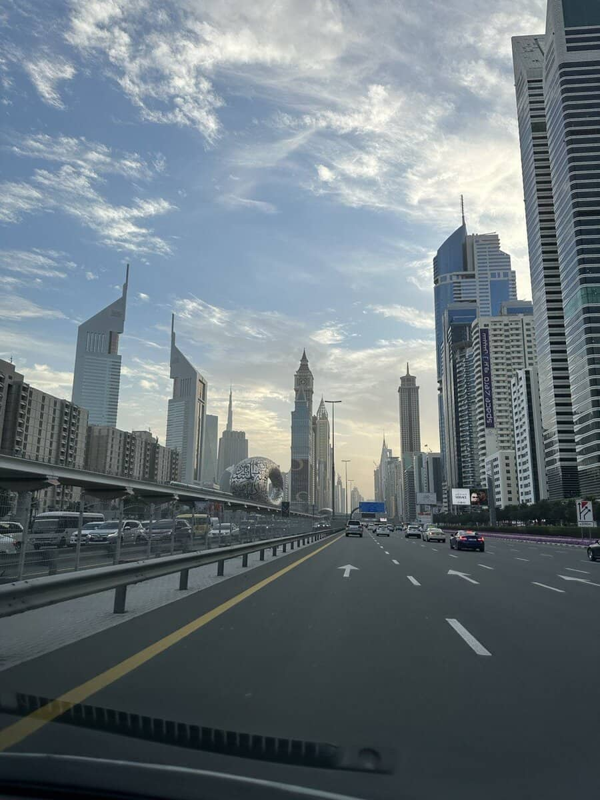

> Мan’s development depends on the power of his ideas and his ability to spread them from one person to another across deserts, continents and oceans.
> H.Н. Mohammed bin Rashid Al Maktoum

Этой цитатой шейха Мактума открывается Dubai-EXPO 2020 (2021) в первом The Mobility pavilion, который дети называют «спиннер». «Экспо», перенесённый на год из-за пандемии, стал промежуточной точкой взрывного роста Дубая. Точкой в том смысле, что Дубай после его проведения стал де-факто одним из новых мировых центров, и многочисленные павильоны — просто символы сотрудничества Дубая с ними. Дубай — это хаб инноваций, девелопмента, логистики, энергетики, финансов, торговли, люкса, туризма. Что-то символичное есть в том, что параллельно на проведение «Экспо» в конкурсе претендовал Екатеринбург. Екатеринбург вышел в финал отбора в 2013 году — смог обойти Сан-Паулу и Измир, но крупнейший город Объединённых Арабских Эмиратов оказался Екату не по зубам. За Дубай проголосовали 116 стран-делегатов Международного бюро выставок, а за Екатеринбург — 47. Два года борьбы за право проведения ЭКСПО-2020 завершились для Екатеринбурга и России почётным вторым местом. И что-то перпендикулярное в том, что Урал, как и 80 лет назад, в 2022 вновь стал мировым рекордсменом в производстве танков.

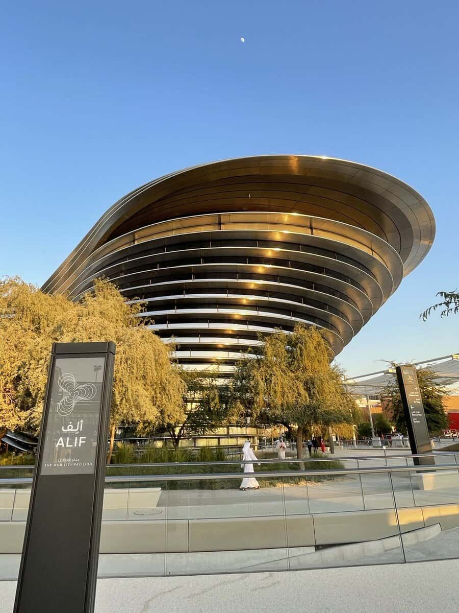

Россия и ОАЭ часто идут параллельными курсами. У нас вообще много похожего. Много самого-самого. Самая большая страна, самое высокое здание в мире, самое высокое здание в Европе, самый большой гостиничный комплекс в Европе, самый большой в мире искусственный архипелаг и так далее. Конечно же нефть, но также и опора на собственную религию, «византийщина», игнорирование ЛГБТ-повестки, а ещё мегапроекты. Мы уже подзабыли, но совсем недавно у нас была фантастическая олимпиада в Сочи. По официальным данным она обошлась в $6 млрд, но оппозиция насчитала $45 млрд. А вот, например, известное всей планете самое высокое здание в мире Бурдж Халифа обошлась «всего» в $1,5 млрд. Один наш зимний Сочи по объёму инвестиций действительно сопоставим с половиной из глобальных дубайских проектов. При этом наш олимпийский кластер — это не просто квадратные метры, но прежде всего уникальный природный комплекс, круглогодичный туристический центр и чистое снежное импортозамещение и шанс сохранить компетенции в олимпийских дисциплинах в период санкционных ограничений и спортивных размежеваний. 

Феномен Дубая не только в материальных рекордах из книги Гиннесса, но и в открытости, профессиональном маркетинге и реальной инновационности. Нам есть, чему поучиться. Неожиданно понимаешь, что Дубай — это не только монархия, но и гигантский предпринимательский проект. История создания глобального семейного бизнеса, в котором много экономики, финансов, маркетинга и пиара. Да, пиар, как часть маркетинга, — это важнейшая часть восточной сказки. Предпринимательские династии и сети — это как раз тема моих научных интересов. 

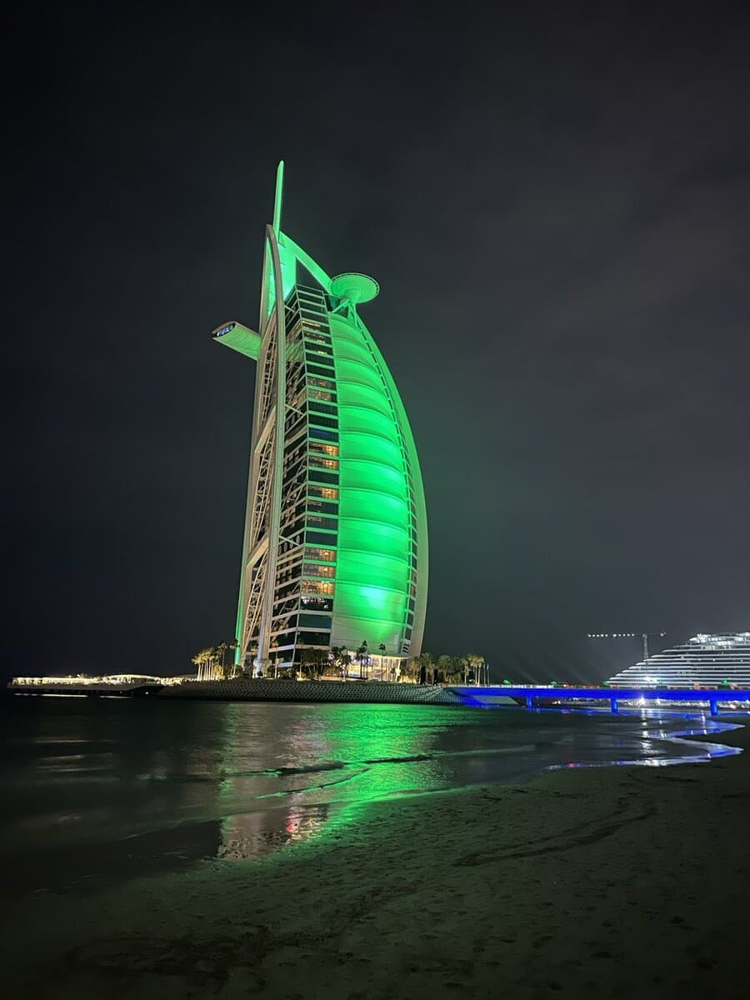

Перпендикулярно замечу, что в отличие от Дубая Россия совсем не умеет пиариться и традиционно недооценивает свои собственные результаты, но часто переоценивает чужие достижения. Итак, на официальном сайте узнаём, что Символ Дубая — отель-курорт Atlantis на 1548 номеров и 4 миллиона посетителей, The Palm, расположенный на 47 га знаменитого острова Пальма Джумейра, отличается превосходными видами на бирюзовые воды Персидского залива и величественные небоскребы Дубая. Роскошные номера, отмеченные наградами, рестораны (28,) в том числе, знаменитых шеф-поваров, и приключения в аквапарке и дельфинарии — всё это в 2008 году обошлось в 1,5 млрд долларов. А знаете ли вы, что в России есть свой отель такого же класса? Когда едешь по трассе Севастополь – Ялта, в районе Понизовки взгляду вдруг открывается завораживающий вид на гигантский цветок у моря: это недавно реализованный объект «Сбербанка России», отель Mriya Resort & Spa класса 5 звезд по проекту архитектурного бюро Нормана Фостера. Проектирование началось в 2010, а открылся отель уже в конце 2014 года. Среди многочисленных наград Mriya Resort & SPA – престижнейшая World Travel Awards, «Оскар» в мире гостиничного дела, в номинациях «Ведущий новый курорт Европы» (2015), «Ведущий курорт Европы для отдыха» (2017 и 2019), «Ведущий курорт Европы для делового туризма» (2017 и 2019), а также «Ведущий мировой семейный курорт премиум-класса» (2018), «Ведущий мировой курорт для отдыха» (2017 и 2018), где он как раз очно опередил Atlantis. «Ведущий мировой комплекс-курорт премиум-класса» (2018). Смелое по замыслу здание отеля построено по проекту, созданному в бюро знаменитого британского архитектора Нормана Фостера. Комплекс находится на первой береговой линии, с характерной для региона пышной зеленью и чудесной пляжной зоной. Отель занимает территорию в 27 га, на которой помимо санаторно-курортного комплекса на 422 номера и вилл построен винно-дегустационный комплекс, включающий в себя винодельню, школу сомелье, школу виноделия, винный ресторан и сыроварню. Строительство комплекса финансировалось собственником, Сбербанком РФ, и обошлось в $300 млн. 

Однако вернёмся в Дубай. Дубай в течение 50 лет целеустремлённо созидает свой маленький оазис, а Россия смогла приступить к качественному развитию менее 20 лет назад. За этот сравнительно небольшой срок наша страна качественно преобразилась. В качестве бизнеса и качестве жизни. Остаётся только сожалеть, что России не достало 30 столыпинских лет роста без военных операций. СВО, безусловно, кардинально меняет весь экономический уклад в стране. Инвестиции в развитие отложены до лучших времён. _A la guerre comme à la guerre_ — «всё для фронта, всё для победы». Прямые и косвенные потери, как в материальных ресурсах, так и в человеческом капитале, будут только увеличиваться, оказывая влияние на ВВП и уровень жизни. Однако при всей глубине кризисной трансформации и санкционной адаптации в 2022 году экономика устояла. Мобилизационная полугосударственная экономика неплохо совместилась с традиционной рыночной. Россияне до начала СВО считали, что в стране слабая экономика и сильная армия, но оба тезиса по результатам оказались некорректными. Следствием санкционного давления стала национализация элит и ресурсов. Год 2023 будет сопровождаться усилением роли государства во всех отраслях. Поворот экспорта и импорта на восток и на юг уже состоялся. Общество находится в состоянии шоковой адаптации к новым реалиям. Значимая часть потребительского рынка живёт в модели параллельного импорта. Как ни странно, но эти изменения сближают нас с экономической моделью ОАЭ. Например, завершилось многолетнее бегство капитала, что формирует национальную базу для прямых инвестиций в постСВО-период. 

Догоняющая модернизация российской экономики и вся система ценностей последних десятилетий России была прозападной. Но уже год золотой западный миллиард не только системно рвёт с РФ все экономические связи, но и активно противостоит в военном плане. Предполагаю, что это отчуждение на долгие годы. Остальной мир использует текущие сложности России в своих интересах. Но любая война ведётся ради условий послевоенного мира. Россия уже в условиях текущего геополитического шторма вынуждена сформулировать новое видение своего места и роли в международном разделении труда, и путь развития общества, институтов, экономики. И этот новый путь может содержать много интересных параллелей. Климат Дубая так же не ласков, как и российский, и природа полгода очень недружелюбна, но с другим знаком. Эмират не очень богат природными ископаемыми, но оперирует значительными капиталами, портовыми мощностями, имеет обширные связи со странами Азии, развитую науку — и всё это чудо реализовано на пустынной территории площадью в четверть Калининградской области. 

В 2022 году Дубай окончательно стал «дружественной» территорией и тысячи россиян переезжают туда всерьёз и надолго. Релокация с бизнесами и семьями. Формируется русское иммиграционное сообщество, определённый русский мир в этом арабо-африканском оазисе. И, конечно, возникает много вопросов о рисках, безопасности капиталов и перспективах комфортной работы с российским рынком. Очевидно, что многие обеспеченные россияне просто пытаются найти «тихую гавань». Потому что, существует мнение, что там не меняются правила, а решения властей продиктованы исключительно прагматическими соображениями роста благосостояния жителей. Здесь дружелюбно сосуществуют десятки этносов и народов, часто враждующих на исторической родине. Функционирует развитое правовое государство с зонами «английского корпоративного» права. Хорошие международные школы, университеты и медицина — это важные части качества жизни. Наконец, где люди могут совершенно спокойно жить, работать, учиться, заниматься спортом, совершенно не интересуясь новостями. И, конечно, арабская версия люкса и гламура, так близкая нашим византийским корням. 

Почему россияне выбирают Дубай не только для жизни, но и для открытия нового бизнеса? Одним из главных аргументов при выборе страны является тот факт, что ОАЭ уже прошла все свои основные кризисы и сохранила стабильность, несмотря на сложную геополитическую ситуацию в мире. Также важным фактором являются дружественные отношения России с ОАЭ. С февраля по сентябрь 2022 г. более 700 российских организаций создали юр. лица в ОАЭ, что примерно в 7 раз больше, чем в 2021 г. Российских бизнесменов привлекает наличие в Дубае международный охват, большой и быстро растущий внутренний рынок, множество стартапов и свободных ниш. Более 60% запросов на релокацию бизнеса поступает от владельцев компаний, работа которых физически не зависит от места: IT-проекты, маркетинг, рекламные и агентства по недвижимости. Также здесь хорошо развивается медицинская сфера, ресторанный бизнес и прокаты спорткаров. 

Непосредственно я с 2006 года удивляюсь экспоненциальному росту эмирата Дубай. Мы не видели собственными глазами, как создавались экономические чудеса Лондона, Нью-Йорка, Сингапура, Гонконга. Зато прямо сейчас за какие-то 50 лет независимости из небольшого колониального порта Дубай превратился в «Нью-Васюки» — неофициальную столицу Ближнего Востока, Африки, а ныне и в уютный русский «Дубайск». Как этот мегаполис вообще мог технически появиться на пустынных берегах невзрачного Персидского залива? Город-конкурент Лондона, Лас-Вегаса, Майами, Турции, Гонконга, Таиланда. В чуде Дубая много предпринимательской стратегии, тяжёлого труда гастарбайтеров, восточных сказок, полёта фантазий, госкапитализма, рационального планирования, везения и божьей милости. Это — увлекательная история, в которой много-много вечных вопросов. 

В поисках ответов на вопросы мне помогут личные размышления, открытые источники и биография самого шейха Мактума «Моя история. 50 лет служения и 50 уроков». Биография лидера, обожаемого среди небольшого количество граждан, безусловно выдержана в форме легенды, но сравнение исторических фактов поможет нам увидеть реальные события, опираясь на принципы и уроки, которые о которых рассказывает лидер Дубая. Однако начнём с цитат и фактов. «Я люблю ставить сложные цели, потому что развитие и эволюция рождаются из стремления к «невозможному». 

## Страна. Монархия. Семья.

Страна. Прежде всего необходимо напомнить, что эмират Дубай — это часть ОАЭ. Объединённые Арабские Эмираты обязаны своим созданием выдающемуся лидеру — Эмиру Абу-Даби Шейху Заиду бен Султану Аль Нахайян. Ниже официальное представление «Отца нации»:

> «В 1966 году 20-тысячное население Абу-Даби, который в то время и городом нельзя было назвать, жило в глиняных постройках с крышами из парусины и пальмовых ветвей. Старшее поколение обитателей нынешних вилл и многоэтажных башен не знало овощей, считало рис лекарством, саранчу и пустынных ящериц — лакомством, страдало от трахомы, туберкулеза и малокровия. Относительно благополучен был лишь принадлежащий эмирату Абу-Даби город Аль-Айн в оазисе финиковых пальм Аль-Бурайми. Его благоденствие обеспечил шейх Заид, который был там наместником правителя. Наместник сам рыл новые колодцы, участвовал в совершенствовании старых оросительных каналов и даже построил мужские купальни. Но самое главное — он был справедлив в распределении главного богатства района — воды, а народ любит справедливых лидеров.

После обнаружения в эмирате Абу-Даби в 1958 году нефтяных месторождений, запасы которых оцениваются почти в 100 млрд баррелей, шейх Заид выступил как объединитель размещавшихся на западном берегу Персидского залива арабских эмиратов. Им была оказана щедрая финансовая помощь. Шейх Заид предпринял шаги для их объединения.

> 2 декабря 1971 года провозглашено создание государства ОАЭ, в которое наряду с Абу-Даби вошли эмираты Дубай, Шарджа, Умм-эль-Кайвайн, Аджман и Эль-Фуджейра. В 1972 году к ним присоединился эмират Рас-эль-Хайма, и их стало семь. Под руководством мудрого, щедрого, хранящего народные традиции, демократичного правителя страна вступила в эпоху стремительного, продолжающегося до сих пор экономического роста.»

Сегодняшняя государственная система в ОАЭ напоминает федерацию, элементами которой являются эмираты. Во главе каждого из них находится эмир (аналог короля), причем, этот титул передается по наследству. Так что каждый эмир является представителем древнего рода восточных правителей. 

Президент является официальным лицом, представляющим страну на международной арене, кроме того, он оказывает непосредственное влияние на органы исполнительной и законодательной власти. В Эмиратах, этот пост также считается почти наследственным несмотря на то, что конституция предусматривает ограничение сроков правления до 5 лет. Тем не менее, как таковых выборов президента не происходит, ведь его назначение осуществляется благодаря тому же Совету Эмиров. Стоит ли говорить, что и кандидаты представлены этим числом правителей. После смерти предыдущего президента, шейха Халифы бин Зайеда Аль Наяна, этот пост занял его сын, крон-принц Абу-Даби, Мухаммед бин Зайед Аль Наян. 

Должность премьер-министра также предполагает кандидатуру одного из членов Совета Эмиров. На сегодняшний день, эту роль выполняет правитель Дубая, Мухаммед бин Рашид Аль Мактум. Он же выступает и вице-президентом, как и многие его предшественники на посту премьер-министра. 

В целом, правовая база в ОАЭ представлена интереснейшим сплавом традиционных мусульманских законов (законом Шариата), египетского гражданского права и некоторых положений англосаксонской доктрины. Помимо шариатских судов в системе предусмотрены палаты по рассмотрению уголовных и гражданских дел. В них высшую юридическую силу имеют принятые кодексы: уголовный и гражданский. Что касается первого, он сполна перенял суровость отношения священных книг Ислама к преступникам и правонарушителям — уголовный закон в Арабских Эмиратах строгий и жесткий, хотя он достаточно справедлив. 

В качестве наказания могут быть применены штрафы, лишение и ограничение свободы и, что самое худшее, смертная казнь. Тем не менее, чтобы оказаться под угрозой такого приговора, необходимо вести себя крайне неосмотрительно — всё же правовая система в ОАЭ достаточно гуманна, как для местных жителей, так и для иностранцев. 

Население ОАЭ достаточно волатильно. В ковидные годы оно колебалось на 10% и более. Однако релевантные расчёты показывают, что всего в стране около 10 млн человек и порядка 18% из них — граждане. Остальные — гости и гастарбайтеры. Самые многочисленные группы — индийцы и пакистанцы. Больше миллиона бангладешцев. Из европейцев по сто тысяч жителей — англичане и россияне. В ОАЭ граждане получают широкомасштабные льготы. При вступлении в брак гражданам ОАЭ бесплатно предоставляются коттеджи и земельные участки. 80 лет — средняя продолжительность жизни женщин в ОАЭ, 77 лет — мужчин (55-е место в мире). Для сравнения: в России 75 лет и 63 года, соответственно (122-е место в мире). 70 000 дирхамов — государственная субсидия, которую получают вступающие в брак граждане Эмиратов. 16 000 дирхамов ($4360) — зарплата учителя-эмиратца в государственной школе. Для сравнения: средняя зарплата учителя в CША ~$3667, в Центральном федеральном округе России — 39 609 рублей (~$600). 10 200 дирхамов ($2780) — минимальная базовая пенсия резидента ОАЭ. Для сравнения: 10 236 рублей (~$155) — средний размер трудовой пенсии в России. На 2% увеличивается размер пенсии резидента ОАЭ с каждым годом работы после достижения 20-летнего стажа. 

**Монархия**. Вернёмся в Дубай. Шейх Мохаммед постоянно подчёркивает, что всё, чего достиг эмират и он лично, связано с корнями и предками.

> «Власть принадлежит одному лишь Господу. Величие принадлежит одному лишь Господу._»_ Главный учитель — отец. В детстве будущий Эмир часто с отцом шейхом Рашидом жил у бедуинов в пустыне. «Я узнал, как охотиться с соколами и собаками, и он научил меня движениям, привычкам и многим камуфляжным уловкам животных. Он научил меня, как охотится хищник и как побеждают слабых». Чтобы иметь доступ к еде в пустыне, необходима стратегия. Шейх Рашид говорил: «Когда проведёшь ночь голодным — на следующее утро усваиваешь уроки интенсивнее».

С детства ребёнка приучали не только к охоте, оружию и лошадям, но и к укусам молодых скорпионов. И не только с точки зрения безопасности, но и для житейского ума. «С пустынными скорпионами общаться легче, чем с их соратниками среди людей… Говорят, что люди-скорпионы обитают на земле в виде сплетников и заговорщиков… Они ядовиты, разрушают групповую мораль, сосредоточивают внимание только на негативе и не видят добра в других. Это лицемеры, движимые завистью и ревностью.» К восьми годам Мохаммед научился выживанию в пустыне, а потом «научил меня, как жить в городе и как жить с людьми. Это было намного сложнее.» 

Экономическая история Дубая — это история портовой торговли. Свободный порт, добыча жемчуга, пиратство. Транзит, реэкспорт любых товаров. Особенно золота. Вечный поиск новых товаров и источников дохода. Развитие порта для приёма крупных судов. Инвестиции и отказ от расточительства. 

**Семья.** «Восток — дело тонкое». Многочисленные войны, падения стран и смерть лидеров в ближневосточном регионе закалило характер Эмира. Но богатство, полновластие и жёсткость натуры, в свою очередь, предопределили авторитарную модель семейного уклада. Главное достояние любой семьи — дети. У Шейха Мохаммеда официально 9 сыновей и 15 дочерей. На самом деле, видимо, гораздо больше. При такой выборке формируется отличная династическая перспектива отбора лучших для семейного бизнеса. В соответствии с традициями главным сейчас является наследный принц Хамдан. В любой семье бывают размолвки, но так уж получилось, что в истории семьи эмира Мохаммеда случались и достойные голливудских экранизаций драмы. 

Иорданская принцесса Хайя бинт аль-Хусейн — самая заметная представительница королевской семьи и одна из наиболее ярких женщин арабского мира. Совсем недавно ее фото не сходили с первых страниц самых крупных таблоидов — все из-за развода с миллиардером, эмиром Дубая, Мохаммедом бин Рашидом Аль Мактумом. Однако известна Хайя не только этим скандальным эпизодом. В прошлом она профессиональная спортсменка, которая выступала на Олимпийских играх и чемпионате мира в конном спорте, что и свело её с бывшим супругом, который боготворит лошадей. Хайя, вопреки общественному мнению и консервативным устоям, построила карьеру и показала другим арабским женщинам, что можно самой определять свою судьбу. 

Главная история принцессы Хайи стала достоянием гласности в 2019 году. Вот, что об этом пишет Википедия:

> Летом 2019 года стало известно, что младшая и наиболее известная его жена принцесса Хайя сбежала от мужа в Лондон вместе с детьми. По сообщениям прессы принцесса Хайя стала опасаться за свою жизнь после того, как Мохаммед заподозрил её в близости с охранником-британцем. Жена шейха боится разделить судьбу своих ранее пропавших падчериц, его дочерей — принцесс Латифы и Шамсы, неудачно пытавшихся бежать из Дубая ранее. Во избежание похищения Хайя пользуется услугами частной охранной фирмы. Рассуждая о причинах побега, близкие к ней источники упоминают, что принцессе Хайе стали известны новые тревожные факты, стоящие за возвращением в Дубай дочери шейха от первого брака _Латифы_, пытавшейся бежать из Дубая в 2018 году. Широкую известность получило видео, в котором принцесса _Латифа_ свидетельствует о насилии и пытках в отношении себя и своих родственниц, а также выдвигает другие серьёзные обвинения в адрес своего отца, в том числе обвинения в убийствах: «После того, как умер мой дядя, он убил одну из его жен. Он убил её. Все знают об этом. Ту, которая из Марокко. Потому что её поведение было слишком дерзким. Думаю, она просто слишком много говорила, и он чувствовал, что она представляет для него угрозу, поэтому он просто убил её».

Её Королевское Высочество Принцесса Хайя бинт Хуссейн Иорданская, находящаяся в Великобритании под дипломатической защитой своего брата — короля Иордании, ныне вполне благополучна. Однако всё было совсем не так очевидно. 

Суд Англии установил, что Эмир Дубая шейх Мохаммед похитил двух своих дочерей, Латифу и Шамсу, и угрожал бывшей жене Хайе. Шейх Мохаммед просил не публиковать решение суда, но суд отклонил его апелляцию, признав, что решение отвечает общественным интересам. Суд постановил, что правитель Дубая «не был открыт и честен с судом». В 2022 году, во время бракоразводного процесса с Хайей, департамент по семейным делам Верховного суда Англии и Уэльса постановил, что эмир не будет иметь права существенно влиять на процесс воспитания их двоих детей и встречаться с ними с глаза на глаз из-за того, что он демонстрировал склонность к принуждению и контролю. Это решение не добавило оптимизма в отношения ОАЭ и Великобритании, зато обеспечило финансовую независимость беглянки. 

Судебное разбирательство длилось больше полугода. В итоге суд постановил, что действия эмира Дубая действительно заставляли принцессу Хайю опасаться за свою жизнь. Согласно решению суда Аль Мактум должен был выплатить бывшей супруге около 550 миллионов фунтов стерлингов, причем половину суммы — в первые три месяца. Судья объяснил, что большая часть присужденной суммы предназначена для защиты Хайи от шейха. Он отметил, что принцесса просит предоставить ей гарантии безопасности для нее и детей. Также дубайскому правителю предстояло компенсировать бывшей жене стоимость имущества, которое она потеряла в результате развода. В частности, речь шла об украшениях и скаковых лошадях, оставленных в Дубае. В ноябре 2022-го СМИ сообщили, что Хайя, продолжая оправляться от потрясений, купила отель в Уэльсе и планирует поселиться там. Она надеется, что сможет вести спокойную жизнь. To be continued. 

В целом очень интересная тема — это взаимоотношения Дубая и ОАЭ с Великобританией, до и после обретения независимости. Тут целый кладезь откровений. Сам Шейх Мохаммед и большинство его детей учились в Туманном Альбионе, но некоторые из наследников, не пройдя испытание «западными соблазнами и пороками», лишились внутрисемейных перспектив. Очевидны тесные экономические связи и в целом копирование английской постколониальной экономической модели без англосаксонской спеси. Дубай аккуратно повторяет экономический путь Гонконга и Сингапура применительно к своему ближневосточному региону. При этом Дубай аккуратно отстраивается и использует многополярную модель. Похоже, эмиры хорошо усвоили уроки британской дипломатии. Помните, знаменитое выступление в английской палате общин (1 марта 1858 г.) премьер-министра Великобритании виконта Генри Джона Темпла Пальмерстона: 

> «У нас нет вечных союзников и у нас нет постоянных врагов; вечны и постоянны наши интересы. Наш долг — защищать эти интересы.»

## Макроэкономика

Макроэкономически Дубай и ОАЭ в целом следуют за основными трендами мировой экономики. Сегодня Объединенные Арабские Эмираты (ОАЭ) — одна из богатейших стран мира и, по данным МВФ, 30 по объему экономики в мире; $40,711 ВВП на душу населения — 25 показатель в мире. Согласно официальным данным, рост экономики Дубая в 2022 году может составить 4,5% благодаря росту основных отраслей промышленности, а также за счет сфер гостиничного бизнеса, продовольствия, недвижимости, оптовой и розничной торговли, транспорта, производства и финансовых услуг. Отмечается, что восстановление экономики началось в июле-сентябре 2021 года после спада в 2020 году. Предполагается, что в 2022 году экономический рост будет осуществляться в умеренном темпе. В Статистическом центре Дубая отмели, что по предварительным данным экономика Дубая с января по сентябрь 2021 года увеличилась на 6,3% в годовом исчислении. При этом, за весь 2021 год рост экономики составил 5,5%. Между тем, специалисты прогнозируют, что в 2022 году рост экономики Дубая замедлится на фоне сдержанного роста мировой экономики, высоких ставок по процентам и укрепления доллара. Отмечается, что в 2021 году зафиксирован рост таких секторов экономики, как транспорт, производство, финансовые услуги, искусство и развлечения. Экономические власти эмирата Дубай недавно объявили о плане удвоения размера экономики к 2033 г. 

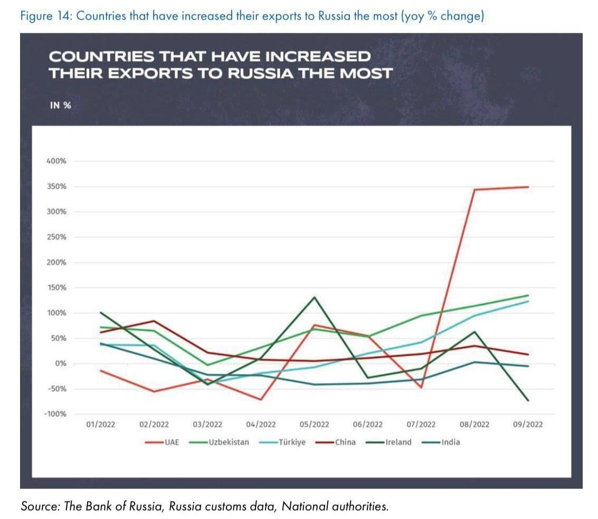

Как следствие, сегодня в ОАЭ доля дохода от нефтяного сектора — менее 30%, а ВВП значительно вырос за последние несколько лет. Дирхам (AED) привязан к доллару (USD), поэтому валюта ОАЭ стабильна с 1991 г. Это способствует росту инвестиций и стоимости активов в национальной валюте Арабских Эмиратов. 

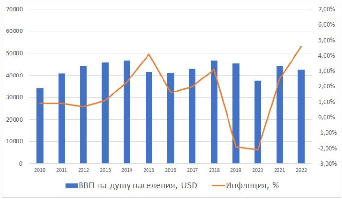

Экономическая история Дубая началась с момента обретения независимости в 1971 году. Принято считать, что секретом богатства являются огромные запасы углеводородов: 97,8 млрд баррелей нефти и природного газа (94% их сосредоточены на территории эмирата Абу-Даби, еще 4% — в Дубае). Это лишь одна из причин. Доходы от нефти помогли развитию города на раннем этапе, но запасы нефти в Дубае весьма ограничены и уровень добычи невысок: доходы от нефти составляют всего около 5 % всех поступлений. Основу экономики Дубая в 21 веке стали составлять туризм, авиация, девелопмент, финансовые услуги, портовое хозяйство. Сегодня можно с уверенностью сказать, что ОАЭ и Дубай смогли избежать традиционного проклятия многих сырьевых держав. Экономика Эмиратов кардинально отличается от Венесуэлы и Ирана. 

Дубай до 1971 года оставался зависимым. Британский протекторат был необходим, потому что вокруг него были значительно более крупные и более агрессивные соседи. Очень маленький и бедный эмират мог вырваться из нищеты только за счёт мудрости и настойчивости в дипломатии и отношениях с гражданами. Шейх Мохаммед Мактум подробно описывает уроки, которые он получил от своего отца Шейха Рашида. Напомню, что речь идёт о монархии. Первый состоял в опоре на сильных сограждан и формировании коллективного интеллекта: «Каждый должен продолжать учиться вне зависимости от его или её достижений. Лидер нуждается в совете других, чтобы узнать больше и заручиться их поддержкой в новых планах и проектах. 

Эмират Дубай многогранен, рационален и осторожен. Не очень известна история становления национальной нефтяной индустрии. С середины XIX века южное побережье Персидского залива было базой пиратов, промышлявших грабежом торговых кораблей на пути в Индию. Крупнейшим портом был соседний Дубаю эмират Шарджа. Итак, в 1861 году тогдашний мировой гегемон — Великобритания — взяла регион под контроль, заключив с местными правителями соглашения о протекторате. В том числе с эмирами Договорного Омана — теперешними ОАЭ. За долгие годы протектората в рамках «Договорного Омана» Великобритания привыкла разговаривать с шейхами витиевато и вежливо, но всегда с позиции силы. Так англичане поступили и при обсуждении условий концессии по разработке первых нефтяных месторождений. 

В конце 30-х годов британские нефтяные компании автоматически получили концессию на разведку и добычу нефти во всех эмиратах. В 1962 году с территории Эмирата Абу-Даби начались первые экспортные поставки нефти. В некогда нищий край потек ручеек денег. Эмираты долго дипломатическими путями боролись за независимость. И в декабре 1971 года эмираты наконец получили независимость и объединились в ОАЭ. Президентом стал шейх Абу-Даби Заид ибн Султан. Новая страна оказалась в очень неспокойном окружении. Крупные соседи (Иран и Саудовская Аравия), имевшие серьезные территориальные претензии к эмиратам Абу-Даби и Шардж, отказались признавать созданное государство. Нужно было срочно найти нового сильного покровителя. По легенде, которую можно услышать от гидов в музеях ОАЭ, шейх Заид ибн Султан позвал представителей британских корпораций и сообщил, что ему нравится договор о разделении доходов от добычи нефти, но в нем закралась досадная ошибка — 90% доходов забирают британцы и лишь 10% остаются местным властям. "Должно быть наоборот", — заявил шейх. Британцы высокомерно отказались, понадеявшись на авторитет и силу британской короны. И ошиблись. Эмираты разорвали кабальные договора с Британскими нефтекомпаниями и пригласили на их место американские. Новый заокеанский партнер одновременно стал щитом и от посягательств соседей. 

А дальше случился нефтяной кризис 1973 года. Осенью 1973 года члены ОАПЕК, а также Египет и Сирия заявили, что они не будут поставлять нефть странам (Великобритания, Канада, Нидерланды, США, Япония), поддержавшим Израиль в ходе Войны Судного дня в его конфликте с Сирией и Египтом. Это касалось прежде всего США и их союзников в Западной Европе. В течение следующего года цена на нефть поднялась с трёх до двенадцати долларов за баррель. Этот кризис не только заложил основу финансового благополучия ОАЭ, но и позволил уже 1 января 1974 года созданной правительством Абу-Даби Государственной национальной нефтяной компании выкупить 60% акций всех действовавших в Эмирате нефтедобытчиков. Одновременно правительство Дубая выкупило 60% акций Dubai Petroleum. В настоящее время с учетом дивидендов и налогов государство в среднем получает 92% от доходов нефтекомпаний. 

## Ислам и местные нравы и обычаи

Россия — страна многоконфессиональная, с крупнейшим (около 17 млн) мусульманским населением среди европейских стран. Традиционная толерантность и добрососедство предопределяют комфортное состояние россиян в Дубае. Надо заметить, что даже считающее себя православным российское эмигрантское большинство так редко ходит дома в храмы (5%), что, скорее, является атеистами и, как следствие, не испытывает дискомфорта, находясь в мусульманской среде. Впрочем, для и истинно православных есть свои приходы. Из православных церквей в стране представлены: Русская православная церковь, построившая в городе Шардже церковь в честь св. апостола Филиппа, и Антиохийская православная церковь с храмом Святителя Николая в Абу-Даби. 

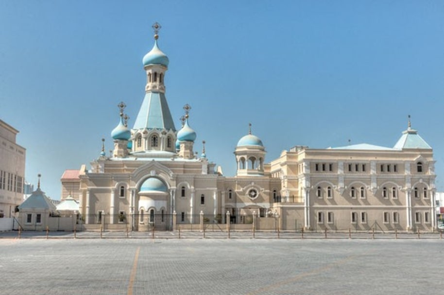

Толерантность во внешних проявлениях вообще является одним из секретов успеха Дубая. Туристы практически не ощущают бытовой разницы, например, со светской Турцией. Необычная местная одежда скорее является изящным национальным элементом. В публичных и людных местах не заметно, как местные жители исполняют намаз, а это, между прочим, 5 раз в течение дня. Ритм жизни не прерывается службами, а в публичных местах достаточно редко встречаются женщины в хиджабах. Полный запрет на алкоголь не распространяется на представителей иных конфессий, но ощущается в его высоких ценах за пределами Duty-free. Впрочем, власти приняли решение снизить налоги с января 2023 года в целях стимулирования немусульманского туризма. 

Достаточно лояльны местные власти к мелким нарушениям дорожных правил, но даже мелкая авария в состоянии алкогольного или наркотического опьянения запросто может привести к «профилактическому заключению» на несколько суток в некомфортных условиях местной тюрьмы. 

Важно понимать, что семья является ключевой ячейкой арабского общества. Богатство здесь напрямую связано с властью и влиянием. Семейные связи формируют социальные связи. Западная культура основана на правилах, а арабская на отношениях, где отношения важнее подписи под контрактом. Связи и networking — это карьерный рост и деловая культура. Понимание термина Wasta определяет переход на неформальный уровень деловых отношений. Уровень, на котором работает система обязательной взаимопомощи и страховки. Влиятельные знакомства заводятся на многочисленных мероприятиях. При этом связь с авторитетным знакомым формируется на основании своеобразного банка взаимных услуг. Эта конструкция детально описана в романе Паоло Коэльо «Заир». В целом тёплые связи в деловом мире помогут вести дела в Дубае даже богатым инвесторам. С точки зрения экономики арабский деловой мир это мир сложных персональных и межфирменных связей, которые формируют уникальную по своей устойчивости экосистему предпринимательских сетей. В некотором роде — «блокчейн взаимных гарантий». 

Необходимо помнить, что существует множество местных правил и примет. Например, в арабском мире считается большим оскорблением скрестить ноги таким образом, чтобы подошва обуви была обращена к гостю. Стоит помнить, что в Арабских Эмиратах нельзя употреблять алкоголь в общественных местах; это можно делать только в ресторанах, гостиницах и ночных клубах. Продажа спиртных напитков производится в специализированных магазинах. Нахождение в нетрезвом виде может быть воспринято как оскорбление и даже вести за собой арест. Алкоголь нельзя рассматривать и в качестве подарка для мусульманина. 

Во время священного для всех мусульман месяца Рамадан туристам следует употреблять пищу в определенных местах, так как сами местные жители в этот период времени отказываются от питья, еды и курения от рассвета до заката. В тоже время во время Рамадана супермаркеты и ТЦ работают в обычном режиме. 

Пятница — особый день для мусульман, в который не следует планировать деловые встречи. Пророк Мухаммед сказал: «Лучший день, благословлённый Аллахом, — это пятница». Считается, что в пятницу был создан Адам, он вошёл в Рай, был изгнан и умер. Судный день настанет в пятницу. 

Арабское слово «Джума» происходит от слова «Аль-Жам», переводится как «собираться». Обычная обеденная молитва (намаз «зухр») заменяется на салах джума («джума-намаз»). Эта молитва произносится обязательно группой верующих минимум из 6 человек, включая имама, и проводится в мечети. 

Обычно время молитвы джума-намаз определяется по солнцу. Но в ОАЭ сейчас время начала джума-намаз фиксировано – 13:15 (в течение всего года). Так сделано для того, чтобы верующие гарантированно имели время (с 12:00 до 13:15), чтобы добраться до мечети для молитвы джума-намаз. 

Пятничная молитва – это религиозный долг каждого мусульманина-мужчины. От неё освобождаются: старики, дети, путешествующие, больные, слепые, инвалиды, и те, кто находится от ближайшего места проведения молитвы на расстоянии более 2 фарсаков. Фарсак – это мера длины, равен 5-5,5 км. То есть, чтобы официально освободиться от пятничной молитвы, нужно быть от ближайшей мечети в 10 километрах или далее. В ОАЭ почти нет таких мест, кроме областей Аравийской пустыни. С 3 января 2022 года Объединённые Арабские Эмираты перешли на новую 4½-дневную рабочую неделю. Рабочие дни – с понедельника по четверг + пятница до полудня. Выходные: пятница с обеда + суббота + воскресенье. Это правило касается всех государственных учреждений и компаний. Также на новую систему перешли частные и государственные школы и другие образовательные учреждения. Частные компании работают по своему графику. 

Крайне важно помнить, что левая рука в Арабских Эмиратах считается «нечистой», поэтому, будь то рукопожатие, ужин, предложение взять что-то, по правилам этикета нужно всегда использовать только правую руку. Используя правую руку, вы также показываете, что у вас добрые намерения, так как в стародавние времена в правой руке всегда сжималась рукоятка меча. В стране действует ряд ограничений при фотографировании. Мусульманские женщины и мужчины, а также государственные учреждения не должны попадать в кадр без разрешения. И это только малая часть местных правил и этикетов. 

## Оффшорная экономика

B2B. На корпоративном уровне в ОАЭ существуют строгие правила, регламентирующие работу иностранных инвесторов. В Эмиратах есть свободные экономические зоны (СЭЗ), в которых можно зарегистрировать фирму, полностью принадлежащую иностранным гражданам. Но такая фирма свою деятельность может вести лишь в СЭЗ или за границей эмиратов. Чтобы зарегистрировать предприятие в ОАЭ, иностранному инвестору нужен местный "спонсор" — гражданин эмиратов, которому будет принадлежать 51% акций компании, и который будет иметь права в любой момент закрыть её деятельность. Инвестконсультанты могут рассказывать неопытному иностранцу, что "спонсор" — это формальность и "можно за две копейки нанять фиктивного местного парня". Но все это с точки зрения местного правосудия незаконно и чревато большими проблемами. Тем более, местные суды славятся простым принципом: "эмиратец всегда прав в споре с иностранцем", а особенно не англосаксом. 

Отличные условия для ведения бизнеса, отсутствие большинства налогов, упрощённая система получения резидентства – главные составляющие спроса к юрисдикции ОАЭ среди иностранцев. 

С 2006 года во всех эмиратах ОАЭ иностранцам разрешено покупать недвижимость и местную землю на территории свободной зоны – Freehold, включающей определенные районы (например, Пальмы). На остальной территории (Leasehold) разрешена только аренда, сроком до 99 лет. 

B2C.  На уровне физических лиц. DUTY free paradise. История становления Дубая как туристического центра неразрывно связана с традиционной для порта беспошлинной торговлей. Ещё в начале 2000-х годов Дубай был одним из центров российской челночной закупки, а транзит через дунайский аэропорт выбирался с учётом большой паузы на шоппинг в аэропорту. В нём в те годы было много мировых фешн-брендов с серьёзным дисконтом к европейским бутикам. 

**Моллы.** После того, как аэропорт Дубая стал знаменит своим DUTY, эмир перешёл к следующей фазе борьбы за денежные ресурсы туристов. От импульсной однократной покупки — к комплексному шоппингу с пляжно-событийным отдыхом. Под шоппинг необходимо было создавать современную инфраструктуру, и дубайцы с блеском справились с этой задачей. Собственно, ничего нового они не придумали, но сделали это с большим размахом, восточным богатством и сильно на вырост. 

Как представитель ритейла не могу не остановиться на удивительном торговом объекте. 
**The Dubai Mall** (также рус. Дубай Молл) — самый крупный торгово-развлекательный центр в мире, расположенный в даунтауне Дубая. Общая площадь центра составляет более 1,2 млн м², торговая площадь — 350 244 м². 

Dubai Mall — главный проект фирмы Emaar Malls Group, подразделения группы Emaar Properties, занимающегося в том числе торговыми центрами. Здесь под одной крышей находится 1200 магазинов, а также культурные и развлекательные сооружения мирового уровня. Среди аттракционов и заведений, размещенных в Dubai Mall, стоит обратить внимание на: 

• SEGA Republic — первый в регионе тематический парк под крышей площадью около 7600 м².
• Gold Souk — самый большой в мире крытый «золотой рынок» с 220 магазинами.
• «Остров моды» площадью 44 000 м², отведённый под 100 магазинов «от кутюр» элитных мировых брендов, среди которых: Versace, Burberry, Roberto Cavalli, Galliano, Hermès, Givenchy, Cerruti, Missoni, Tom Ford и Ermenegildo Zegna. После закрытия в России лакшери бутиков теперь это, пожалуй, место главного шоппинга российских модниц.
• Первый на Ближнем Востоке универмаг известной компании Galeries Lafayette.
• KidZania — детский развлекательно-образовательный центр площадью 8000 м².
• Aquarium of the Dubai mall — один из самых больших океанариумов мира.
• Комплекс кинотеатров с 22 экранами.
• Ледовый каток олимпийских размеров.
• «Роща» (The Grove) — кусочек улицы, накрытый сдвигающейся крышей.
• Торговый центр имеет крытую автостоянку на 14 000 автомобилей. К торговому центру The Dubai Mall примыкает пятизвездочная гостиница The Address с 250 номерами и 450 квартирами с обслугой. «Дубай молл» расположен в так называемом «самом престижном в мире квадратном километре», в квартале Downtown Burj Khalifa, который сооружается вокруг Бурдж-Халифа, самого высокого здания в мире. Каток олимпийского размера, который используется не только как площадка для любителей катания на коньках, но и для различных публичных и частных мероприятий, крытая аллея с раздвигающейся крышей.
• К числу уникальных сооружений, разместившихся под крышей Dubai Mall, относится крупнейший в мире крытый аквариум, в котором можно увидеть более 33 000 рыб и морских животных, в том числе, акул и скатов. Через чашу аквариума, вмещающую 10 млн литров воды, проходит туннель, застеклённый сверху, так что посетители могут с близкого расстояния рассмотреть обитателей аквариума, проплывающих над ними. Над аквариумом находится «Центр открытий», где можно подробнее ознакомиться с жизнью морей и океанов.

## Туризм

По данным Всемирного совета по туризму и путешествиям, в 2016 г. туристический сектор принёс экономике ОАЭ $64 млрд., а в ближайшие 10 лет этот показатель увеличится почти вдвое. Сектор туризма и путешествий ОАЭ развивается наиболее активно, что способствует диверсификации экономики страны. 

В 2015 г. общий вклад туризма в ВВП Эмиратов составил 133,8 млрд. дирхамов ($36,43 млрд.), или 8,7%; в 2016 г. этот показатель вырос на 4,4%, а до 2026 г. ожидается ежегодный его прирост в размере 5,4%, пока вклад туризма в ВВП страны не составит 236,8 млрд. дирхамов ($64,47 млрд.), или 11,2%. 

Таковы последние данные, представленные в докладе «Экономический эффект индустрии туризма и путешествий в 2016 г. (Объединённые Арабские Эмираты)» Всемирного совета по туризму и путешествиям. Доклад позволяет объективно взглянуть на активно развивающуюся туристическую индустрию страны, которая сегодня нацелена на расширение соответствующей инфраструктуры и привлечение большего числа деловых туристов и гостей со всего света. 

В 2015 г. в туристический сектор ОАЭ было инвестировано более 27,4 млрд. дирхамов ($7,46 млрд.), что составляет 7,3% от совокупного объёма капиталовложений страны. Ожидалось, что в 2016 г. этот показатель увеличится на 2,8% и продолжит расти на 6,8% ежегодно в течение последующих 10 лет, составив в 2026 г. 54,4 млрд. дирхамов ($14,81 млрд.), или 8,2% от общего объёма инвестиций. 

ОАЭ намерены стать одним из ведущих туристических направлений мира, и доклад совета показывает, что в 2015 г. страна занимала 28-е место из 184 с точки зрения значимости её туристической индустрии для экономики. С позиций объёма сектора и его вклада в ВВП Эмираты заняли 105-е место, однако на 2016 г. стране прогнозируется 42-е место из 184. 

С учётом прогноза на ближайшие 10 лет Всемирный совет по туризму и путешествиям отдаёт ОАЭ 48-е место. Безусловно, рост данного сектора создаёт рабочие места — главным образом в таких сферах, как отели, турагентства, авиалинии и другие транспортные услуги. 

По данным Всемирного совета по туризму и путешествиям, в 2015 г. туристическая индустрия напрямую повлияла на создание 330 000 рабочих мест (5,7% от общего объёма занятости в стране). Аналитики ожидают, что в 2016 г. этот показатель вырастет на 3,8% и будет расти на 4,3% ежегодно, пока не составит 520 000 рабочих мест (7,6% от общего объёма занятости) в 2026 г. Вместе с тем, рост туристической индустрии также положительно сказывается на сфере общественного питания и индустрии досуга, где тоже появляются новые рабочие места. 

Таким образом, в 2015 г. сектор туризма и путешествий прямо и косвенно способствовал созданию 9,6% от общей занятости ОАЭ, что составило 557 000 рабочих мест. В 2016 г. ожидается рост этого показателя на 3,8% (578 000 рабочих мест) и далее на 3,9% ежегодно вплоть до 850 000 рабочих мест в 2026 г., что составит 12,4% от общей занятости страны. 

Каждый эмират в стране поставил перед собой амбициозные цели по привлечению туристов. Лидером среди них остаётся Дубай, намеревающийся к 2020 г. привлекать по 20 млн. гостей ежегодно. Аналитики Всемирного совета по туризму и путешествиям ожидают, что к 2026 г. число иностранных туристов, ежегодно посещающих ОАЭ, достигнет 30,94 млн. человек, а объём их трат в стране составит 167,7 млрд. дирхамов ($45,66 млрд.).Таким образом, в ближайшие 10 лет объём трат со стороны иностранных туристов будет ежегодно расти на 5,4%. Parks & Resorts, приведённые выше данные могут оказаться заниженными. 

Такие результаты стали реальностью благодаря тому, что стратегия развития отрасли включала в себя долгосрочные инновационные и стратегические подходы. Так, например, ныне всемирно известный чемпионский гольф-клуб «Emirates golf club», именуемый “the desert miracle” был построен в 1988 и стал первым гольф-полем на Ближнем Востоке. Идея строительства принадлежала американским и английским бизнесменам, скучавшими по гольфу в пустынном ландшафте начинавшихся мегастроек. Шейх Мохаммед по совету Президента Пакистана поддержал эту смелую идею через масштабную программу "Dubai Golf" для привлечения внимания профессионалов и любителей гольфа. С 1989 в Дубае проводится титульный турнир "Dubai Desert Classic" с призовым фондом. Так 71 гектар обычных песчаных дюн превратился в легенду зимнего гольфа в евро-азиатско-африканском регионе. В настоящий момент тринадцать 18-луночных гольф-полей Дубая в осенне-весенний период принимают до 300 игроков ежедневно. А это означает выручку около миллиона долларов ежедневно 9 месяцев в году. В летние месяцы, конечно, слишком жарко, но и летом есть ночной гольф. Согласитесь, что неплохой доход с лужаек? В момент строительства EGC действительно вокруг была пустыня, а сегодня это центр большого нового жилого и делового района. 

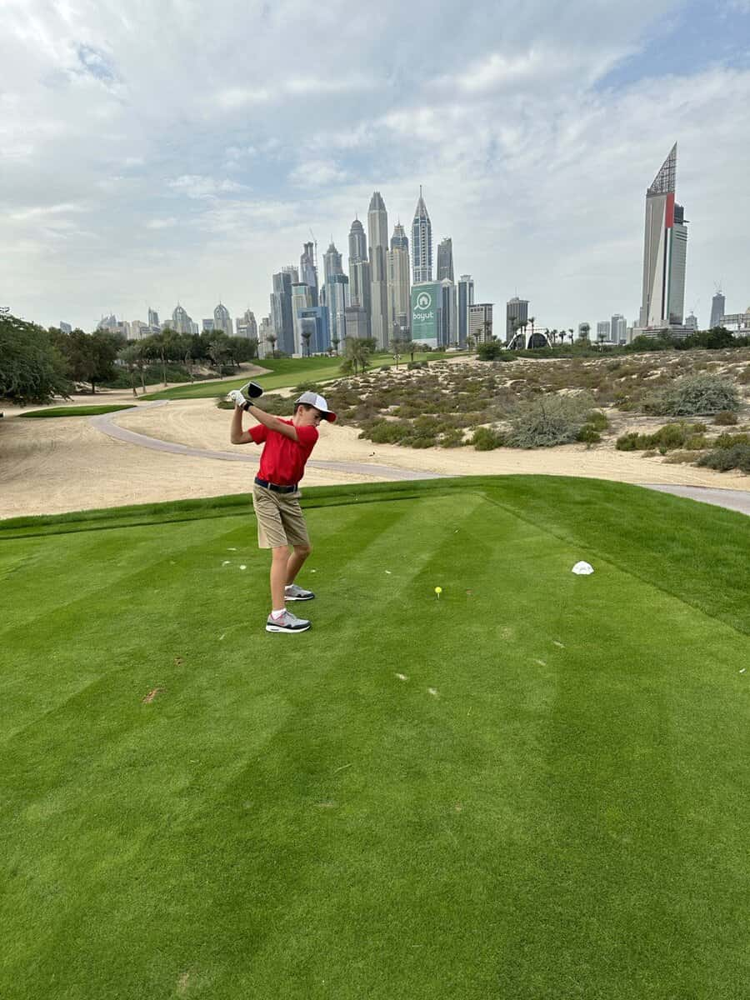

Число новых проектов множится каждый день. Это и IMG Worlds of Legends, Six Flags at DPR и тематический парк в Дубае, посвящённый гонкам Формулы-1, а также Sea World Abu Dhabi на острове Yas Island и многие другие проекты мирового уровня. Благодаря таким проектам, а также планам по созданию новых достопримечательностей, культурных и торгово-развлекательных центров, проведению развлекательных мероприятий, туристическая индустрия ОАЭ позволит стране занять более высокую позицию в следующем отчёте Всемирного совета по туризму и путешествиям. 

## Порт. Логистика. Авиация

Авиация в Дубае начиналась сложно. Аль Мактумам пришлось в 1958 году лететь в Лондон, чтобы уговорить тогдашнего Премьер-министра Великобритании Макмиллана разрешить! строительство аэропорта. Таковое наконец было получено, и это позволило запустить первую туристическую стратегию города. Расширение терминалов подготовило инфраструктуру. Создание авиакомпании Emirates с премиальным сервисом создало гарантированный трафик. Все эти усилия превратили Дубай в крупнейший в мире глобальный хаб. Более 20 миллионов туристов в год сегодня принимает аэропорт, усилиями 113 авиакомпаний мира. С учётом роста уровня жизни в развивающихся странах перспективы Дубая выглядят превосходными. 

Параллельно. Третий российский представитель среди победителей 2017 года — «Аэрофлот», названный лучшим авиабрендом. Его соперниками по номинации были Aeromexico, Air New Zealand, Air Seychelles, American Airlines, Avianca, Caribbean Airlines, Emirates, Ethiopian Airlines и Singapore Airlines. Награждение World Travel Awards проходит в несколько этапов. Сначала жюри определяет лучших на всех континентах, параллельно выбирая победителей на локальном уровне (почти в каждой стране). Победителей на уровне Европы выбрали в начале октября. Тогда лучшими также признали Санкт-Петербург (лучшее городское направление Европы), Mriya Resort & Spa (лучший европейский курортный комплекс для отдыха) и «Аэрофлот» (он выиграл в двух номинациях: лучший бизнес-класс в Европе и лучший бренд). 

Логистика — исторический бизнес ОАЭ. Портовые услуги Эмиратов давно вышли за границы страны. Сегодня DP World (Dubai Port World) — один из крупнейших мировых портовых операторов. По состоянию на 2011 год, согласно отчёту лондонской консалтинговой компании Drewry Shipping Consultants, компания Dubai Worlds Ports стала третьим крупнейшим портовым оператором в мире. Являясь географически одним из самых диверсифицированных портовых операторов мира, DP World обладает долей мирового рынка в 6,7 %. Компания оперирует 78 морскими терминалами в 31 стране мира и самым большим индустриальным парком мира Jebel Ali Free Zone (JAFZA). DP World находится под управлением крупнейшего мирового инвестора и девелопера компании [Dubai World](https://ru.wikipedia.org/wiki/Dubai_World), принадлежащей правительству ОАЭ. 

## ОАЭ и Россия

Факт и цитаты. 11 октября 2022 года в Санкт-Петербурге в Константиновском дворце Владимир Путин встретился с Президентом Объединённых Арабских Эмиратов — Мухаммедом Аль Нахайяном. 

В. Путин: «Отношения между Россией и Объединёнными Арабскими Эмиратами являются важным фактором стабильности в регионе, да и в мире в целом. Что касается двусторонних отношений, то, как я уже сказал в начале, они развиваются очень успешно. В прошлом году рост товарооборота составил – до кризиса на Украине ещё – 65 процентов, а в этом году, несмотря на все сложности, всё-таки рост продолжается, не такой большой, как в прошлом году, но тем не менее 17 процентов. 

Мы активно работаем и в рамках «ОПЕК плюс». Знаю Вашу позицию, наши действия, наши решения не направлены против кого бы то ни было, мы не собираемся и не делаем так, чтобы создавать кому-то проблемы. Наши действия направлены на то, чтобы создать стабильность на мировых энергетических рынках, с тем чтобы и потребители энергоресурсов, и те, кто занимается добычей, поставщики на мировые рынки, чувствовали себя спокойно, стабильно и уверенно. Чтобы и предложение, и потребление были сбалансированы. Поэтому мы всегда реагируем на потребности рынка, стараемся сделать это адекватно происходящим событиям. 

Для меня очень важно обсудить с Вами ситуацию в регионе, там тоже много проблем остаётся. Роль и влияние Объединённых Арабских Эмиратов на ситуацию в самом регионе, конечно, очень высокие, и для меня очень важно обсудить с Вами вопросы, связанные с ситуацией в Сирии и вокруг неё.
Спасибо, что нашли время приехать в Петербург.» 

М. Аль Нахайян (как переведено): «Господин Президент, я очень рад Вас видеть и хочу поздравить Вас с прошедшим днём рождения, пожелать всего наилучшего.»
В. Путин: «Спасибо. Шукран.»
М. Аль Нахайян: «Хочу отметить ряд пунктов, которые важны для наших отношений. Хочу отметить, что мы не виделись три года. Ситуация была трудная – коронавирус.

Но тем не менее, несмотря на эти трудные коронавирусные условия, нам удалось достичь не мало: мы увеличили наш товарооборот с 2,5 миллиарда до 5 миллиардов [долларов]. И примерно полмиллиона туристов из России — всего этого нам удалось добиться благодаря помощи России. 

Мы также будем отмечать открытие первой российской школы в [Объединённых Арабских] Эмиратах в этом году. У нас работает четыре тысячи русских компаний. И это всё укрепляет тот мост, связывающий нас, —мост сотрудничества. Я надеюсь, что в ближайшие годы мы сможем значительно увеличить все эти показатели.» 

Экономические успехи ТЭК России в 2022 году стали возможны прежде всего благодаря сбалансированной и дружественной политике ОПЭК. Саудовская Аравия и ОАЭ когда-то уничтожили экономику Советского Союза, а в прошлом году очень помогли. Особые отношения нефтяных грантов с США на поверхности, но мир действительно изменился, и эта услуга России прямо говорит о многополярности. Россия прямо необыкновенно успешна в вопросах сглаживания региональных конфликтов Персидского залива. 

> Важная деталь к этому абзацу. Reuters пишет, что индийские нефтеперерабатывающие заводы начали оплачивать большую часть поставок российской нефти, которые они закупают через трейдеров в Дубае, в дирхамах вместо долларов. Это довольно логичный шаг — курс дирхама и так привязан к доллару. При этом валюта крепкая, а переводы в них вряд ли когда-либо будут заблокированы. А еще это объясняет тот факт, что дирхамы теперь можно и в России поменять за наличные — надо же куда-то сбывать валюту от индусов.

## Недвижимость. Комфорт, качество жизни и стабильность в городе будущего

Нестабильность и кризисы во многих странах побуждают к масштабной эмиграции в ОАЭ семей, бизнеса и активов. В будущем эта тенденция возрастёт. Чем больше новых специалистов, бизнесменов и талантливых людей, тем выше уровень развития страны. 

При этом в Дубай едут сразу несколько потоков мигрантов. «Синие воротнички», обеспечивающие мегаполис дешёвыми рабочими руками, и «белые воротнички», обеспечивающие управление. Но гораздо важнее поток топ-менеджеров, предпринимателей и просто обеспеченных людей. Новые люди — это новая кровь капиталу, связи, недвижимость, новые стандарты ведения бизнеса. Это новые требования к офисам и жилью. А если таких людей сотни тысяч? Значит — это сотни тысяч юристов, финансистов, бухгалтеров, водителей, нянь и так далее. Приход больших капиталов означает приход большого бизнеса. А это уже путь Лондона в 21 веке. 

Один из самых свежих и ярких примеров — это релокация в Дубай и получение предпринимателем с российскими корнями — Павлом Дуровым — гражданства ОАЭ. Можно только догадываться, сколь велик может быть вклад Telegram в развитие информационных технологий эмирата. Как раз намедни Павел был признан самым влиятельным предпринимателем страны. 

В целях уточнения многочисленных разногласий с иностранными юрисдикциями в декабре 2022 в ОАЭ сегодня вступил в силу новый закон для иностранцев-немусульман о личном статусе. Закон вносит ясность в процедуры: заключения брака, оформления развода, опеки над детьми, регламентации наследования и завещания, проведения тестов на подтверждение отцовства и т.д. 

Согласно государственному плану развития «Дубай 2040», к 2040 г. планируется увеличение численности населения от ~5,5 млн до 7,5 млн чел., что принесёт стране новые инвестиции и квалифицированные кадры. 

Дубай возглавил чарты самых популярных городов 2022 г. По данным Google Destinations Insight, Дубай занимает второе место в мире по популярности после Лондона. 

3 место — Париж
5 место — Нью-Йорк
10 место — Стамбул

В рейтинге швейцарского банка UBS от 2022 г. Дубай — единственный город с позитивным прогнозом развития рынка недвижимости. Такой статус присваивается населенным пунктам, которые имеют высокую значимость в мировом сообществе и выступают в качестве движущей силы развития и роста своей страны.
Недвижимость в таких городах, как Лондон, Нью-Йорк, Париж и Токио, оказалась переоцененной. В то время, как рынок Дубая сейчас недооценен. Это значит, что рынку Дубая есть куда расти и в будущем он может составить конкуренцию крупнейшим мировым мегаполисам. Цены на недвижимость можно сравнить с ценами в Гонконге, Сингапуре, Сеуле или Тель-Авиве. 

- в Гонконге квадратный метр в среднем стоит около $25 000
- в Сингапуре – $14 500
- в Сеуле – $10 900
- а вот в ОАЭ – лишь $3 500.

Причем, $3500 — это средняя цена. А вот цены в самых популярных районах:

- Dubai Marina — $4300,
- Downtown Dubai — $6700,
- Business Bay — $6450.

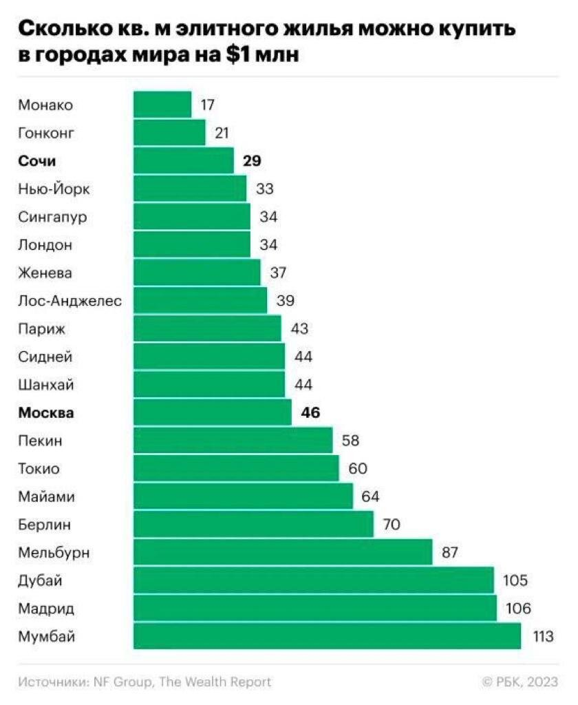

Сейчас усилиями в том числе наших соотечественников цены на топовые локации быстро растут, но по-прежнему ниже текущих московских. Начало украинского кризиса стало удачей для дубайского рынка недвижимости. В третьем квартале 2022 года было продано 22895 помещений, что на 61% превышает показатели предыдущего года. Россияне стали лидерами по покупкам, обойдя выходцев из Индии, Италии, Великобритании, Германии, Франции и США. По последним данным динамика цен оказалась разнонаправленной. Например, районе The Palm Jumeira цены выросли на 10%, а в районе Jumeira Village упали на 5%. Некоторые эксперты считают, что рынок «золотых пузырей» может скорректироваться под воздействием неблагоприятных внешних факторов, но таких пока меньшинство.

Forbes констатирует, что рынок недвижимости Дубая уже в третий раз в XXI веке демонстрирует стремительный и продолжительный рост. За первыми двумя взлетами последовали эпичные обвалы в 2009 и 2015 годах. Сейчас рынок вновь переживает стадию роста, причем она продолжается уже не первый год, поэтому наиболее пессимистичные участники рынка недвижимости ждут следующего спада. За год в Дубае было заключено 97 252 сделки (+59,5% за год), средняя стоимость сделки составила $435 610 (+10,3% за год). Общая стоимость всех транзакций превысила 265 млрд дирхамов (около $71,2 млрд по курсу на 17 февраля).

Инвестиции в недвижимость остаются одним из важнейших приоритетов для местных властей. Рынок недвижимости цифровизован и прозрачен. Приложение Dubai Rest позволяет проводить расчёты «одной кнопкой». Благодаря стабильности и отсутствию преступности рост капитала в недвижимости ранее достигал 5-6%, а «модные» среди русских локации типа Blue Waters могут расти на 30% при нулевом годовом налоге на недвижимость и нулевом подоходном налоге. Гонка новых проектов продолжается.

## Капиталы и капитализация

Город и порт Дубай были заметны на карте региона задолго до обнаружения нефти. Советский справочник "Страны мира 1971" характеризовал порт Дубай, как "центр региональной контрабанды и транспортировки наркотиков и золота".

Курс денежной единицы ОАЭ был установлен ещё в 1997 году и составил 3 дирхама 67 филсов за один доллар США. С тех пор мир сотрясли несколько экономических кризисов, но в Эмиратах ничего не менялось: доллар стоил столько же, сколько и раньше. Банки продавали доллары по первому требованию в любых количествах, поэтому спекулянты-валютчики здесь не прижились. Граждане страны потеряли интерес к «зелёному» —зачем следить за котировками, если курс всегда одинаков? Эмиратский дирхам свободно обменивается на всём Ближнем Востоке, в отличие, скажем, от египетского фунта или йеменского риала. Главной для ОАЭ была установка —люди должны полюбить национальные деньги, хранить сбережения только в них и не сомневаться в стабильности: что бы ни произошло, дирхам не «посыплется». С 1997 года доллар серьёзно девальвировался. Например, средняя зарплата по данным BLS USA в том далёком году составила $27420, а в 2021 году $43824, т.е. выросла на 59%. Дирхам в полной мере воспользовался в полном смысле сеньоражем в тени бакса.

В истории дирхама как транснациональной региональной супервалюты было немало везения. Дубаю было крайне сложно стать международным арабским финансовым центром. До середины 70-х им был ливанский Бейрут. Но в 1975 году Ливан охватила гражданская война — банкиры и транснациональные корпорации стали искать новое место для своих региональных штаб-квартир. Изначально казалось, что им станет Тегеран. Но в 1979-м году в Иране случилась исламская революция — этот вариант отпал. Тогда-то впервые и прозвучало название Дубай. И вот спустя всего 40 лет и бедный Ливан, и послевоенный Ирак, и санкционный Иран, как и многие другие страны региона, зависят от финансовой системы Дубая.

## Исламский банкинг.

Исламский банкинг — способ ведения банковской деятельности, который основан на соблюдении религиозных правил шариата. Главный запрет касается процентных доходов — они запрещены на любые сделки. Также банкам запрещено инвестировать в «харамные» (запретные) сферы: производство алкоголя, табака, свиноводство, игорный бизнес и так далее.

Банки получают прибыль с инвестиций, поэтому распространенные операции исламского банкинга — рассрочка, лизинг, долевое финансирование. К исламскому банкингу, скорее, применимо понятие проектного инвестирования, считает руководитель Аналитического центра финансового маркетплейса Банки.ру Дмитрий Хмелев: «Банк выступает инвестором и разделяет риски компании, которой выдает деньги».

Суть мусульманской сделки заключается в том, чтобы риски несли все стороны финансовых отношений, объясняет старший преподаватель факультета мировой экономики и мировой политики НИУ ВШЭ Эльмира Имамкулиева. «Если прибыль получает одна сторона, то ее получают и остальные в оговоренных пропорциях. Если начинание провалилось, например, не взошел урожай или была страшная засуха, то убытки также делятся пропорционально. Риски не должны ложиться только на одну из сторон. Поэтому возникает обоюдная заинтересованность», — объясняет Имамкулиева. По словам эксперта, такой подход показывает свою эффективность: финансовые институты, которые работают по правилам шариата, в кризисы остаются более стабильными.

Еще один принцип, важный в исламском праве, — мнение религиозных учителей. Банки, которые оказывают услуги по правилам шариата, должны действовать с одобрения совета муфтиев и исламских ученых, которые понимают и разъясняют сущность религиозного права. Именно их придерживаются банкиры, желающие привлечь клиентов, исповедующих ислам. Эти принципы основываются на:

- Отсутствии четкой процентной ставки по депозитам и кредитам.
- Лояльном отношении к просрочке платежей, поскольку сумма дохода банка не может быть согласованной заранее.
- Осуждении спекуляции, то есть нельзя использовать денежное затруднение своего клиента, чтобы получить прибыль.
- Запрещении азартных игр и всего, что с ними связано, в том числе – и лотереи.
- Невозможности инвестировать в проекты, связанные с порнографией, проституцией, алкоголем, свининой, колдовством и шаманством.
- Нежелании видеть среди своих клиентов дельцов, которые занимаются всеми перечисленными областями деятельности.
- Заинтересованности в успехе проекта, который создается совместно с клиентом, на всяческом содействии ему.
- Минимизации рисков.

Исламские банки ОАЭ действительно предлагают своим клиентам беспроцентный кредит. Однако, не значит, что банк абсолютно безвозмездно одалживает вам нужную сумму. Вы сами учреждаете прибыль, которой хотите порадовать банк. По законам шариата нельзя зарабатывать на нуждающихся людях, посему исламские банки не требуют от клиента больше, чем он может заплатить. Впрочем, российские эмигранты не являются целевой аудиторией исламских банков. Поэтому на практике лучше обслуживаться в классических банках ОАЭ.

### Крипта в ОАЭ.

ОАЭ криптовалюты уже активно регулируются, операции с ними не запрещают. Напротив, местные власти стремятся к развитию криптовалютной отрасли в стране.

Несмотря на то, что в Объединенных Арабских Эмиратах на федеральном уровне не существует единого и общего закона о криптовалютах, здесь активно разрабатываются и принимаются законы и постановления — в отдельных эмиратах и Свободных зонах.

Правовой статус криптовалют постоянно уточняется. Например, в марте 2022 г. в Дубае принят Закон № 4 «О регулировании виртуальных активов». Он нацелен на создание правовой базы для защиты инвесторов и разработки общепризнанных международных стандартов для индустрии виртуальных активов.

Кроме того, данным законом учрежден специальный надзорный орган — Дубайское Управление по регулированию виртуальных активов (Dubai Virtual Assets Regulatory Authority). Положения этого документа применяются на всей территории эмирата Дубай, в том числе в зонах особого развития и свободных зонах — за исключением Международного финансового центра Дубая.

Но и это еще не все. Так, ради контроля над оборотом криптовалют Управление по регулированию финансовых услуг Свободной зоны Abu Dhabi Global Markets 24 февраля 2020 г. опубликовало Руководство по деятельности в сфере виртуальных активов на территории ADGM ([Guidance – Regulation of Virtual Asset Activities in ADGM](https://www.adgm.com/document-repository), далее — Руководство). Необходимо отметить, что это первый подробный регуляторный документ по криптовалютам в ОАЭ.

Согласно Руководству понятие «виртуальный актив» означает цифровое представление стоимости. Им можно торговать в цифровом виде и оно функционирует как средство обмена и/или расчетная единица, и/или средство сбережения, но при этом не обладает статусом законного платежного средства ни в одной юрисдикции.

«Тонкий лёд». Есть информация, что некоторые российские покупатели использовали для покупки недвижимости крипту. Однако… В настоящий момент официально на территории Эмиратов расплачиваться криптомонетами нельзя. Так что при оформлении сделки продавцы получают деньги в евро, долларах и дирхамах. И тут на помощь приходят лицензированные брокеры цифровых валют. Именно они переводят крипту в реальные деньги, в фиат. И такую сделку можно совершить как на первичном, так и на вторичном рынке. Кстати, стоит знать, что в Дубае запрещены наличные (так в ОАЭ борются с отмыванием денег), так что для оплаты квартиры или апартаментов часто используются банковские чеки.

Горячая новость от февраля 2023. ОАЭ выпустит цифровую национальную валюту. Власти Объединенных Арабских Эмиратов сделают государство «обществом без наличных» с помощью цифровой валюты. Центральный банк Объединенных Арабских Эмиратов (CBUAE) выпустит цифровую валюту (CBDC). Об этом говорится в сообщении регулятора о старте «Программы трансформации финансовой инфраструктуры» (FIT programme), направленной на ускорение цифровизации сектора фин. услуг.

Программа включает реализацию нескольких ключевых инициатив. На первом этапе ОАЭ планирует создать систему внутренних карт (Card Domestic Scheme), открыть платформу мгновенных платежей (Instant Payments Platform) и выпустить CBDC для трансграничного и внутреннего использования. По словам CBUAE, это расширит финансовую доступность, повысит безопасность и эффективность платежей, а также приблизит страну к цели стать «обществом без наличных». На следующем этапе программы FIT в стране будет разработана и внедрена цифровая инфраструктура, в том числе финансовый облачный сервис (Financial Cloud), система eKYC (Know Your Customer) и другие платформы. Согласно документу, завершить внедрение инициатив по программе FIT планируется в 2026 году.

В феврале 2023 в Дубае регулятором эмирата The Dubai Virtual Assets Regulatory Authority (VARA) были опубликованы новые правила, касающиеся виртуальных активов и связанных с ними видами деятельности. Документ установил обязательное лицензирование криптокомпаний в эмирате и запретил выпуск и операции с алгоритмическими стейблкоинами.

Параллельно. В России с 1 апреля ЦБ запустит пилот с 13 банками по реальным операциям физлиц с цифровым рублем — переводам и оплате товаров и услуг, сообщила журналистам первый зампред ЦБ Ольга Скоробогатова 17 февраля в кулуарах Уральского форума по кибербезопасности. "Проект цифровой рубль мы планируем запустить в пилотную стадию с 1 апреля в начале с операциями — переводы между физическими лицами и платежи в торгово-сервисных предприятиях. Сразу обращу внимание, что пилот будет идти на реальных операциях и реальных клиентах, но ограниченном количестве операций и на ограниченном количестве клиентов с 13 банками, которые уже технически подтвердили свою готовность", — сказала она. По ее словам, банки прошли все технические и операционные тесты, и ЦБ рассчитывает, что они с 1 апреля выйдут в пилот с регулятором на тех клиентах, которых они определили. Следующим этапом будет проработка вариантов использования цифрового рубля в бюджетном процессе, добавила Скоробогатова. Логично предположить, что через некоторое время ЦБ дружественных стран начнут тестировать цифровые валюты и в «межстрановых» расчётах. С учётом перспектив всего BRICS это может быть очень увлекательным процессом.

### Российские банки и клиенты в ОАЭ.

После начала СВО российские банки столкнулись с заморозкой активов и приостановкой платежей в «недружественных» валютах. Некоторое время ситуация вообще представлялась патовой, но потом иностранные регуляторы приняли решение технически «закрутить» санкционные и временно оставить платежи прочим российским банкам и их клиентам. Газ, пшеница и вывод европейских инвестиций из РФ пока ещё важны. В каком пакете санкции G7 доступ к SWIFT и свободно конвертируемым валютам для россиян закончится? Вопрос риторический. В любом случае и Россия и Запад настроены на последовательное сокращение объёмов и количества транзакций. Наличные, а потом и безналичные евро и доллары будут исчезать из российского оборота. Потребности международной торговли России таковы, что рубль на многочисленные мягкие валюты развивающихся стран без удобного посредника поменять не просто. А поскольку «природа не терпит пустоты», то неизбежно появились новые иностранные финансовые активы и банковские гавани. ОАЭ — один из лидеров финансовой эмиграции России. В целом украинский кризис и санкционная история — это огромный подарок местным банкирам. Что-то в этой истории перекликается с масштабным ростом Швейцарии в период Второй Мировой войны.

Массовое открытие счетов россиянами в Дубае в 2022 году не осталось незамеченным американскими властями. «Некоторые из крупнейших частных банков мира стали более осторожными и проявляют больше должной осмотрительности при привлечении новых российских клиентов в Дубае. Более крупные финансовые фирмы, связанные с США, Великобританией и Европой, проявляют особую осторожность, проводят расширенные проверки по принципу "знай своего клиента" для выяснения источника средств, посещают дома потенциальных клиентов», — сообщает Bloomberg, ссылаясь на собственные источники, пожелавшие сохранить анонимность. Это не распространяется на местные банки меньшего размера, которые готовы обслуживать клиентов из РФ. Более того, создаются специальные подразделения для работы с клиентами из стран Восточной Европы. Организации предлагают обширный набор услуг: от помощи в получении гражданства до корпоративного структурирования.

Официальные лица США предупреждали о рисках использования ОАЭ для уклонения от санкций. Власти ближневосточной страны, в свою очередь, подчеркивают, что следуют международному праву и не обязаны соблюдать наложенные другими странами санкции. В ОАЭ заявили о приверженности защите целостности мировой финансовой системы, отмечает издание.

Много интересного происходит прямо сейчас. Во-первых… Российский МТС-банк осенью 2022 года получил банковскую лицензию в Объединенных Арабских Эмиратах, следует из реестра на сайте Центрального банка ОАЭ. Из идентификационного номера лицензии следует, что МТС-банк получил лицензию в 2022 году. В реестре Центробанка ОАЕ отмечается, что головной офис МТС-банка находится в Абу-Даби. Российский кредитор стал первым за несколько лет иностранным банком, получившим лицензию в ОАЭ, отмечает Financial Times. Собеседники издания отметили, что решение ОАЭ выдать банковскую лицензию кредитору, который не затрагивают западные санкции, удовлетворит растущий спрос на финансовые услуги со стороны российских экспатриантов. «Все дело в бизнес-кейсе и количестве россиян, проживающих здесь сейчас», — сказал один из них.

UPD:
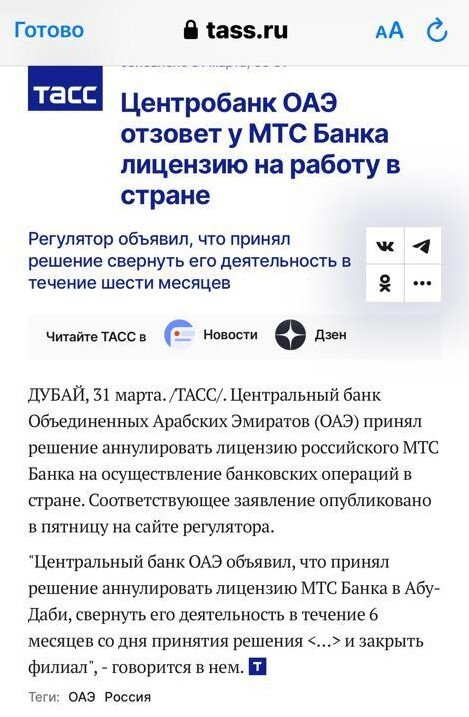

Во-вторых, Сбербанк с февраля текущего года в тестовом режиме запустил продажу наличных дирхамов ОАЭ. Не трудно догадаться, что дирхам и юань имеют большие перспективы в российском банковском секторе. Впрочем…7 февраля стало известно о том, что попавший под санкции Сбербанк лишился «дочки» в ОАЭ после претензий США. У Sberinvest Middle East Limited со штаб-квартирой в Абу-Даби, которую «Сбер» презентовал в 2020 году, обещая создать лицензированное «исламское окно» и работать с экспортерами, с 6 февраля отозваны разрешения на все виды банковских услуг. О закрытии «дочки» стало известно через несколько дней после того, как ОАЭ посетила делегация чиновников Минфина США во главе замминистра финансов Брайаном Нельсоном, курирующим вопросы противодействия терроризму и финансовой разведки. Так что в мире эмиратско-российских финансов нас ждёт много интересного. Особенно в мире цифровых активов. Финансовая многополярность мира может стать явью, но США будут активно бороться за Бреттон-Вуд и контроль над мировым финансовым рынком. Точно будет много параллельного.

## Промышленность, инновации и технологии

При всём блеске небоскрёбов никаких очередей из инвесторов, желающих вложить свои капиталы в бизнес в ОАЭ, никогда не было. Шейхи проделали кропотливую работу по созданию собственной промышленности и бизнеса в целом, в том числе через создание СП с ведущими в своих секторах компаниями мира. Именно эмиратцы были их инициаторами, главными источниками финансирования и, в конце концов, основными бенефициарами. В результате они контролируют 75% капитала промышленных предприятий ОАЭ. Эмиратское чудо в целом и Дубайское, в частности, обеспечили не иностранные инвестиции, а местный капитал и целевые полугосударственные кредиты, в первую очередь от "родственного" эмирата Абу-Даби.

Одновременно с этим в Дубае появились собственная промышленность и национальный бизнес. Правительство Дубая выступило инвестором большинства заводов в своем эмирате, как и другие шейхи в своих. Строительство могли вести только компании, зарегистрированные в эмиратах — минимум на 51% в них принадлежали местным гражданам. Земля, на которой велось строительство, могла принадлежать исключительно гражданам ОАЭ или правительству эмиратов. Для обслуживания возводимых городов потребовались мощные электростанции, заводы по опреснению воды, фабрики по производству пищевых продуктов.

Стратегия шейхов полностью себя оправдала. За фасадом небоскребов и развлекательных центров скрывается одна из крупнейших в мире промышленных стран. Концерн Arkan — крупнейший в Западной Азии производитель стройматериалов, в том числе цемента и кирпичей (с общей производительностью 235 000 блоков в день), Emirates Global Aluminium — алюминиевых профилей и заготовок, концерн Ducab — медных кабелей (пять заводов в ОАЭ), Emirates Steel Industries (ESI) — стали, химзавод Borouge — полиолефинов. Компания Al Foah — крупнейший в мире производитель экологических фиников. Группа Agthia крупнейший производитель и экспортер продуктов питания в странах Совета Персидского Залива.

ОАЭ быстро развивают аэрокосмическую и оборонную промышленность, например, Strata Manufacturing PJSC (STRATA) производит детали для самолетов Airbus, Boeing и ATR. Поэтому дубайская программа Марс 2117 — это не безумный проект, а бизнес-проект, имеющий чёткую дорожную карту. Если ты привык выживать в пустыне при 55 градусах, то почему бы не попробовать минус 153 градуса? 6 декабря 2017 года шейх Мохаммед объявил о создании первого города на земле, имитирующего климатические условия соседней планеты. Проект имеет долгосрочную цель — создать на Марсе населённый и устойчивый город. Амбициозно? Да, но реалистично. А мы со дня на день ждём космонавта ОАЭ на МКС.

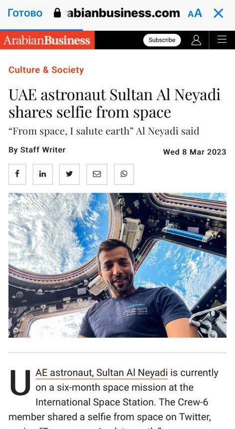

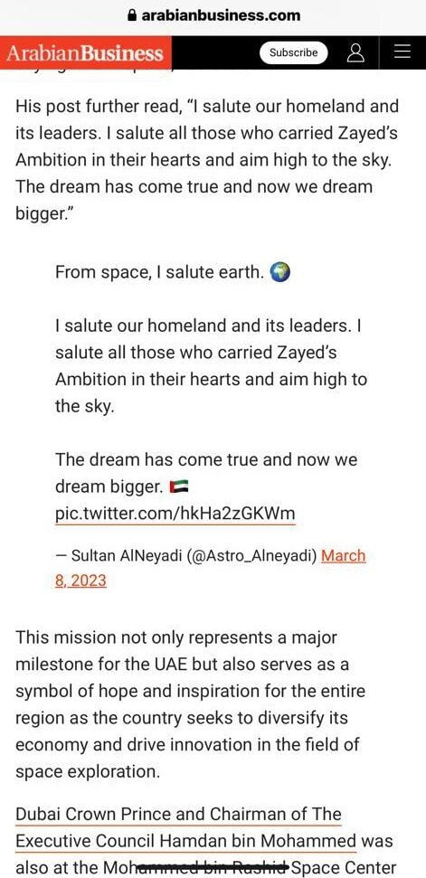

Дубай, кроме всего прочего, — это город ИТ-технологий. Самая яркая его звезда — это, конечно, Павел Дуров. Павел в прошлом году был признан самым влиятельным предпринимателем и ГРАЖДАНИНОМ Дубая. Как много интересного в свете текущих событий может быть у ныне второго мессенджера планеты. И в свете несостоявшегося крипто-проекта TON и в с о точки зрения IPO и в перспективе отвязки от американских маркетов. Большая игра ИТ-гигантов продолжается.

## Принципы и правила Дубая

Много параллелей у нас с ОАЭ и Дубаем, но есть важная перпендикулярность. Мир, безопасность, прозорливость в формировании альянсов и опора на сограждан. Многие поколения монархов-собственников выковали систему ценностей, на которых базируется сегодняшний экономический успех эмирата. Важнейшим уроком лидерства шейх Мохаммед считает слова отца о том, что «Современные лидеры —это тихие гиганты, владеющие средствами, а не политики, устраивающие вокруг себя шумиху.»

> Концентрация на экономике и избежание конфликтов — вот главная философия Дубая.

Время покажет, станет ли мегаполис Дубай вторым домом, малой родиной для сотни тысяч россиян. Исход, иммиграция, бег, релокация, кочевая жизнь. Всё это уже бывало много раз в российской истории. Риски для жизни и бизнеса в чужой монархической стране безусловно остаются. Но сегодня это действительно дружественная территория с дружественными людьми.

Одной из моих самых любимых автобиографий предпринимателей является книга «Принципы» Рэя Далио. «Моя история» Шейха, миллиардера и выдающегося предпринимателя Мохаммеда ибн Рашида аль Мактума заканчивается 10 правилами лидерства. Точнее, это 10 десять самых важных правил государственного управления от монарха Дубая. Многие из них знакомы из классического менеджмента и менеджмента качества, но тем они интереснее.

Вот они заветы собственника и выдающегося предпринимателя:

- Правило 1. Служите людям. Цель государственного управления — служить обществу, а роль государственных процедур, систем и законов —служить человеку.
- Правило 2. Не делайте из позиции культа. Работа, должности и обязанности — всё это временное. Ваша истинная ценность заключается в той работе, которую вы сделали, и ваших достижениях.
- Правило 3. Разработайте ваш план. Когда у вас нет плана — вы настраиваете себя на провал.
- Правило 4. Контролируйте себя. Контролируйте эффективность организации.
- Правило 5. Создайте свою команду. Вы не можете парить в одиночестве. Одна рука не может хлопать.
- Правило 6. Внедряйте инновации или уходите.
- Правило 7. Общайтесь и будьте оптимистом. Всегда общайтесь с общественностью, сообществом и СМИ. Создайте свой имидж и репутацию и расскажите миру о своих амбициях и навыках. Относитесь к СМИ как к своим друзьям, а не к своим врагам — они друзья для динамичного честного победителя и враги для коррумпированных, изворотливых и ленивых.
- Правило 8. Конкурируйте. Конкурируйте со своим прошлым, чтобы построить лучшее будущее. Стремитесь к первому месту на местном и международном уровне. Конкурируйте сами с собой и с другими.
- Правило 9. Создавайте лидеров. Когда вы создаёте лидеров — вы создаёте будущее. Создание лидеров — это секрет, который дан лишь тем, кто преодолел собственное эго и понимает, что их величайшим достижением является создание людей, а не зданий.
- Правило 10. Двигайтесь вперёд и живите осмысленной жизнью.
- Да дарует Господь мне и вам способности служить стране и ее народу.
- Это только начало.Мохаммед ибн Рашид аль Мактум.