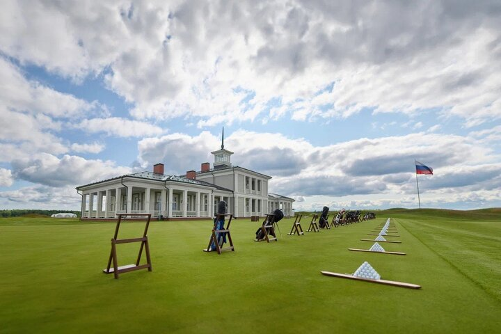
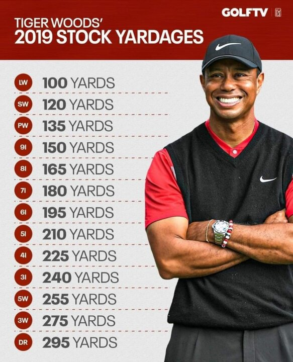
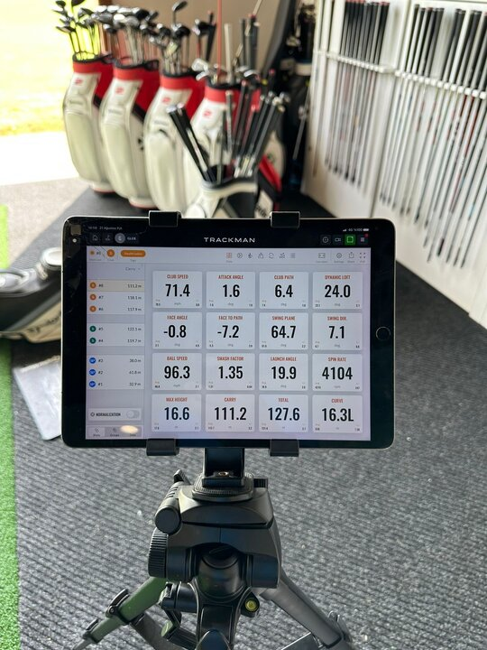

---
title: Гольф как путь саморазвития
description: Статья про саморазвитие через гольф
slug: golf-kak-put
date: 2023-08-29 00:00:00+0000
image: image-1.jpg
categories:
    - Бизнес
    - Жизнь
    - Спорт
tags:
    - Бизнес
    - Статья
    - Спорт
weight: 1       
--- 

> Дорогие друзья, этот текст для начинающих спортсменов, а также их родителей. Задача этого документа ­­– показать, как навыки и умения в области игры в гольф могут быть полезны для развития управленческих компетентностей и предпринимательского вещества.

Сегодня на планете более 70 миллионов играющих в гольф. До того, как гольф стал олимпийским видом спорта, он покорил и шотландских пастухов, и английских аристократов. Сегодня активно развивается в странах глобального Востока и Юга. Эта игра очень давно перестала быть увлечением избранных, но сохранила многие черты элитарности. Почему же в гольф играют успешные люди?

1.Причин будет много:

1.1. Воздух. Игра ведётся на свежем воздухе. В любую погоду кроме грозы.

1.2. Движение. За один раунд игры в 18 лунок игрок проходит в среднем 15 тысяч шагов.

1.3. Демократичность. Правила игры, в частности разная длина поля для игроков в зависимости от уровня и игра в формате stable fort позволяет на равных сражаться за призы и новичкам, и сеньорам, и серьёзным спортсменам. А это всегда здорово - что-то выигрывать.

1.4. Net working. Давно замечено, что важным источником умственной энергии являются контакты с равносущностными людьми. Особая организация Клубных домов и концепция «19 лунки» - торжественное завершение турнира, идеально подходят для установления неформальных отношений. Психологи давно заметили, что 5 часов, проведённых вместе, сближают людей. Гольф-раунд — это как раз пять часов, и опытному игроку после игры очень многое понятно о коллегах по флайту.

1.5. Социальный лифт. Для молодых игроков важно добиться внимания потенциальных спонсоров. Институт caddy, т.е. помощников игроков, важен для молодёжи, мечтающей о карьере. И таких примеров множество. Рэй Далио, один самых выдающихся инвесторов современности, начал свою карьеру в возрасте 12 лет, когда желание иметь достаточно карманных денег побудило его работать в качестве кэдди. Игроки, с которыми он работал, часто обсуждали торговлю акциями, поэтому он начал инвестировать. Одна из его удачных сделок заключалась в покупке акций Northeast Airlines на $300, и эта сумма утроилась, когда авиакомпания слилась с другой.

1.6. Большие деньги. Гольф игроки мирового уровня после появления LIV golfзарабатывают больше своих коллег из других видов спорта. Тайгер Вудс за свою карьеру заработал $2,5 млрд и уступает только Майклу Джордану. В 2022 году первая десятка гольфистов заработала от 138 до 35 млн долларов. Замечу, что кедди получают 10% от призовых игрока.

1.7. Отличная работа. Хороший спортсмен может стать Golf Pro. Для этого нужно играть на уровне 3 удара больше пара и пройти обучение в специальном PGA центре со сдачей тестов по важным аспектам игры. И поверьте, что это проще, чем стать мастером спорта. В России всего 10 тысяч игроков в гольф, а для сравнения в США — 25 миллионов. Очевидно, что нам есть, куда расти.

1.8. Доступность. Простые сеты (комплекты) клюшек стоят недорого и существует приличный рынок б/у оборудования. В результате приличный сет для игрока уровня 1 взрослого разряда можно купить по цене профессиональной ракетки для тенниса. В России появились бесплатные спортивные секции при гольф-клубах и федерациях, где для воспитанников игра становится бесплатной. В средних европейских и российских клубах годовое членство составляет около 100т рублей — и играй до упаду. Не будем забывать, что сам Тайгер Вудс начинал с того, что много часов бил по мячу с коврика в сетку в отцовском гараже.

1.9. Комфорт. В отличие от контактных видов спорта при соблюдении правил безопасности вам и вашему здоровью ничего не угрожает.

1.10. Это спорт. Гольф — это технически сложная игра с мячом. Игроки способны придавать мячу вращение до 10000 оборотов в минуту и скорость в 270 км/час. Игра высших достижений требует не только выдающихся физических кондиций, но и безусловно интеллектуального, психологического совершенства. В гольфе много драйва и удачи. И ещё шоу. Современный гольф — про красивые фото и видео.

1.11. Да, это красиво. The last but not the least. Прекрасна эстетика клюшек, одежды и ударов. Удар в гольфе — это очень сложное и гармоничное волновое движение. И эта красота в гармонии с природой. Гольф-поле вне зависимости от своего типа — всегда произведение архитектуры и ландшафтного дизайна. Одно из главных полей мира Masters Georgia USA — это вообще ботанический сад, где каждая лунка носит название кого-либо уникального дерева, произрастающего на ней.

Теперь немного о параллелях с бизнесом. Образно говоря, поле — это рынок. Клюшки, мяч, тележка, бэг и прочее — это основные средства и один из видов ресурса. Ваше тело и мозг ­— это тоже основные средства. Игра ­— это денежная ставка или инвестиция. И в соответствии с теорией игр — это чистая и сложная экономика. Удар — это ввод мяча или товара на рынок. Удары соперников — это действия конкурентов. Стандартная, аккуратная игра — это консервативный бизнес. Рискованный удар на максимальную дальность — это рискованный маркетинговый ход, например резкое снижение цены в расчёте на нелинейный рост продаж. Или неудачная игра на фондовом рынке с плечом. Попадание в бункер — это hazard, т.е. получение штрафа, убытка. При этом если это второй удар на пар пять, а бункер у грина, то вы имеете страховку и мало чем рискуете, а если четвёртый — то без. Подписали свою карточку с ошибкой – DQ, т.е. дисквалификация, которая является поражением по невнимательности, а, точнее, по безответственности в работе с важными документами. Устали, перегорели к концу раунда? Это означает, что вы не управляете ресурсами, как будто в магазин по ошибке доставили мало товара или у вас на смену не вышла часть сотрудников. Не успели размяться? Значит, не успели спланировать и организовать команду. И таких примеров может быть множество. В целом, карьера игрока — это и есть бизнес. Сначала долгие инвестиции, потом выход на точку безубыточности, а дальше если пойдут победы, то и выход на прибыль!

Какие качества нужны для победы в гольфе? В общем то же самое, что и в других видах спорта. И я отсылаю вас к своему лонгриду [«Спорт — тренажёр предпринимателя»](https://oleg-ponomarev.ru/p/sport-trenazhyor-predprinimatelya/). Если кратко, то по моему мнению, нам для успеха нужны 5 главных сил: _точность, воля, любознательность, ответственность и инстинкт победителя_.
Не все станут чемпионами, но все могут использовать гольф для личного роста. Что же развивает вдумчивая, но именно интеллектуальная игра в гольф? Очевидно, что гольф развивает много профессиональных навыков работы руками или hard skills, но я уверен, что, кроме этого, гольф — это ещё и тренажёр мягких навыков. В частности, спортсмену необходим развитый self-management — популярное ныне направление в модных soft skills. В открытых источниках вы легко найдёте определение: Self-менеджмент – это навыки самоуправления, наличие которых показывает, что вы умеете организовать себя, брать на себя ответственность за свои действия и делать все, что от вас зависит, для достижения целей и результатов, которых желаете. Проще говоря, это способность быть директором для самого себя. И состоит эта способность из группы вспомогательных навыков.

_А. Умение ставить цели и планировать_. Чтобы чего-то достичь, нужно, в первую очередь, понимать, чего конкретно ты хочешь. При этом желания должны быть не просто абстрактными «хотелками», а конкретными результатами с конкретными характеристиками. Целеполагание – это основа прогресса человека. А чтобы достигать желаемого, необходимо учиться планировать. Сюда входит и планирование самой цели, и планирование собственного времени и дел. Гандикап, рейтинг и другие KPI (ключевые индикаторы эффективности) вам в помощь.

_Б. Умение управлять временем._ Ничего не получится достичь, если разбазаривать свое время направо и налево, не придавая ему никакой ценности. Но время – как раз-таки один из самых ценных ресурсов, которые у нас есть. И научившись правильно его распределять, вы научитесь не только умело расходовать остальные свои ресурсы (средства, силы, здоровье и т.д.), но и получите возможность уделять внимание всему, что вам хочется: работе, спорту, друзьям, отношениям. В спортивном гольфе, как и в школе — нельзя оставаться на второй и третий год в одном и том же классе. А в физкультурном гольфе часто наоборот.

_В. Умение управлять стрессом._ Наша жизнь невозможна без стресса, и его мы испытываем ежедневно. Но если иногда он почти незаметен для нас, то порой он способен выбить из колеи и заставить впасть в апатию или депрессию. Поэтому вы должны научиться управлять стрессом и развивать в себе стрессоустойчивость, для чего подходят такие практики, как медитация, релаксация, переключение внимания и, конечно же, соблюдение режима и ведение здорового образа жизни. Удар - концентрация, переход до лунки - расслабление. Ошибки в турнирах неизбежны и умение собираться после них — неотъемлемая часть психологии победителя.

_Г. Умение мотивировать себя._ Гольф, как и любой другой спорт, это «10000 часов тренировок». Труд. Далеко не каждый способен подарить себе «волшебный пендель», когда так и хочется бросить всё и забыться наркотическом скроллинге в смартфоне. Но лидер тем и отличается от слабака, что в нужный момент умеет взять себя в руки, собраться, вспомнить о целях и собственной миссии, и продолжить идти к намеченному. Именно самомотивация помогла и продолжает помогать людям становиться чемпионами, «сворачивать горы» и делать то, что другим не под силу.

_Д. Умение быть гибким и адаптивным, оставаясь индивидуальностью._ И, конечно же, сегодня никуда без умения адаптироваться к изменчивым условиям внешнего мира. Сейчас все меняется с невероятной скоростью, и эти перемены влияют на наши планы и действия. Вы должны уметь «быть водой», т.е. плавно продолжать свое движение, подстраиваться под извилистое русло жизни. К вершине есть много разных путей и техник восхождения. Недавняя победа на The Open 2023 Брайана Хармана игрока со 148 по дальности ударом драйвером среди игроков мейджоров прямое тому подтверждение. И, кстати говоря, развитие конкретно этого качества поможет вам лучше развить все остальные.

Итак, что конкретно развивает гольф?

2.1. Физическую форму. Игра ведётся двумя руками, что позволяет гармонично развивать обе руки. В гольф-ударе, согласно современным исследованиям, задействованы все группы мышц. Техника удара (swing) сложна и включает множество параметров: стойка, развесовка, хват, замах, скорость, контакт, релиз. На высокой скорости — это серьёзная нагрузка.

2.2. Память. Гольф требует усидчивости, внимательности и хорошей памяти. Помнить в мелких деталях рельефа поля длиной 6 км — это прям непростая задача. Игрок обычно помнит все свои удары, а их 70-90.

2.3. Работа с безопасностью. Гольф — это зона повышенной опасности, поэтому без строгого соблюдения правил и выработки навыков предосторожности обойтись невозможно.

2.4. Законопослушность. Прежде всего, это правила гольфа. Правила весьма мудрёны и являются неотъемлемой частью игры. Правила касаются не только учёта и техники игры, но и этики.

2.5. Обучаемость. В гольфе придётся много учиться, спрашивать и узнавать. «Ведь признаться в незнании - одно из лучших и вернейших доказательств наличия ума» говорил Мишель Монтень. И много последовательно узнавать в работе с тренерами и разнообразными источниками информации. Критическое мышление необходимо для оценки как собственного движения, так и результатов. А объективный видеоконтроль — это возможность посмотреть на бизнес-процесс со стороны. Декомпозиция удара (swing) — это глубокий анализ альтернативных вариантов комплексных переменных, потому что изменение хоть одного из параметров неизбежно ведёт к изменению других. А это - физика, математика, геометрия, биология, биомеханика, сопротивление материалов и много других научных дисциплин. Любая наука — это изучение закономерностей. Гольф-мяч весом 45,93гр и размером 42,67мм обязательно упадёт на землю в соответствии с законом Всемирного тяготения и выбьет ямку (дивот) в зависимости от плотности поверхности и угла падения.

2.6. Аналитическое и мышление. Современный гольф — это большая работа с тренажёрами и симуляторами, потому что при контакте клюшка придаёт мячу разнообразные векторы энергии и вращения. Высота и скорость влияют на дальность полёта, а тип траектории и вращения — на направление и дальность проката после контакта с землёй. Сама по себе игра — это непрерывная аналитическая работа с базами данных. Каждый игрок знает наизусть свою дальность полёта по воздуху (carry) каждой клюшкой в штилевых условиях и рассчитывает c определённой аппроксимацией погодно-рельефный прогноз total distance. Выбор клюшки напрямую зависит от стратегии прохождения турнира, тактики игры на поле (course management) и подлежит непрерывному уточнению в зависимости от точности предыдущего удара. При этом в расчёт принимается множество переменных. Место нахождения мяча, рельеф, жёсткость и высота травы, метеоусловия: атмосферное давление, точка росы, ветер, влажность и т.д. Добавлю, что только ветер анализируется в динамике по множеству параметров: направление, курс и динамика смены направления, сила у поверхности и на 20 метрах, порывы, влияние термического нагрева, ветровая тень на разных лунках и т.д. Целая наука.

2.7. Управление ресурсами. Где есть собственные параметры, такие как: выносливость, стрессоустойчивость, внимание, концентрация, расслабление. А есть внешние, например, зарядка тележки, дальномера, наличие дождевой одежды, воды, спортивного питания и пр.

2.8. Самоконтроль. Здесь и работа с самочувствием, и прогнозирование. собственного состояния (например, антигистамины), анализ своих результатов и соблюдение режима дня и питания, и забота об инвентаре.

2.9. Уважение к чужому труду. Гринкипер — это человек, а, точнее, большая команда людей, которые создают и содержат сложный природный ландшафт. Заделывание бункеров, дивотов ­— это не только правила этикета, но и уважение к другим игрокам, гринкиперам, полю, клубу, которое, кстати, прекрасно иллюстрирует уважение игрока к себе самому.

2.10. Перфекционизм. Гольф — это спорт высших достижений, и выигрывать — это смысл любой игры. Гандикап — это аналог привычных нам спортивных разрядов. Но в гольфе ещё есть серьёзные призы, деньги и карьера спортсмена и тренера.

2.11. Много полезной и увлекательной информации на английском языке. Гольф — прекрасная возможность улучшить знание главного языка международного общения.

2.12. Открытие природы. Туман над водой, облака, дожди, закаты, птицы, звери и мошкара — всё это с нами на поле. Игроки часто гладят грины руками и разговаривают с полем. Это хорошо, это вселенная гольфа.

Очевидно, что хорошая физическая форма спортсмена — прямое следствие активных тренировок, но гораздо важнее то, что сложность и размеренность игры способствует развитию ментальных способностей. Анализируя влияние гольфа, я пришёл к выводу, что гольф способствует развитию всех 4 видов интеллекта/способностей. Лучше всего это знание раскрыл «коуч всех коучей» — Стивен Кови:

А. Физический интеллект (PQ).
PQ - это дисциплина, последовательность, реалистичность, компетентность, решительность.

Б. Ментальный интеллект (IQ).
IQ - человек с этим типом интеллекта идеалист, верит в людей, дальновидный мечтатель, неординарный, оптимистичный стратег, добивается поставленных целей.

В. Эмоциональный интеллект (EQ).
EQ-человек это мужественный оптимист, сопереживающий, влиятельный, побуждающий, имеющий чувство юмора.

Г. Духовный интеллект (SQ).
SQ-человек это мудрый, высоконравственный, ответственный, справедливый, разносторонний, ориентированный на общее дело.

В заключении процитирую Кови и скажу, что каждый спортсмен должен обрести свой уникальный «голос человека, связанный с талантом (вашими природными способностями и сильными сторонами), страстью (тем, что, как правило, придает вам силы, стимулирует, мотивирует и вдохновляет), потребностью (включая то, в чем окружающий мир нуждается достаточно, чтобы заплатить вам за это) и совестью (тем тихим, приглушенным голосом, который говорит вам, что правильно, а что нет, и побуждает вас к тем или иным действиям). Свой голос — свое призвание, кодекс своей души — можно обрести, занимаясь такой работой (в профессиональной среде, обществе или семье), которая раскрывает ваш талант и разжигает в вас страсть, — работой, связанной с существованием в окружающем вас мире какой-либо значительной потребности, к удовлетворению которой подталкивает вас ваша совесть. Так пусть этой страстью будет гольф.