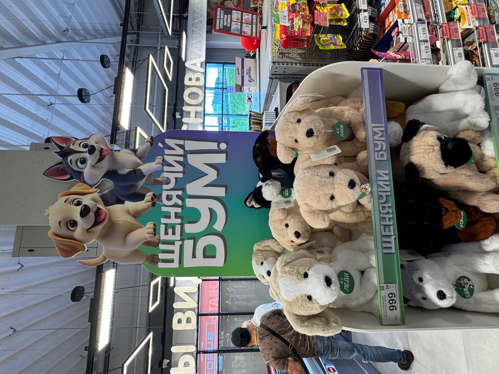
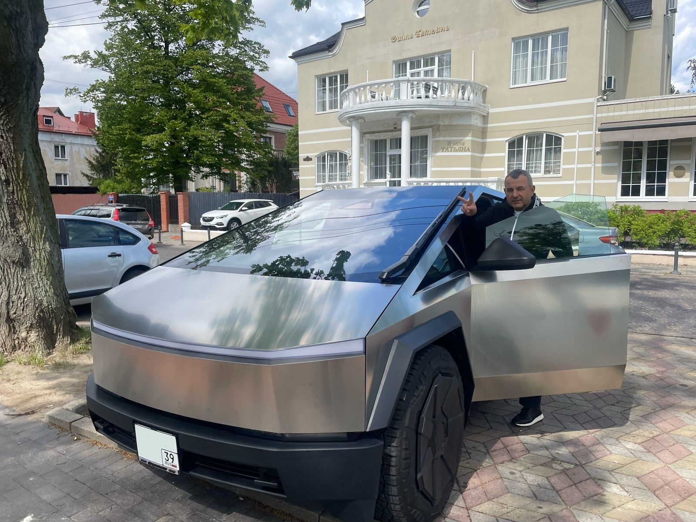
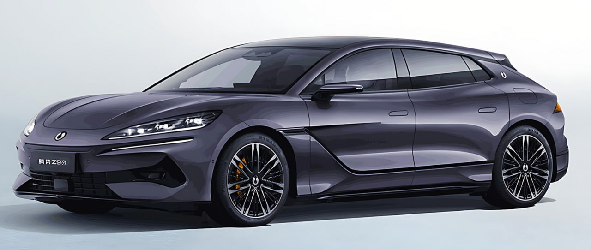
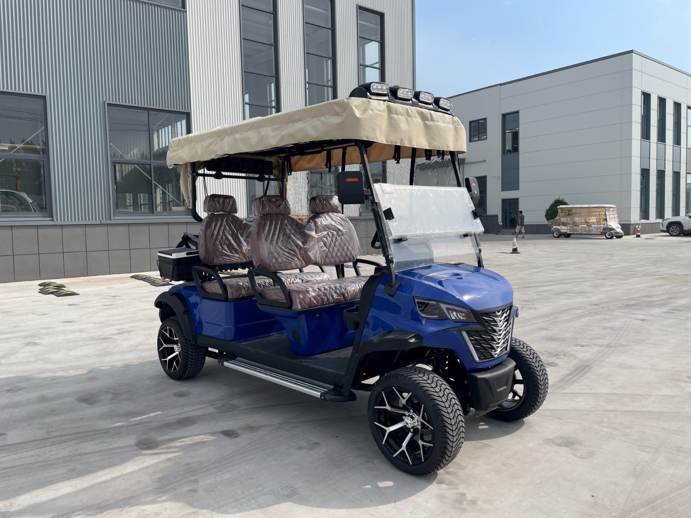
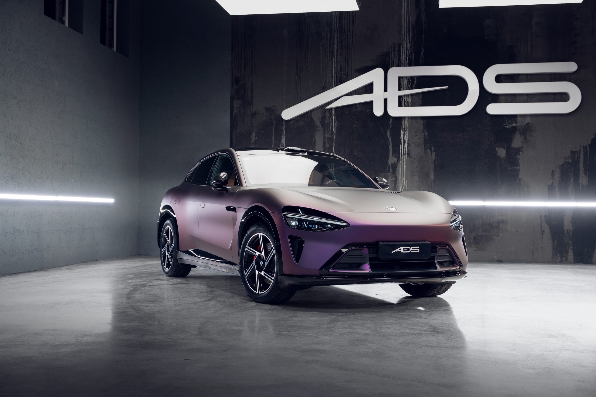

---
title: Машины, Стратагемы и игрушки в 2025. 
description: 
slug: igrushki
date: 2026-04-10 00:00:00+0000
image: 2.jpg
categories:
    - Бизнес
    - Жизнь
tags:
    - Бизнес
    - Статья
weight: 1       
--- 

Август 2025. Мы всем семейством целое лето на гольф-даче в МиллКрике. Играем, учимся, я работаю дистанционно. В «Спаре» как раз с большим успехом начали большую акцию лояльности «Щенячий бум». В центре акции восемь милых собачек made in China. Акция повторяет традиционные решения крупных западных маркетинговых компаний типа TCC. Собачки, фишки, товары-спонсоры. Но наша команда реализовала не только полное импортозамещение, но и собрала фиджитал маркетинг нового уровня. 

## Игрушки. 

Топы сети - главный маркетолог, Павел Голубев, и коммерческий директор, Владимир Ракицкий, слетали в Китай и выбрали производителя собачек, который не только имеют правильные цены, но и «не линяют и не пахнут химией». Дизайн зверушек ребята сгенерили в ИИшке на основе текущих восприятий ЦА 3-13 лет, но долго искали компромиссы, чтобы наши Лаки и Бони понравились всем. Закупили целый контейнер, и он за несколько месяцев добрался до Кд. Механика акции включала в себя продажу за 999р в деньги или за 1р при условии сбора полного буклета фишек. Фишки, естественно, выдавались за покупки в магазине. Для продвижения акции в «Клубе друзей» создали игру с собачками и даже фотобудку с ИИшкой внутри. 

Эта самая нейронка внутри была американской, и генерация оплачивалась с моей киргизской карты:)  Мимимишные собачки и их хозяева получались очень милые. В результате полный контейнер собак разошёлся за акцию и даже не хватило. При этом продаж за полную стоимость при себестоимости 490р было так много, что удалось почти вернуть закупочную стоимость. Но главное — это высокая привязка (retention) и бэкмаржа от поставщиков за попадание в список товаров-спонсоров. Прямой экономический эффект оказался рекордным среди аналогов. Большой успех мощной фиджитал акции. Прям молодцы! Нам опять выдали профильные награды за лучшую акцию в розничной лояльности в стране. Игрушки делают деньги и настроение. Экономика впечатлений.

Тем временем в мире много интересного. Трамп с Путиным на Аляске сгенерили «дух Анкориджа». Америка похоже начинает менять к нам отношение. Блокировка Китая? Обмен стратегических зон влияния? Сливаем Венесуэлу и Кубу, а получаем карт-бланш по Украине? Пока на словах какая-то «Перезагрузка 2.0, но лиха беда начало. Я за годы СВО уже написал две или три заметки о китайских автомобилях. Начинал я с размышлений о электромобилях и когда-то мечтал купить супербыстрый Tesla Plaid. 

## Тесла. 

Вот уже 10 лет Tesla является эталонным электромобилем. Первый большой серийный бренд электричек. Символ наступающего нового автомобильного времени. С нескрываемым любопытством я жду это время и готовлюсь к нему.  Несколько раз мне удалось познакомиться с этими машинами. Я катался на Тесле у друга в Майами, тестил Model Y и Model S, и даже Cyber Truck моего друга в Калининграде.

Каждый раз Tesla оставляла какое-то странное ощущение. Безусловно тишина и абсолютное ускорение дают то особенное ощущение телепортации, которые трудно встретить в обычном машине, но аскетизм внутреннего убранства и вот это ощущение несерьезности автомобиля меня никак не покидает в Tesla. Планшет на колёсах? Брутальный Кибер удивляет стальным кузовом, размерами и потрясает разгоном, но ощущением как в анекдоте про «верблюдов с горбами в зоопарке» - зачем весь этот «тюнинг в городском зоопарке»?

## Потребительский патриотизм и Китай. 

За последние три года у меня утвердилось твёрдое понимание, что неправильно, а, точнее, непатриотично покупать сегодня «недружественные» европейские машины. Также как и неправильно избавляться от честных немцев, купленных до войны. Запишем их как делали наши деды в «трофейные». Да, у меня есть и возможность купить любую машину, но не хочу экономически помогать тем, кто вводит против нас санкции и угрожает блокадой Калининграду. Будем «донашивать» довоенных немцев, но новые деньги — дружественным китайцам. Да, на удачу китайцы в 2025 стали прям удивительно интересны.

Очевидно, что соотношению цена-качество большие китайские бренды давно обогнали именитых конкурентов, но достаточно долго все эти Черри и Джили оставались только в низких рыночных сегментах. Потом началась массовая скупка технологий, перенос в Китай производства передовых автокомпонентов в попытке закрепиться на рынке Поднебесной и импорт ведущих автомобильных умов. Гениальная операция по импортозамещению длинной в двадцать лет по созданию самой передовой автомобильной индустрии мира.  Дракон накапливал умения и силы… И вот 2025 год стал ещё и годом, когда мне стало очевидно, что китайцы раскатали автомейджоров по ТТХ.

Гибриды и электрички. Простые и эффективные, но требующие других технологических решений сверху до низу. Очень интересно, когда, где и кем в Китае было принято прозорливое стратегическое решение не догонять европейцев в машинах ДВС, а объехать их на гибридах и электриках? Новый технологический уклад. Невидимая рука рынка или руководящая роль Компартии КНР? Похоже, что этот успех достигнут в синергии двух этих сил. Ведь без массового создания зарядного парка «на земле» и ввода новых генерирующих мощностей переход с жидкого топлива на электричество невозможен. Понятно, что и без целого кластера предприятий под комплексное развитие специализированных производств батарей и ПО ничто не поедет массово и не будет ключевого преимущества в цене. Вертикальная китайская интеграция позволяет добиться совершенно уникальных цен. А в борьбе за передел мирового рынка китайцы готовы на долго работать в ноль и даже в минус. Многотысячелетняя история Поднебесной знала разные примеры долгосрочных стратагем. Предпринимательская энергия, неограниченные ресурсы и плановая концентрация на прорывных технологиях.

Эх, когда же в России в автопроме хоть где-то начнётся эволюция! Топовые китайцы быстрее и интереснее и при этом дешевле в два-четыре раза. Китайцы начинали с пылесосов и плюшевых собак, а теперь делают не игрушки, а серьёзные вещи. Импортозамещение по-китайски привело не только к быстрому вытеснению западных марок с домашнего рынка, но и к началу конца господства европейцев и японцев на мировых рынках. Автомобильный мир похоже уже никогда не будет прежним.  

На днях посмотрел большое интервью главы «Автотора» Владимира Щербакова. Щербаков, конечно, глыба. История автопрома СССР. Детальный анализ китайского экономического чуда. Любопытно, что он не признал ошибочности стратегии «Автотора» на глубокую отвёртку. Крупнейшее контрактное производство — это было здорово, но вот СВО — и мы у разбитого корыта: производство упало в 8 раз. Полная зависимость от «новых технологических партнёров» и скрытая надежда на возвращение БМВ и Киа. Зато чётко дал понять, что китайцы избегают санкций и не хотят не инвестировать ни развивать производство в России. А ведь Щербаков был министром экономики СССР. Он создавал «Автоваз» и «Камаз». И что? Будет ли у нас когда-нибудь суверенный калининградский «Амберавто»? Стратегия «большое ателье индивидуального пошива»?  Не уверен, что это правильный путь к технологическому суверенитету. Двенадцать заводов в условиях санкций — это и правда крайне сложно. Хочется надеяться, что у «Автотора» всё получится.  А ведь смысловое значение автомобилей для оценки экономики трудно переоценить. Уровень жизни наш человек оценивает по состоянию полки супермаркета, а уровень развития промышленности по отечественному автомобилю. Точка. 

В целом поворот на восток получился крайне своевременным и полезным. Тридцать лет догоняющей модернизации по-западноевропейски создали новую экономику потребления и сделали Россию важным, но, как выяснилось, нелюбимым сырьевым придатком Западной Европы. Не может быть иллюзий — мы так и остались неоколонией для западников. Продавали сырьё и покупали готовую продукцию. Учились и старались жить по западным стандартам и лекалам. Нашли хороших партнёров и даже друзей, но для европейского истеблишмента ничего не изменилось… Спасибо нашим бывшим европейским партнёрам за науку, но СВО показало, кто есть кто. Мы — чужие. И в традиционной высокомерной попытке вернуть нас в нищету 90-х принудительно повернули на восток. Как удачно всё случилось. Разорванные экономические связи с Западом позволили осознать, что же на самом деле является технологическим суверенитетом и быстро адаптироваться к доступным экономичным и технологичным решениям. И с машинками тоже самое. Машины стали одной из первых жертв европейского самострела. Редкая экономическая тупость — ограничить россиянам покупки своих продуктов высоких переделов и себе запретить покупать сырьё.  Текущие проблемы европейского автопрома — это тоже эхо санкционной лихорадки. Да, брендинг и инженерное искусство прежнего технологического уклада ЕЩЁ за немцами, но технологии, скорость и цена УЖЕ за китайцами. Кажется, Сунь-цзы принадлежит стратагема: «Не стоит мешать противнику совершать ошибки».

## Трудности выбора. 

Итак, в этом году я решил, что «пора» пересаживаться на новые китайские машинки. После долгих размышлений решил взять китайскую версию любимой «Панамеры». Большая и очень бодрая (3,6 до сотни) Denza Z9GT. Дензу активно рекомендовали питерские и московские приятели. И вообще — это гибридное творение BYD и Мерседеса полностью отвечало моим ожиданиям драйва и комфорта. И я в феврале решил заказать машину в калининградском AutoHub. Не торгуясь, согласился на 9,3 млн и сразу оплатил. Заказал интересную комплектацию с одним только спецусловием: без второго холодильника в багажнике. Этот самый холодильник никак не укладывается в наш образ жизни с клюшками и тележками. 

В мае месяце, когда пришло время выкатывать машину, ребята стали мельтешить и «включать заднюю». Не люблю муть. Заметил особую манеру переговоров у многих молодых предпринимателей — они не говорят правду, а напускают туман. При этом парни не понимают, что мы видели таких болтунов и сразу понимаем, что с такими дело не сделаешь. Молодёжь, насмотревшаяся инфоцыган, просто не в адеквате. Жаль. Клиента развести можно только один раз.  Забрал деньги и передоговорился с Филом из Филмаша, который специализируется на электричках. При этом цена составила 8,2 млн. Припавший курс и более честное ценообразование позволили сэкономить миллион. Прошло два месяца и тут уже Филипп расписался в беспомощности: «китайцы отказываются производить спецкомплектацию, потому что сняли с конвейера машину из-за «затоварки». Не сложилось.

Как-то перегорел за 7 месяцев к Дензе. Задумался о своих текущих хотелках и потребностях. Понял, что, скорее, хочу быстрый электрокроссовер. Воскресная игрушка с постоянным полным приводом и нормальным клиренсом в 17см. Самый удобный формат машины для мужчины, который любит скорость и комфорт. И что же у нас есть среди интересных новинок? Выбор сделан. У Фила переоформил заказ на самую ожидаемую новинку Xiaomi Yu7 Max. Самая интересная машина на сегодняшний день! Китайская альтернатива электрическому «Кайену» в формфакторе Феррари Пуросанг. Есть правда нюанс… Народ шутит про «микроволновку на колёсах». А ведь я и правда никогда не сталкивался с продукцией компании «Сяоми». Что за компания?

## XIAOMI.

Лэй Цзюнь — это основатель компании Xiaomi, предприниматель. Родился 16 декабря 1969 года. После окончания школы он получил степень бакалавра в области информатики в Уханьском университете, окончив его в 1991 году. Как признавался Лэй Цзюнь, в этот вуз он поступил просто за компанию с друзьями. Настоящий интерес к технологиям появился у будущего изобретателя только тогда, когда в 1987 году ему в руки попала книга «Пожар в долине: история создания персональных компьютеров» (Fire in the Valley: The Making of The Personal Computer). Лэй становится менеджером, венчурным инвестором и фанатом передовых технологий. 

Здесь стоит сказать пару слов про саму компанию Xiaomi. Xiaomi Inc. была создана в Пекине в всего лишь в 2010 году восьмью партнерами. Логотип Mi — это аббревиатура словосочетания Mobile Internet («мобильный интернет»). Есть и еще одно значение — Mission impossible («миссия невыполнима»). Деятельность Xiaomi изначально строилась вокруг смартфонов и ПО. В дальнейшем компания занялась всеми товарами для дома, объединённых в «умный дом». Фокус компании в 2025 сместился и на создание интеллектуального оборудования на платформе интернета вещей (IoT). Реализация смартфонов составляет около 60% доходов Xiaomi, IoT и продукты для образа жизни — 25–30%, интернет-услуги — 10%.

Заявление основателя Xiaomi Group Лэя Цзюня о намерении создать дочернее автомобильное подразделение прозвучало в марте 2021 г. Официальной же датой образования компании Xiaomi Automobile Co., Ltd считается 1 сентября 2021 года. Через каких-то три с половиной года появился первенец — ХIAOMI SU7. Вопреки ожиданиям критиков технологический гигант Xiaomi вышел на автомобильный рынок не для теста. Это была полномасштабная, агрессивная атака. Компания изменила стратегию экосистемы «Человек х Автомобиль х Дом» (Human x Car x Home), где автомобиль — центральное интеллектуальное устройство. Вслед за седаном SU7, который бросил вызов Tesla Model S, компания нанесла «двойной удар», выпустив внедорожник YU7. Его цель — самый прибыльный сегмент рынка. Это не шаги стартапа, а «гигантские скачки» корпорации, которая выводит продукты на рынок с беспрецедентной скоростью

В июне 2025 года спорт-седан стал рекордсменом. Xiaomi SU7 Ultra установил рекорд на «Нюрбургринге» для серийных электромобилей, преодолев 20,8-километровую петлю «Зелёного ада» за 7 минут 04,957 секунды. Трехмоторный суперседан мощностью 1548 л.с. обошел Porsche Taycan Turbo GT и Rimac Nevera, став самым быстрым 4-дверным автомобилем в истории трассы

Xiaomi Auto использует собственные технологические разработки в сферах производства двигателей, емких электрических платформ, крупного литья под давлением, систем умного пилотирования, интеллектуального наполнения салонов. 

Если более подробно, то команда бренда производит на собственных заводах по собственным технологиям все ключевые элементы автомобиля. Это электродвигатели серий V6, V8s, электрические платформы напряжением 800V с батареями, обладающими показателем КПД 77,8%. Компания разработала масштабную кластерную систему Xiaomi Full Link для осуществления крупногабаритного литья под давлением, также здесь используется свой уникальный титановый сплав. Электромобили бренда оснащены системами Xiaomi Pilot Pro / Pilot Max. Машины интегрируют элементы, обеспечивающие надежное взаимодействие аппаратного и программного обеспечения.

Конструкция кузова. Роботизированное производство работает на собственных технологиях и даже собственных сплавах металлов. На «Международном конкурсе литья под давлением 2025 года» жюри отметило YU7 за интегрированную литую алюминиевую треугольную балку «20-в-1». Это ключевой элемент передней части автомобиля, который заменяет множество отдельных узлов и тем самым делает конструкцию одновременно крепче и легче. Важно понимать масштаб достижения: эту награду выдаёт Североамериканская ассоциация NADCA, крупнейшая профессиональная организация в отрасли литья под давлением. Компоненты проходят независимую техническую оценку — от прочности до качества интеграции. За награду здесь не платят, её можно только заслужить.

Вишенка на торте. Автором дизайна модели SU7 является Ли Тяньюань, трудившийся раньше над проектами BMW iX. Ещё одним бывшим автомобильным стилистом BMW, ныне работающим в творческой студии Xiaomi Auto, стал великий Крис Бэнгл. До поступления в китайскую команду он отвечал за эстетику моделей Rolls-Royce, MINI и BMW. За дизайн YU7 тоже отвечал Ли Тяньюань, но, как и в случае с SU7 (который прозвали «Mi-shijie» за сходство с Porsche Taycan), YU7 немедленно получил прозвище «Ferra-mi» (法拉米) из-за явного сходства с Ferrari Purosangue. Это не случайность, а стратегия «аспирационного дизайна»: Xiaomi привлёк к разработке дизайна Фабиана Шмольца из Lamborghini и Porsche, чтобы интегрировать «ДНК» люксовых брендов и быстро сформировать премиальный имидж. 

Да, а мой Макс — это всего лишь вторая модель компании в формфакторе SUV (sport utility vehicle). XIAOMI YU7 уже на старте установил несколько значимых рекордов, став одним из самых успешных электромобилей на рынке. Ключевые достижения включают ошеломляющий интерес: 200т предзаказов за 3 минуты. На начало 2026 года стандартная очередь на заказную комплектацию уже 50 недель. И ещё: рекордный суточный пробег (с зарядками, конечно) для электрокаров в 3944 км. Это бестселлер китайского авторынка в январе 2026 года.

## Стратегема историческая, плановая и корпоративная. 

Почему Сяоми решила на самом деле заняться машинами? По корпоративной легенде по тому, что, а вдруг перестанут продаваться смартфоны? Видимо реальный ответ прост — большой рынок. Огромный. Немцы ещё недавно экспортировали машин на 190 млрд. долларов США. И вот китайцы накопили сил и технологий и приняли решение атаковать мировых лидеров сначала дома в Китае, а при успехе и везде на планете. Повторюсь, что уверен в том, что это часть комплексной общестрановой стратегии борьбы за мировые рынки, а точнее — набор стратагем.

Стратагема (древнегреческое понятие στρατήγημα — «военная хитрость», некий алгоритм поведения, просчитанная последовательность действий, направленных на достижение скрытой цели или на решение какой-либо задачи с обязательным учётом психологии визави, его положения, обстановки и других особенностей ситуации. Традиционно выделяется 36 классических китайских стратагем. Есть ощущение, что плановая китайская экономика долго готовилась к атаке на мировые автомобильные рынки. 

Есть группа «Стратагем объединения сил для достижения преимущества». С китайского — Стратагемы объединённого и совместного боя. Ключевая идея — работа с союзниками (своими и чужими). Для ситуаций укрепления своего положения. Стратагемы направлены на внутреннее переустройство: как тайно подорвать силу противника, переманивая его союзников; как укрепить свою власть внутри коалиции; как демонстрацией силы заставить союзников противника усомниться в нём.

Китай долго производил игрушки для всего мира. Потом развивал вредные и химические производства, которые страны Запада выносили со своих зелёных территорий. Из вредных производств выросла, в частности, ведущая мировая спецификация на производстве аккумуляторов и переработка редкоземов. Долгие десятилетия китайцы использовали технологии европейских и американских технологических лидеров в своих целях. Вот ключевые стратегии, обеспечившие китайский триумф. А это точно абсолютный успех. Цифры неумолимы. В 2025 году мировой автомобильный экспорт демонстрирует доминирование Китая, достигшего рекорда в 8,3 млн проданных за рубеж машин (рост на 30%).

Первая китайская хитрость — «мы ваши надёжные, трудолюбивые и простые подрядчики в контрактном производстве. Не бойтесь нас и забудьте вашу матрицу 5 сил конкуренции Майкла Портера. Стратагемы: «изображать дурака» и «прятать нож за улыбкой».

Вторая хитрость — «если вы хотите полноценное производство и доступ к 1,5 миллиардному рынку, то создавайте СП с китайской компанией 49/51 в пользу китайского партнёра. Стратагема «заманить на крышу и убрать лестницу».

Третья хитрость — по мере появления собственной автомобильной промышленности китайцы начали перекупать через модель многократного роста вознаграждения ведущих европейских инженеров и дизайнеров. Стратагема «увести овцу лёгкой рукой». Воспользоваться стратегической слабостью конкурента и дёшево получить ключевые компетентности.

Четвёртая хитрость — скупать разорившиеся европейские бренды и марки чтобы прикинуться местными и купить интеллектуальную собственность, которая создавалась десятками лет. Так были куплены VOLVO, MG, LOTUS. Теперь под их шкурой уже собственные машины и большие линейки. VOLVO на глазах становится ZEEKR, LINK-CO, POLESTAR. А европейские заводы уже работают на сборку китайских компонентов. Стратагема «получить право на проход и напасть».

Пятая хитрость — пользуйся стратегическими ошибками и разладом. между своими клиентами и поставщиками. В условиях СВО на Украине, Иранского конфликта и общей игровой дестабилизации Китай сохраняет минимальную себестоимость сырья и энергии и тем самым достигает шоковой себестоимости машин по материалам и энергозатратам. И со всеми воющими между собой очень профицитно торгует. Гениально!  Стратагемы «наблюдать за огнём за рекой», «гнать, но не загонять в угол», «вытащить хворост из-под котла».

Ну и главное — это быстрое копирование и развитие передовой идеи, которая плохо продвигается на родине, но является стратегической целью в силу очевидного технологического превосходства. Идея и технологии машины будущего Илона Маска долго и тяжело пробивали себе дорогу на западных рынках, а плановая экономика Китая моментально создала эффективную и комплексную модель перехода на новый уклад. И производство машин, компонентов и инфраструктура зарядок — всё делается планово и долгосрочно. Чистая победа плановой экономики ещё в смысле чистого воздуха. По своему опыту помню, что 20 лет назад в Шанхае было невозможно дышать, а в 2025 году доля NEV — электрических и гибридных машин в Китае в продажах новых составила 59%.

Мультипликатором всего вышеперечисленного стала общее технологическое превосходство Китая в высоких переделах и знаниях. Мировая фабрика не только многофункциональна, но и выстроена в вертикально-интегрированные кластеры.

## Почему Yu7 Maх?

Сяоми — это технически понятная мне «Тесла». Смартфон на колёсах. Только с удивительными характеристиками и отличным качеством дизайна наружного и внутреннего. Настоящая машина 2025 года. Будущее сегодня. Но очень высокого качества, на новой технологической и инженерной платформе. Сделал тест-драйв Xiaomi SU7 летом в Питере и всё понял. Отличная машина для водителя и для «островного» Калининграда. При очень высоком комфорте и технологичности это ещё и машинка, которая превосходит по всем основным характеристикам прямые немецкие аналоги от BMW и MB. А вот и как раз подоспела новинка от BMW в дизайне neu Klasse с тем же решением head-up дисплея. И что же получилось у баварцев?

Прямо скажем, немцы проиграли. Макс больше и комфортнее не только новой электрической IX3, но и эталонных для этого класса SUV БМВ Х6 и Порше Кайен. А ведь BMW IX3 был признан World Car of the year 2025.  Видимо помогло то, что скопировали у XIAOMI YU7 head-up Panoramic vision:) Разгон в 3,2 секунды для версии Макс — это быстрее, чем моя Панама Турбо. И только совсем новый Cayenne Electric 2025 стал быстрее. Однако за 1156 немецких электролошадок с разгоном в 2,5 секунд придётся выложить в ЕС более 165К евро, что получится раза в четыре больше в России. И да, скоро выйдет YU7 GT c 1000 лс, и это будет быстрее, чем топовый немец, но, по мне, это too much. Кроме этого, Кайен внешне мне нравится меньше, чем удивительная дизайн-компиляция от Сяоми. Можно долго спорить о заимствованиях у Феррари, Астон Мартин и Порше, но получилось красиво. Критерий прост: любуюсь. Всё как-то логично и органично — и внутри, и снаружи. Так всегда, то, что любишь — и смотреть, и присматриваться. 

## Экономика P2P. Новые дилеры. Машина «в мешке». 

С любопытством жду машинку. Особый колорит придаёт come back из больших и официальных салонов назад к частникам. Да, машины Сяоми не поставляются официально, поэтому это основной канал импорта. Несмотря на рекомендации друзей понимаю, что риски потери денег есть. Вроде парни приличные, но я знаю, что в бизнесе всё бывает не по плану. Даже без злого умысла. Новый прозрачный цифровой мир в движении. Disruption. P2P. Производитель-Потребитель. Просто агентская комиссия. Особенно иррациональным выглядит покупка машин, не глядя. Я так никогда не делал. Смотрел, щупал, тестил. Любил ждать рестайлинг, когда машина доведена «до ума». И вот — не глядя. Да, я видел и катался на Xiaomi SU7, но это новый опыт. Экономика впечатлений 2025. 

Сегодня 18 сентября. Начался мощный движ. Шесть дней назад авто журналисты раскопали, что Правительство приняло решение резко поднять утильсбор на новые импортные автомобили. Дело хорошее… Для бюджета плюс триллион в 2026 году и для национального автопрома. Впрочем, похоже, что Ладе не поможет, а вот в плане понуждения братьев-китайцев к локализации производства на нашей неавтомобильной родине может и прокатить. Однако мне как физику платить за машину на пару-тройку миллионов больше прям обидно. Никакого желания нет. И так возникли проблемы с Сяоми. Общий ажиотаж на эту машинку и редкость моего заказного тёмного синего цвета вынудила изменить решение по цвету. Перебрав «живые» наличные варианты мы с Филом остановились на серебре («ведро») с подходящим техно оранжевым салоном. Я подумал, что давно хотел матовую машину. И вот он тот самый случай порезвиться с плёнкой. 

Увы, но и с Филом случился грустный казус. Будучи уверенным в калининградском автотоварище (друг его рекомендован как правильного парня) я, передоговариваясь с Дензы на Ксю, не получил от него твёрдой цены, но на словах получалось, что цена будет до 7 миллионов. До инфы про новый утиль я ждал свою заказную комплектацию Макс. Тёмно-синий кузов, оранжевый салон, карбон, чёрные диски. Но история про утиль с 1 ноября подстегнула меня (не Фила, а меня) и я заторопил своего продавца. Берем любой нейтральный цвет под будущую оклейку плёнкой. Фил через пару суток нашёл. Берём. Согласовано, но…

Дальше началась до обидного знакомая, классическая история с дожиманием клиента на доверии. Фил попросил срочно добить до полной стоимости и прислал расчёт на 8,3 млн. Я прям поперхнулся. Это как? Фил начал рассказывать, что мол «курс рубля припал, да и пришлось брать машину дороже у перекупов». Я пытался парировать напоминая, что деньги он получил ещё в мае, скидывал ссылки на уже живые машины в России по цене от 7 до 8 миллионов, но Фил, активно имитируя дружбу и «клиентоориентированность», настаивал на своём. Зачем? Попытка развести на деньги — это ведь просто неуважение. Опять же только один раз может сработать.

Я взял паузу на пару дней и попросил москвича Пашу Табалаева срочно найти живую Ксю в нужной комплектации. Через сутки я получил видео похожей машинки и детальную смету на 7,4 млн, в которой комиссия агента составляла понятные четыреста тысяч рублей. Отправил этот расчёт Филу и предложил срочно вернуть деньги. Он начал выкручиваться, что, мол, он дорого выкупил, но уже тут я проявил твёрдость. Семь с половиной полная цена «под ключ» в Питере или money back. Со словами «сработаю в убыток» Фил с явным неудовольствием подписал новый договор и получил остаток оплаты наличными. Сказал, что расчёты с китайцами через крипту. Жаль, а ведь я ему доверял. Не люблю, когда меня держат «за богатого лоха» и пытаются «обвариться до волдырей». Теперь мы сухо переписываемся по поводу деталей допоборудования, которое непонятно где то ли ещё едет, то ли уже где-то хранится. Опять муть. А я тем временем выбираю темно-фиолетовую плёнку и чёрные двадцать первые диски. Машина же, со слов Фила, сегодня 4 октября стоит где-то в очень длинной очереди на китайско-казахской границе.

## Гольф-багги on demand. 

Попутно ещё один кейс B2C «на колёсах» про «новую экономику». Летом я решил, что нам в Питер нужен гольф-кар. В Японии мы оценили четырёхместные машинки автобусной компоновки. То, что нам надо. И в мае занялся поиском. Всё как обычно. Официальные салоны, Авито. Сформировал несколько сегментов. Смотрел, что есть в наличии и в пути. Готов был переплатить за готовую машину. Но простые Lvtong, как у нас в клубе, за миллион были не интересны, а топовые «европейские» (Китай под европейским шильдиком :) не очень заходили по дизайну и цене в районе трёх миллионов. В результате по визуальным характеристикам победила машинка с навороченным названием Kinghike Brand New Golf Car Model HKEV-GEL4. Начал её искать по знакомым. Гольф-Про из Геленджика сказал, что сможет продать нужную за 1,5 млн через пару недель. Дело было в начале июня. Похожую машинку нашёл и в Питере, но уже за 1,7 млн. Время шло, а «живых» машин нигде не было.

Сезон заканчивался. И тут вдруг точно такую же я увидел в клубе у наших соседей по МиллКрику в июле. По иронии судьбы это оказалась та же, что я ждал, но её продали подороже чем обещали мне. Russian business (снова молодые бизнесмены и снова грустно!). Сосед не стал делать тайны из этого подаренного ему транспорта и подкинул мне контакт китаянки экспортного менеджера завода-производителя. Девушка прислала инвойс с большой красной звездой и ссылку на оплату в рублях на физическое лицо с китайскими ФИО в Т-банке. Через месяц получил видео своей машинки в моей комплектации. В два приёма я платил аж 750.000 рублей и теперь с интересом жду коробку с частично разобранной с машинкой в Москве. 

Машинка после 3х-месячного трансграничного путешествия пришла в середине ноября в коробке объёмом 5,5 метров и весом 717 кг. Таможенная пошлина в размере $3,5 за кг была уплачена через того же неизвестного московского китайца. И вуаля — машинка доехала в МиллКрика за 25т усилиями московской логистической компании. Дальше несколько дней работы по сборке нашей эксплуатационной службой — и машинка поехала. Первым нашим семейным водителем стал Глеб, который не взирая на декабрьский снег навернул первые круги со светомузыкой по посёлку. Однако ура, друзья. 

## Тюнинг Сяоми Макс. Xiaomi YU7 Max. Innovation for everyone.

Тем временем возвращаемся к Максу или к Ю Ми (Сяоми или Шаоми Ю Семь Макс). Пока не понимаю, она или он это моё новое транспортное средство. Надо знакомиться лично. Фил реабилитировался. Машинка успела приехать до нового утиля. Хотя и без чёткого контроля дат и состояния. Я люблю ясность и точность. В итоге в конце ноября электрический Макс добрался до МиллКрика, встал на номера и попал в питерское тюнинг-ателье ADS. Я смог оценить машину в статике. Красавец (точно не девочка-машина).  Отсутствие ДВС, конечно, удивляет, но обкатка ещё впереди. А пока я занят экстерьером. Задача была закатать «ведро» в интересную плёнку. Бодрая машинка — яркая плёнка. Логично было использовать матовый серый, но я хочу яркой машине нарядную ливрею. Поэтому я выбрал современный хамелеон — фиолетовую полиуретановую европейскую плёнку.

Провёл тендер между детейлинговыми ателье. На этапе сметы цена в Питере была на 70т дешевле, чем в Кд, а в итоге после всяких допов по множеству глянцевых деталей и светотехники выросла на сто двадцать тысяч. Вежливо и с улыбкой развели на деньги. Грустно. Торговаться по финальной сумме, когда машина уже стоит разобранная, было поздновато, да и речь шла «по денежке чуть добавилось». Опять обидно. Но сделали хорошо и тем самым не испортили настроение. Цвет фиолетовой плёнки Ultra matte metallic pinot noir purple неожиданно оказался более изящным чем планировалось, но скорее фиолетово-баклажаново-сиреневый. Буду привыкать, но зато похоже, что он органичен с оранжевым салоном — это хорошо. Паром из Питера в Кд перенесли на 14 декабря, а это означает, что я увижу машину только в январе после возвращения из Америки. 

Макс. Я буду звать его Макс. Макс Ю Семь.

Первые впечатления после недели за рулём. Начнём с яркого. Из вау-эффектов, конечно же, 3D-проекционный дисплей. Это не просто красиво, а очень удобно. Тот случай, когда Китай сделал всех, и мне лично приятно и безопасно. У меня дальнозоркость и крошечные циферки на дисплее Хавала или Аватра прям сильно меня раздражают. Я вообще не понимаю, например, приложения, которые не позволяют выбрать большой шрифт. Они там не понимают, что у многих не идеальное зрение? Люди видят большие шрифты, но испытывают сложности с мелкими объектами. Так вот, отказавшись от традиционной приборной доски и сделав head-up во всю длину лобового стекла, конструкторы купили мою абсолютную лояльность. Ну и, конечно, зверёк (выдра?), который жмурится от удовольствия и испытывает боковые перегрузки, конечно же, достоин имени Макс. Так что и машинка тоже Макс. А я надеюсь, что дальнейшая кастомизация позволит мне купить аватарчик Лакки, и тогда это будет полное превращение стандартной машины в родную. Надо бы им написать! Может, ускорятся в белом или хотя бы «сером» открытии на РФ. Мы же — патриоты Сяоми и вообще передовой отряд тестировщиков и промоутеров. Официально главная технологическая «фишка» YU7 называется Xiaomi HyperVision Panoramic Display. Xiaomi стала первым в мире производителем, серийно выпустившим панорамный проекционный дисплей (P-HUD), без традиционного приборного щитка.  Огонь!

Из первого странного — дверные ручки. Полностью утопленные в двери они зимой пачкают руки, удивляют непосвящённых и вообще не очень… И вряд ли борьба за аэродинамику в данном случае оправдана. И на ямах постукивают амортизаторы или приводы. Странный звук. На форумах пишут, что это системный «косяк», который усиливается в мороз. Странные маленькие кнопки, например аварийки. Очевидно, маленькие и не серьёзные рычажки управления трансмиссией и светом. Понятно, что это тумблеры, но всё же не серьёзно. Не хватает бмвэшной основательности.

Временные неудобства. Огорчает неполный контроль за машиной. Мастер-эккаунт (МЭ) с приключениями, но повесили на специально купленный китайский (для Китая) смартфон Cяоми, но от этого пока мало толку. Хорошо, что разлочили спортивный режим. Самое грустное, то, что при минус десяти приходится мириться с прогревом «по старинке». Теперь мой совсем неофициальный дилер Фил предлагает впаять китайскую симку, чтобы запустить нормальную работу всех систем. Я думаю. А кроме этого, судя по переписке в профильных каналах довольно многочисленные владельцы Ю Ми активно ждут русификации, а точнее — пиратской перепрошивки заводского софта. Чем больше будет владельцев, тем вероятнее победа в этом деле. Ломать нельзя настроить! Где запятую ставить? Осторожный Китай осторожен (боится вторичных санкций). Топовые китайские бренды не спешат в РФ, но ведь Сяоми технику в России давно продаёт, так что будем верить. Но точно не быстро, но надеюсь, что дождёмся официального дилера…

Из классного. Высота посадки. Самая удобная. Не высокая и не низкая. В седане нужно приседать, а в высокий кроссовер залезать. Я долго думал про машину типа Audi All-road или типа низкий Порше Кайен. Здесь же всё идеально. Как и следовало ожидать тяжёлая электричка (2800кг), с низким центром тяжести, превосходно рулится. Что-то как раз есть от спортивных версий Ауди и БМВ — блогеры пишут, что подвеска прям оттуда родом. Жду тёплой погоды, чтобы активно потестировать.  Салон визуально и тактильно тоже отличный. Спортивный кокпит, похожий на AUDI 6RS. Очевидно, что в моей семёрке БМВ кожа более привычная и более солидная, дерево теплее, чем карбон, клавиши более солидные, колонки B&W играют глубже, но это уже про статус, а не про езду… БМВ и Порше — это уже old luxury, а Макс — это new sport-premium.

Март 2026. Из любопытного. Self-made тюнинг.  Докупил в онлайн-магазине Сяоми ароматизаторы, физические клавиши, эквалайзеры на центральный монитор (таки игрушка), подушечки. Доволен зимним расходом в 27,7 кВт. Салон, руль, карбон, панорама — всё гуд. Заказал летние 22х-дюймовые диски в чёрном глянце под цвет арок. Предвкушаю спортивный шик. 

Резюме «про ехать» в духе анекдота: «вам шашечки или ехать?». Мой автомобильный мир никогда не будет прежним. Удивительная по своим возможностям машина за сравнительно небольшие деньги. Помню, что думал в 2023 году про схожую игрушку LOTUS Eletre, но как раз очень большие деньги (20млн с лишним) меня и остановили. Спортивный кроссовер. Это, безусловно, новое слово в вождении. Аскетичный мир быстрой Теслы раскрасился новыми функциональными и тактильными цветами. Не только в амбьентной подсветке в цвет кузова, но в ощущениях в салоне. Новый полёт. Скрытая сила, тихое всемогущество. Дракон, готовый пикировать, рвать пространство и тихо плыть в городском потоке. Удивительная лёгкость движения. Гибкость и эластичность неподвластная ДВС. Мощность и ускорение, доступное лишь суперкарам. Теперь жду выходных, чтобы порезвиться с Максом. Кто бы мог подумать. Пришла в голову метафора: Макс — это реактивный самолёт. Неслучайно название кроссовера Xiaomi YU7 (где YU произносится как /ü/ или [y˥˩] образовано от китайского термина 御风而行, что переводится как «оседлав ветер». Браво, Xiaomi. Летим вместе!