---
title: Икигаи (生き甲斐 «смысл жизни») — японское понятие, означающее ощущение собственного предназначения в жизни.
description: 
slug: ikigai
date: 2025-04-14 00:00:00+0000
image: image-1.jpg
categories:
    - Бизнес
    - Жизнь
tags:
    - Бизнес
    - Статья
weight: 1       
--- 

Япония — безусловно, удивительная страна. Это островное государство с богатой историей, во многом неожиданно перекликающейся с российской. Периоды замкнутости и почвенничества здесь сменялись активными заимствованиями культурных и экономических моделей у соседей — особенно в Средние века. А в последние два столетия Япония стала активно импортировать западные, в том числе американские, социальные и экономические институты.

Особенно поражает, что всего 160 лет назад страна сохраняла средневековый уклад жизни и соответствующий уровень экономического развития.

После буржуазной революции 1868 года и реставрации Мэйдзи Япония, как и Российская империя, начала стремительную индустриализацию. Быстрый экономический рост подпитывал амбиции страны на доминирование в Дальневосточном регионе. Победы в русско-японской войне (Цусима, Порт-Артур) лишь усилили милитаристские и националистические тенденции. Подчинив Корею и часть Китая, к сожалению, Япония совершила тяжелейшие военные преступления в годы Второй мировой войны. Страна окончательно утратила связь с реальностью, напав на США без объявления войны — и в итоге потерпела сокрушительное поражение, капитулировав после атомных бомбардировок Хиросимы и Нагасаки.

**Ключевое отличие от России** заключается в том, что Япония, оставаясь под политическим и экономическим контролем США с 1945 года, сохраняет лояльность своему победителю. В её культуре множество американизмов: от языка до популярных видов спорта (бейсбол, гольф). Однако в семейном укладе, философии и духовных практиках японцы сумели сохранить свои многовековые традиции.

Россия же, главный победитель во Второй мировой, после 1991 года не только отказалась от советской идеологии, но и во многом утратила национальную идентичность. Фактически в результате крушения советского режима страна из лагеря первых моментально оказалась среди стран третьего мира по уровню жизни. За 30 лет страна заимствовала не только западные экономические модели, но и чуждые ей ценности. Сегодня, когда Россия переходит от прозападной парадигмы к поиску новых национальных смыслов, японский опыт становится крайне интересным для сравнительного анализа.

**Экономический парадокс Японии**

Несмотря на стереотипы о богатстве, сами японцы утверждают, что их страна уже давно небогата. Цифры подтверждают: Южная Корея обогнала Японию по уровню жизни, а Китай активно сокращает разрыв. При этом на бытовом уровне цены на товары и услуги здесь заметно ниже, чем в ОАЭ, США или ЕС. 

Экономическая история Японии в XX веке беспрецедентна — это уникальный пример взлёта, катастрофы и возрождения, который продолжает изучаться во всем мире.

**Технологии и экономика: взлёты и падения послевоенной Японии**

Впечатляющая технологическая революция, мировое лидерство в промышленности, богатейшая банковская система мира, «пузыри» в сфере недвижимости и их неизбежный крах, десятилетия деградации и дефляции, отсутствие безработицы, быстрое старение населения, высокоразвитое социальное государство – это вехи послевоенной истории Японии. И всё это на фоне ультрапатриотичной национальной элиты и самой продолжительной рабочей недели (67,5 часов) среди развитых стран.

После 1945 года Япония перестала быть империей, лишилась значительных территорий и превратилась в оккупированную зону под управлением американской военной администрации. США провели масштабные реформы, направленные на демилитаризацию и демократизацию японского общества. Знакомый сценарий? Однако с началом Холодной войны Вашингтон резко изменил курс: вчерашний враг (как и Германия) стал ключевым союзником у границ социалистического лагеря. Американцы не могли допустить, чтобы Япония превратилась в «коммунистический остров».

**От разрухи к экономическому чуду**

Прорыв из нищеты произошёл стремительно, но по классическому сценарию. Корейская война (1950–1953) стала катализатором экономического роста: японская промышленность работала на полную мощность, снабжая американскую армию. Военное кейнсианство вновь доказало свою эффективность — и снова мы видим исторические параллели с нашим настоящим. 

К 1985 году Япония, благодаря масштабным американским инвестициям, заимствованию передовых технологий, жёсткой протекционистской политике, превратилась во **вторую экономику мира**, обогнав Великобританию по ВВП на душу населения и вплотную приблизившись к США. Этот период вошёл в историю как **«японское экономическое чудо»** — эталон успеха в эпоху третьей промышленной революции. На пике темпы роста ВВП превышали 10% в год!

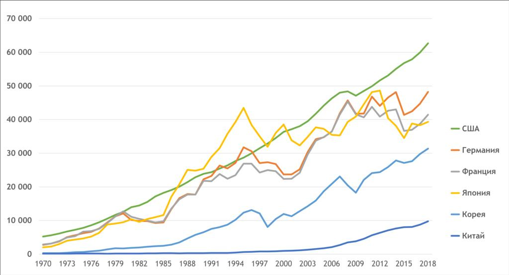

График 1. Изменение ВВП на душу населения, $ (Источник: https://data.worldbank.org).

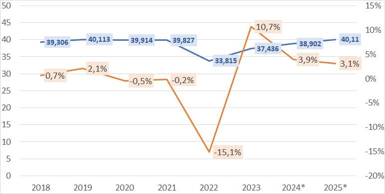

График 2. Изменение ВВП на душу населения, $ (Источник: Всемирный банк, МВФ).

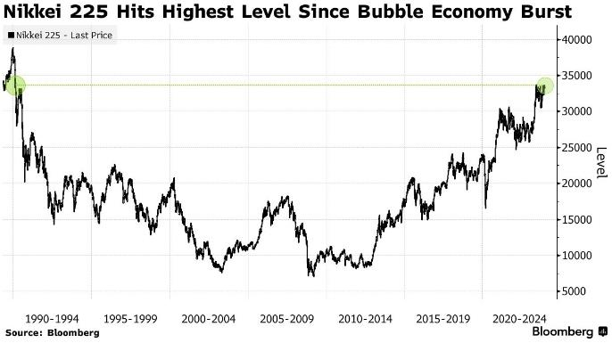

График 3. Динамика индекса Nikkei 225 1990-2024

Ключевые фазы индекса Nikkei 225:

 1. **Крах (1990-2003)**:
	- Потеря 80% стоимости
	- Дефляционная спираль
	- Банкротства банков (1997 кризис)

2. **Стагнация (2003-2012)**:
	- Вялый рост (+3-5% годовых)
	- Влияние глобального кризиса 2008
3. **Abenomics (2012-2020)**:
	- QE Банка Японии (80 трлн иен/год)
	- Корпоративные реформы
	- Ослабление иены (+50% к индексу)
4. **Современный этап (2021-2025)**:
	- Инфляция (впервые с 1990-х)
	- Смена политики BOJ (отказ от отрицательных ставок)
	- Технологический ренессанс (робототехника, AI)

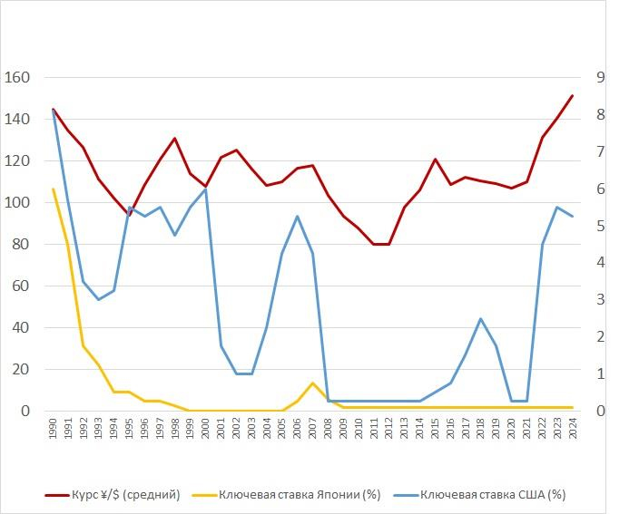

График 4. Динамика курса иены и КС Японии и США. (Источники: Курс ¥/$: FRED, Банк
Японии, Ставки: BOJ, ФРС.)

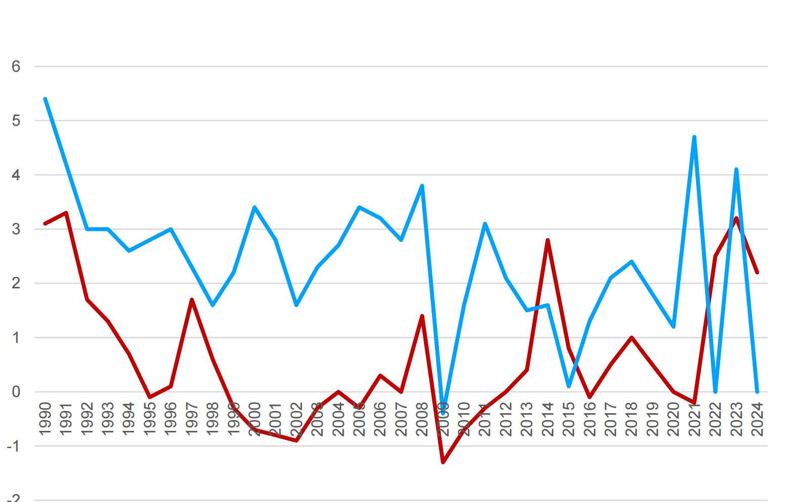

График 5. Инфляция Японии и США 1990-2024. Источники: МВФ, OECD.

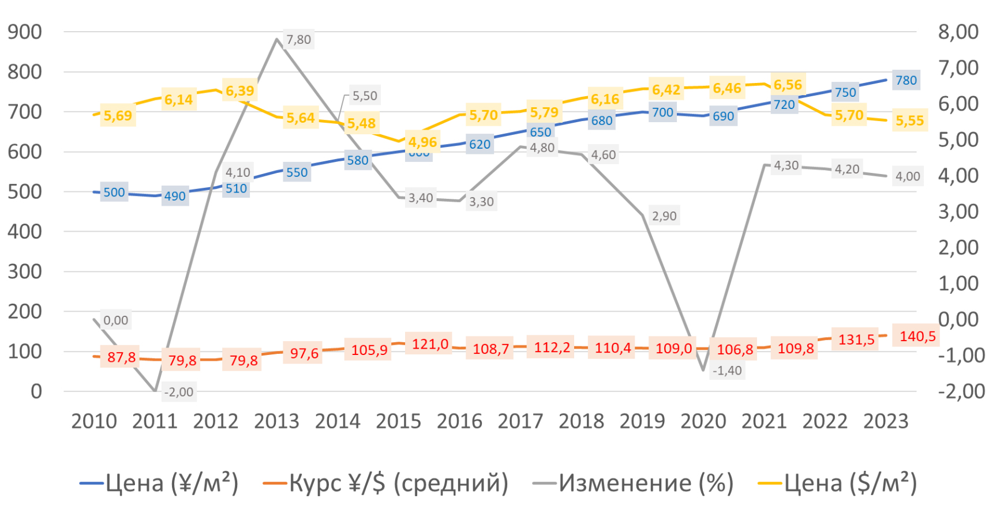

График 6. Динамика цен за 1 м. кв. в Токио (Источники: Ministry of Land, Infrastructure,
Transport and Tourism (MLIT), JREI, Nomura Research Institute).

**Возрождение из пепла: как Япония создала новую экономику**

Действительно, послевоенная Япония начинала с **полного нуля** — её милитаристская
экономика лежала в руинах. Но именно это стало преимуществом: вместо устаревших
мощностей страна строила **ультрасовременные производства** с чистого листа.

**Технологический рывок: от ASICS до Toyota**

 - **Пример Nike**: молодой Фил Найт, ища альтернативу монополии Adidas,
обнаружил в Японии высокотехнологичного производителя ASICS. Именно на
базе японских технологий и при поддержке торгового дома Nissho Iwai (1971)
родились первые кроссовки Nike, которые позже завоюют мир.

 - **Автомобильная революция**: после нефтяного кризиса 1973 года компактные
и экономичные Toyota, Honda и Datsun (ныне Nissan) захватили американский
рынок. Их успех доказал: Япония может не просто копировать, но
и **превосходить Запад** в инновациях.

**Импорт знаний: революция Деминга.**

Вместе с импортом оборудования японцы заимствовали и самые передовые
американские методы управления. Ключевую роль сыграл американец **У. Эдвардс
Деминг**, чьи принципы стали основой «менеджмента качества»:

> «Если вы не можете описать то, что делаете, как процесс — вы не
> знаете, что делаете»

Его идеи слились с традиционными японскими ценностями:

- **Трудолюбием** (культура «кароси» — смерти от переработок),
- **Перфекционизмом** (влияние каллиграфии и чайных церемоний),
- **Упорством** («кайдзен» — философия непрерывного улучшения).

Результат:

- **ДАО Toyota** — система «точно в срок» (Just-in-Time),
- **Six Sigma** — снижение брака до 3,4 случаев на миллион,
Именно эта концепция легла в основу другой цитаты **Соитиро Хонды**: «Разгадывая секрет успеха, смотрите не на результат, а на метод, который к нему привёл».

Сам Деминг начинал со статистического контроля качества, но быстро пришел к выводу:

> «Выявление ошибок — лишь первый шаг. Главное — понять их природу и
> перестроить систему, чтобы они не повторялись»

Его подход сформировался под влиянием **концептуального
прагматизма** американского философа **Кларенса Ирвинга Льюиса**, которыйутверждал:

- **Знание — это инструмент для предсказания**, а не просто описание
реальности.
- **Ошибки возникают, когда наша «рабочая теория» расходится с
действительностью.**

**Деминг адаптировал это для менеджмента:**

> «Управление — это предсказание. Если ваши прогнозы системно ошибочны,
> значит, ваша модель неадекватна реальности»

Это и есть ключевой принцип **адекватности управления**:

- **Адекватная система** учится на вариативности,
- **Неадекватная** — игнорирует её или борется с симптомами.
Деминг развил идеи о вариабельности на основе работы **Уолтера Шухарта** (книга «Economic Control of Quality of anufactured Product», 1931), который предложил различать проявление двух принципиально различных типов вариабельности любой системы или процесса, инициированных либо так называемой **«общей причиной»** (common cause), либо **особой причиной** (assignable cause).

**Главный парадокс** Шухарта, а затем и Деминга, заключался в том, что:

> «Не вся вариабельность — зло. Задача не в её устранении, а в понимании
> её природы»

**«Колесо Деминга-Шухарта»** (PDCA/PDSA) стало наглядным инструментом для работы с этой идеей:

 - **Plan (Планируй) → Do (Делай) → Check/Study (Проверяй/Исследуй) → Act (Действуй).**
Сам Деминг вместо проверки заменил «Check» на «Study»? Ведь «Проверка» — это констатация ошибок, а «Исследование» — поиск их системных причин. Поэтому иногда цикл называют PDSA: планируй → делай →учись → действуй.

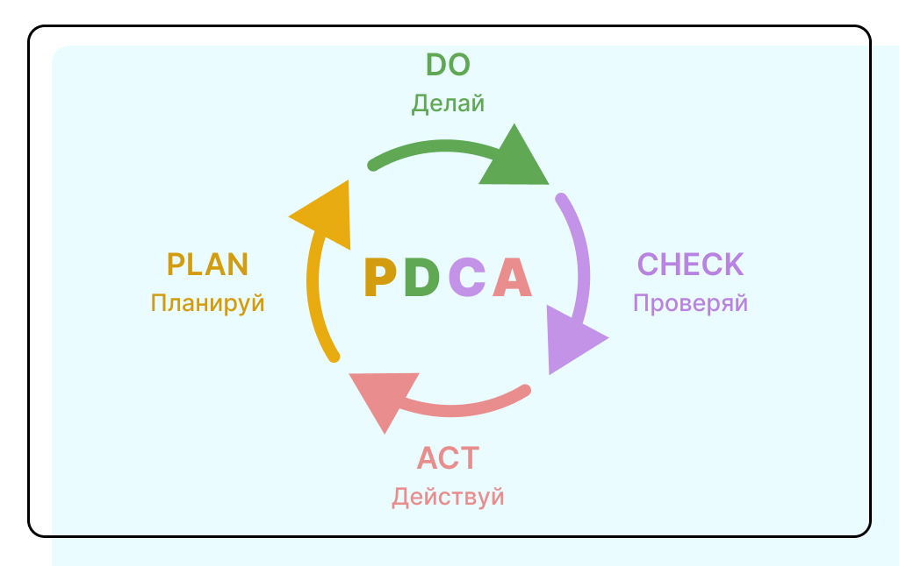

В период с 1946 по 1950гг Деминг организовал масштабное обучение японских инженеров и менеджмента. Он обучил даже рядовых рабочих методам статистического контроля. Японцы мгновенно осознали потенциал: уже в 1950 году Союз японских ученых и инженеров (JUSE) запустил nationwide-программу внедрения его методов. С тех пор У. Э. Деминга регулярно приглашали для чтения лекций и консультаций, а широкое внедрение методов статистического контроля в практику деятельности фирм принесло плоды в виде существенного повышения качества продукции, эффективности производства, что и обусловило лидерство Японии в области конкурентоспособности на мировых рынках. Сегодня Деминга за его вклад в японское качество считают национальным героем Японии. В **1960 году** император Хирохито наградил Деминга **орденом Священного Сокровища** 2-й степени — высшей наградой для иностранцев. Сегодня Деминга называют "архитектором японского экономического чуда". Премия Деминга в Японии считается аналогом "Нобелевки" в области качества.
**Как говорил сам Деминг:**

> "Японцы слушали меня, потому что хотели учиться. На Западе же все были
> уверены, что уже всё знают."

Деминг и Шухарт создали не просто методы контроля, а **философию системного мышления**. Их подход объясняет, почему Япония добилась качества не через жесткий контроль, а через **постоянное обучение системы**. Для России это особенно актуально: переход от культуры «поиска виноватых» к культуре «исследования ошибок» мог бы стать прорывом.

*Кстати, недавно Сэм Альтман в своём масштабном интервью затронул ключевые навыки, которые стоит развивать современной молодёжи (чтобы не оказаться за бортом рынка труда в эпоху OpenAI). Среди главных компетенций он выделил «метаспособность» к обучению — универсальный навык, который сохраняет актуальность независимо от изменений в мире.*

Но какой навык можно считать самым универсальным? По моему убеждению, это аналитическое мышление. Если говорить простыми словами, это способность:

 1. Декомпозировать сложные задачи на управляемые компоненты.
 2. Последовательно решать каждую подзадачу.
 3. Интегрировать результаты в комплексное решение.
 
Этот навык незаменим в любой сфере: от точных наук и разработки до управления продуктом и маркетинга. Даже при создании эффективных промптов для чат-ботов (тех самых, что разрабатывает Альтман) без аналитического подхода не обойтись. Что характерно, сама "метаспособность" к обучению, по сути, представляет собой структурирование информационного хаоса — а значит, тоже требует развитого аналитического мышления.

**Кайдзен: философия малых шагов к большим переменам**

**Кайдзен (改善)**, или искусство маленьких шагов — это еще одна японская методика улучшения качества жизни и бизнеса, которая акцентирует внимание на **постепенных, но постоянных небольших изменениях**, чтобы повысить эффективность и качество. Этот подход основывается на идее, что большие перемены часто пугают людей, а также довольно сложно внедряются в производство и управление компанией. Поэтому улучшения могут быть достигнуты через множество маленьких изменений, совершаемых на регулярной основе.

**Кайдзен vs. Западный подход**

| Кайдзен (Япония) | Западный подход |
|--|--|
| Постепенные улучшения |Радикальные изменения  |
| Вовлечение всех сотрудников |Решения "сверху вниз"  |
| Вовлечение всех сотрудников |Решения "сверху вниз"  |    
                                                                                                                                                                                                                                                                                                                                                                           
Кайдзен стал эволюционным развитием идей Деминга. Развитие этой системы управления связывают с **Киичиро Тойода**, основателем **Toyota Motor Corporation**. Руководя работами по отливке двигателей, он обнаружил множество проблем в их производственном процессе. Когда в 1936 году его процессы столкнулись с новыми проблемами, он создал группы по совершенствованию «кайдзен». Toyota систематизировала «кайдзен» через борьбу с потерями:

 1. **Муда (無駄)** — любая деятельность, не создающая ценности.
	 Пример: хранение избыточных запасов, ненужные движения работников.
	 
 2. **Мури (無理)** — перегрузка людей или оборудования.
	 Пример: авральные работы из-за плохого планирования.
	 
 3. **Мура (斑)** — неравномерность в нагрузке или качестве.
	 Пример: то простаивающий, то перегруженный конвейер.

Ироничное, но точное наблюдение:

> «Системно вредно заниматься мурой (неравномерностью) и доверять
> мудакам (тем, кто создает бессмысленные действия)».

**Кайдзен vs. Деминг: что общего?**

| Деминг | Кайдзен |
|--|--|
| Акцент на статистике и циклах PDCA |Акцент на ежедневных улучшениях  |
| «Учись на ошибках» |«Предотвращай ошибки через малые шаги»  |
| Требует менеджмент-поддержки |Вовлекает всех сотрудников  | 

**Общее:** Оба подхода отвергают идею, что «и так сойдет».

Это помогает систематически выявлять проблемы и упрощает использование правильных инструментов там, где невозможно достичь идеала. **Тайити Оно**, японский промышленный инженер и бизнесмен, считается отцом производственной системы Toyota. Он предложил сосредоточиться на сокращении исходных семи расходов Toyota, чтобы улучшить конечный продукт

Кайдзен – это настоящая корпоративная культура, так как в процесс включены все сотрудники. Деминг говорил, что «корпоративная культура ест стратегию на завтрак». Здесь важна и командная работа, и личная дисциплина, поддерживаемая сильным моральных духом. При этом каждый может предложить свою идею для улучшения рабочего процесса: для этого проводятся собрания и мозговые штурмы, где принимаются и обсуждаются все предложения. Помните знаменитые советские рацпредложения? Легенда приписывает развитие этих идей японцами на основе советских кружков качества. Также как, по слухам, некий японец, выписывая советский журнал «Наука и техника», запатентовал так много изобретений, что стал миллионером.
   
Дополнительно сам производственный процесс поддерживается в полном порядке за счет концепции «5С»: сортировки, систематизации, стандартизации, содержания в чистоте и совершенствования. Они применимы к каждому человеку компании – от уборщика до генерального директора. Таким образом компания растет, уменьшая затраты ресурсов и времени на ненужные процессы и материалы, и концентрируясь на важном. Глобально все эти методики складываются в LEAN PRODUCTION и «Бережливое производство».

Инновации в бытовой технике и электронике сделали всемирного известными японские бренды SONY, Panasonic, Коdak, TOYOTA, HONDA. Продажи били рекорды. Деньги в Японию текли рекой. Японцы стали скупать дорогие американские активы: киностудии (PARAMOUNT), банки, сети магазинов, небоскрёбы («Рокфеллер-центр»!). Резкое укрепление иены создало условия для массового притока внешнего капитала, но его было некуда инвестировать, и он массово перетекал на финансовый и на рынок недвижимости. Избыток капитала оказал деструктивное влияние на экономику. Японские банки, получившие неограниченный доступ к финансовым ресурсам, стремительно вышли в мировые лидеры - в конце 1980-х годов они занимали верхние позиции в мировых рейтингах по активам. Более того, на пике экономического пузыря в 1989 году восемь из десяти крупнейших компаний мира по рыночной капитализации были японскими.

Недвижимость в Токио стала самой дорогой в мире, поскольку спрос значительно превышал предложение. Это было время расцвета потребления. Ведущие лакшери- бренды высадились и процветали на японских островах. Япония стала своеобразной Францией на востоке. Изысканность и перфекционизм в деталях вне стоимости — всё это совпало с представлениями японцев о прекрасном. Собственно пришествие мировых лидеров индустрии люкса и ознаменовало окончательный переход Японии из третьего в первый мир. Очень-очень редкий пример в современной истории, противоположный тому, что случилось с Россией в 90-е гг.

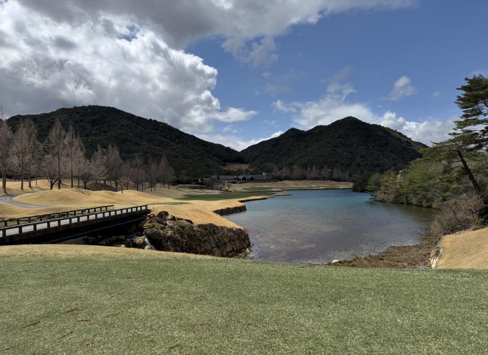

Япония до сих пор остаётся одной из самых густонаселённых стран мира. Дефицит земли ускорял рост пузыря на рынке недвижимости и порождал масштабные диспропорции. Люди вкладывали деньги в любые суррогаты недвижимости и перепродавали спустя несколько лет с большой прибылью. Так в маленькой Японии было построено около 2500 гольф-клубов в том числе на паевой основе. Гольф вообще идеально совпал с японской философией **Шинрин-йоку. Эта японская духовная практика предлагает сбалансировать ум при помощи прогулки по лесу.** При этом важно отказаться на это время от всех гаджетов и находиться в единении с природой. «Лесная ванна» – так дословно переводится этот концепт, и он дает возможность за счет физического и ментального отдыха снять напряжение, которое сопровождает нас в современном мире. Важно найти свое «место силы», где вам комфортно и приятно находиться. Гольф в Японии — это обычно гористые места (никто в Японии не отдаст «сельхозку» под что-либо иное) с очень красивыми видами, ботаническими садами и ландшафтными парками, и эта практика достойна отдельного большого рассказа.

Безумие на рынке недвижимости не могло продолжаться бесконечно. В 1987 году средняя цена квадратного метра в Токио достигла примерно $25.000, что в текущем эквиваленте соответствует сумме в два раза больше. До соглашения «Плаза», навязанного США Японии в 1985 в целях уменьшения торгового дефицита, доллар стоил 250 иен, а уже к 1990 году иена укрепилась до 150. Забегая вперёд, скажу, что и до сих пор после тридцати лет волатильности иена стоит около 150 к доллару, но, как мы понимаем, это совсем другой доллар. Смена производственной модели развития на финансовую не только привела к резкому укреплению японской валюты, но и

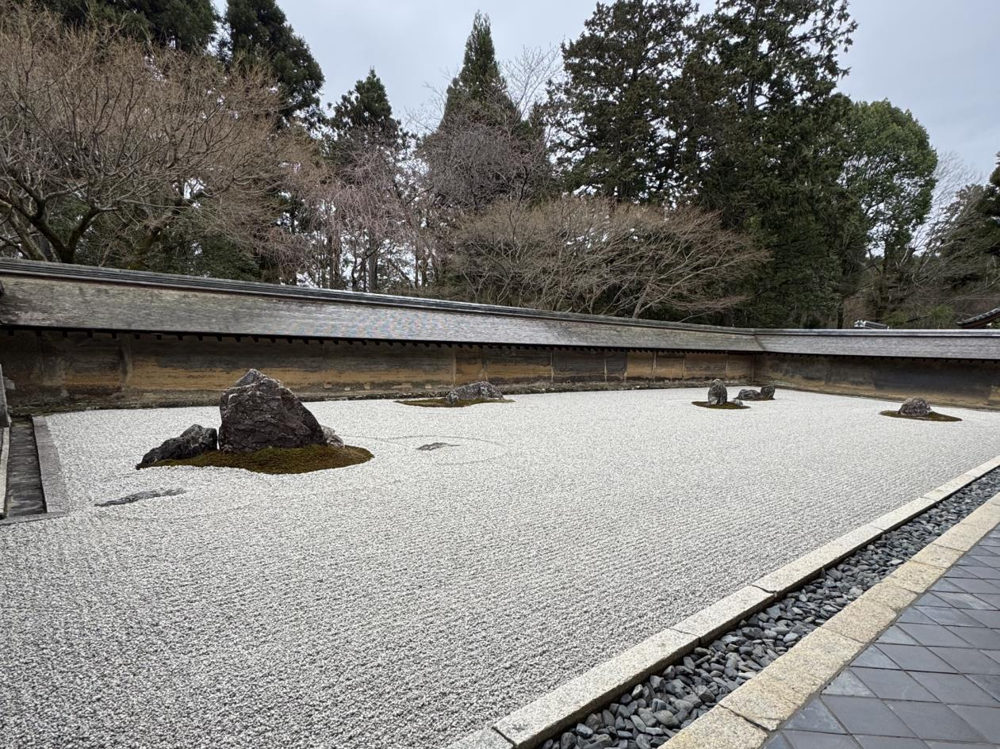

вызвало такое же резкое сокращение экспортного потенциала японских товаров. Это явление завышения курса в национальной экономике также называют **«голландской болезнью»**. Россия не так давно в 2008 году тоже пережила болезненный приступ неадекватности под названием «энергетическая супердержава».

**Кризис японской экономики: от пузыря к "потерянным десятилетиям"**

Японские финансовые власти пытались бороться с замедлением экспорта и финансовым пузырём с помощью крайне низких — практически нулевых — ставок. Однако эти меры лишь усугубили ситуацию. Высвобождаемые денежные потоки неизменно возвращались на финансовый рынок, надувая финансовые пузыри.

Когда власти начали повышать ставки, переоценённые активы резко обрушились. Началась массовая распродажа: инвесторы избавлялись от любых японских активов. В период **с 1990 по 1995 год** акции японских компаний подешевели более чем вдвое. Даже сегодня индекс Nikkei 225 остаётся значительно ниже своих пиковых значений тридцатилетней давности.

К 2000 году ключевая ставка опустилась до нуля, но момент для мягкой коррекции был упущен. ВВП вошёл в отрицательную зону, деловая активность резко сократилась. Экономика погрузилась в классическую **дефляционную спираль**: падающие активы перестали покупать — все ждали дальнейшего снижения цен; проблемные предприятия лишились инвестиций.

Эта коррекция получила название «потерянные двадцатилетия», и до сих пор Япония не может выйти на новый путь развития. Потерянные годы привели к утрате конкурентоспособности и крупнейших **кэйрэцу** (финансово-промышленных групп), и среднего бизнеса. Несмотря на масштабы бизнеса мировой лидер в фотографии
Kodak, подобно Nokia, закончил свой путь крахом. **Технологическое отставание** стало роковым: Япония пропустила переход к технологиям Четвёртой промышленной революции. Бывшие аутсайдеры — Южная Корея и Китай — сначала захватили рынок бытовой и офисной техники, а теперь теснят японских автопроизводителей даже в премиум-сегменте.

Согласно имеющимся данным, до 20% японских компаний остаются неплатёжеспособными без государственной поддержки. Эти так называемые «компании-зомби» фактически существуют за счёт правительственных субсидий и кредитов «проблемных банков», что позволяет избежать усугубления кризиса. Однако сохраняющееся перепроизводство, даже в условиях протекционизма, препятствует естественной "расчистке рынка".

Традиционная японская модель ведения бизнеса продолжает сдерживать инновационное развитие и предпринимательскую инициативу. Примечательно, что даже в условиях глубокого кризиса уровень безработицы остаётся на поразительно низком уровне — всего 2%. Компании по-прежнему придерживаются концепции пожизненного найма, а сотрудники отвечают им абсолютной лояльностью. Такой тип идеальных работников — предел мечтаний для любого российского работодателя!

Япония — удивительная и высокотехнологичная страна. Здесь всё работает безупречно. Однако есть важное отличие Японии от Китая и России — практически полное отсутствие строительных кранов на горизонте. Страна прошла фазу урбанистического бума и больше не строит в прежних масштабах. Модели экстенсивного роста себя исчерпали, а в гонке за полупроводниками и новыми технологиями лидерство было утрачено. Что же остаётся?

**Контраст с Китаем/Россией:**

| Япония | Китай/Россия |
|--|--|
| Ремонтирует старое |Строит новое  |
| Живет в дефляции |Борется с инфляцией  |
| Делает "лучшее, но мало" |Делает "много, но как получится| 

**Ваби-саби** — важный принцип японской философии, утверждающий, что **ничто не совершенно**. Но всегда ли нужно стремиться к идеалу? Эта философская концепция делаетакцент на красоте неполноты и непостоянства, уча ценить простоту, скромность и природную аутентичность. Она предлагает находить эстетику в несовершенстве, мимолётности и незавершённости. Как говорил Коносукэ Мацусита (основатель Panasonic): **"В бизнесе всегда есть взлёты и падения, а процветание редко бывает долгим. Так устроен мир и человеческое общество"**. Руководствуясь принципами ваби-саби, японцы перестали гнаться за недостижимым идеалом, научившись находить возможности в том, что имеют. Они создали комфортный образ жизни, соответствующий их представлениям о счастье. И живут действительно хорошо: в достатке, чистоте, с доступом к прекрасным продуктам.

Удивительно, но в то время, когда весь мир (за исключением Китая) борется с инфляцией, Япония, напротив, не может добиться её устойчивого роста. Ситуация осложняется демографическими особенностями: японцы отличаются исключительным долголетием. Медианный возраст населения уже приближается к 50 годам — вот что дают знаменитая японская кухня и здоровая философия жизни!

Однако за этим позитивным фактом скрывается серьёзная экономическая проблема: пожилое население потребляет меньше, а рождаемость остаётся крайне низкой. Яркой иллюстрацией старения общества служит таксопарк страны. На дорогах множество машин с пробегом в шестьсот тысяч километров, за рулём которых —водители преклонного возраста. Хотя автомобили содержатся в идеальной чистоте (нередко с трогательными кружевными салфетками на сиденьях), это преимущественно старые модели Toyota, тогда как производителю необходимо продавать новые автомобили.

Экономические трудности — неуверенность в завтрашнем дне и высокая стоимость жизни — препятствуют восстановлению демографического роста. Дополнительные удары по экономике нанесли пандемия COVID-19, энергетический кризис 2022 года и протекционистские пошлины эпохи Трампа. Череда этих кризисов напоминает настоящее экономическое цунами. Что же ждёт Японию в будущем?

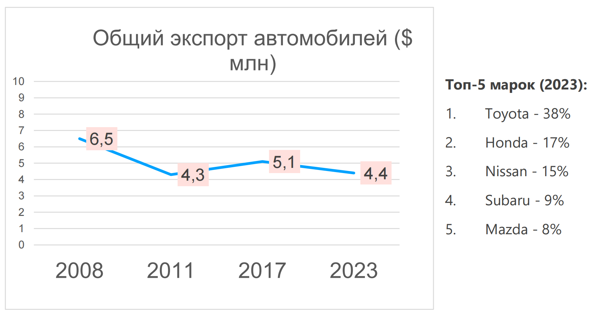

**Ключевые тренды:**

1. Постепенная потеря доли рынка (с 22% мирового экспорта в 2008 до 16% в2023).
2. Замедленный переход на EV (отставание от Китая и ЕС).
3. Рост гибридов (особенно Toyota RAV4, Corolla Hybrid).
4. Потеря российского рынка (-60% после 2022).

Похоже, многие изменения уже стали необратимыми. Восстановление лидерских позиций на мировых рынках представляется маловероятным, особенно учитывая, что Япония продолжает конкурировать по принципу "цена-качество", что в эпоху стремительной цифровизации уже недостаточно. Это особенно заметно в отсталости финансового сектора, где наличные иены и монеты до сих пор играют значительную роль.

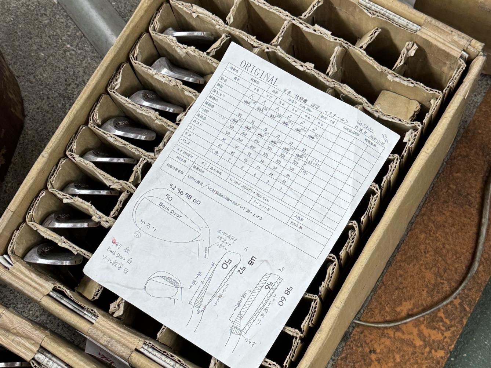

Мне довелось посетить два прекрасных ремесленных производства - по изготовлению японских ножей и гольф-клюшек. Кузнец «Такуми» с гордостью демонстрировал свою технологию, ведь поговорка гласит, что «мастер показывает ученику спину», но, увы, никаких учеников мы не увидели. Обе мануфактуры производили впечатление запустения и упадка — настоящая «уходящая натура», хотя и создающая по-прежнему красивые и качественные изделия.

Показательна история с легендарной японской маркой гольф-оборудования Honma. После покупки китайскими инвесторами компания, сохранив японское качество, добавила современный маркетинг и технологии, что позволило успешно продвигать бренд на мировом рынке. В целом Китай постепенно, но уверенно вытесняет Японию с традиционных для неё позиций.

Почему же Япония не может вернуться на путь устойчивого роста? Почему на протяжении тридцати лет она постепенно теряет позиции, хотя и сохраняет высокий уровень жизни? Что мешает стране открыть свои рынки, отказавшись от изоляционизма в пользу глобализации? Почему не решается вопрос с импортом рабочей силы? Почему продолжают поддерживаться нерентабельные предприятия? И главное - почему перестал работать принцип кайдзен?

Ответ во многом кроется в проблеме старения элит. Современные лидеры японского общества и экономики достигли того жизненного этапа, когда инновационному мышлению начинает противостоять философия сохранения - сбережения ресурсов компаний и накоплений граждан.

В Японии существует шутка: «Мы рождаемся синтоистами, женимся по-христиански, а умираем буддистами». Если внимательно изучить труды Коносукэ Мацуситы, основателя Panasonic, становится ясно: в Японии бизнес воспринимается как неотъемлемая часть общества. Как в большой семье, здесь невозможно разрушить многовековые духовные устои.

Сегодня японцы по-прежнему много работают, но их труд стал менее эффективным. Иерархия ценится выше продуктивности, порядок — важнее прогресса. Однако взамен они сохраняют главное — свой «Смысл жизни» (Икигай), который невозможно измерить экономическими показателями.

Икигай представляет собой гармоничное сочетание нескольких сфер жизни: увлечений, профессиональной деятельности и семейных ценностей. Это философское понятие отражает глубокое внутреннее ощущение, что ваши созидательные действия обладают значимостью и оказывают влияние на окружающий мир. В японском языке этот термин, образованный от слов «ики» (жить) и «гай» (причина), используется в различных контекстах. Буквально его можно перевести как «причина просыпаться по утрам» или «смысл существования».

Икигай — это традиционная японская концепция, определяющая источник глубокого личного удовлетворения и жизненного смысла. Она основывается на четырехключевых элементах:

1. **То, что вы любите** (страсть) — деятельность, приносящая вам радость и вдохновение;
2. **То, в чем вы сильны** (миссия) — осознание своих уникальных способностей,навыков и талантов;
3. **То, за что вам готовы платить** (профессия) — востребованные обществом умения, которые могут стать источником дохода;
4. **То, в чем нуждается мир** (призвание) — понимание того, как вы можете внести ценный вклад в развитие общества.

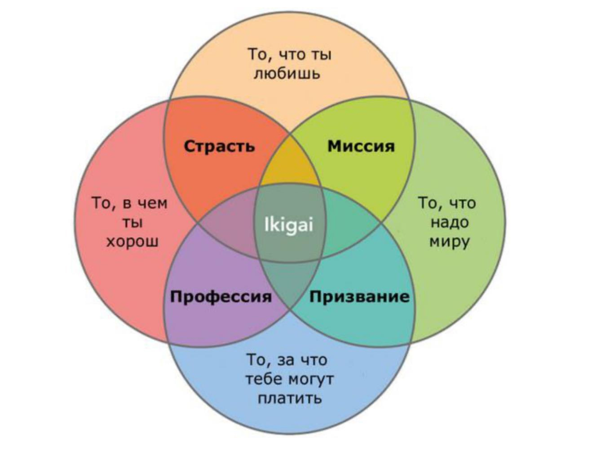

Настоящее удовлетворение и смысл жизни находятся на пересечении этих четырех элементов. Иными словами, когда вы находите работу или дело, которое вам нравится, востребовано обществом и приносит реальную пользу. Человек, живущий в соответствии со своим икигаем, испытывает чувство радости, полноты и гармонии.

Согласно исследованию Университета Тохоку, концепция икигая влияет не только на качество жизни, но и на ее продолжительность. Результаты показали, что у людей, не нашедших свой икигай, риск смертности от всех причин значительно выше по сравнению с теми, кто следует этим принципам. Напротив, те, кто обрел этот баланс, живут дольше, отличаются крепким здоровьем и достигают большего как в личной жизни, так и в карьере. Это вполне логично: человек, радующийся каждому дню, не испытывает токсичного стресса.

В закрытом японском обществе все могло бы быть прекрасно, если бы не критически низкий индекс фертильности (1,2). Тем не менее японцы сохраняют веру в то, что новое "восходящее солнце" принесет свежие идеи. Скоро откроется EXPO в Осаке — посмотрим, какие изменения это принесет. А пока можно насладиться зрелищем cамых больших в мире водоворотов, образующихся при столкновении вод Тихого океана и Внутреннего Японского моря (во время приливов и отливов) у острова Авадзи.

Так и внутренний мир современной Японии продолжает противостоять глобализации и мировой турбулентности, сохраняя свою уникальность.

**Выводы**

Хотя наши страны имеют сопоставимый по размеру ВВП, между Россией и Японией существуют принципиальные различия в масштабах территории и плотности населения (соотношение 9 к 330). В то время как России предстоят ещё многие годы экстенсивного экономического роста, Япония вынуждена бороться с проблемами перепроизводства и хронической дефляцией.

Экономическая история Страны восходящего солнца содержит множество ценных уроков. Главный из них для нас — необходимость сохранения нашей пассионарности и энергии прогресса, которых так не хватает нашему восточному соседу. Однако одновременно стоит задуматься о наших культурных корнях и смыслах. В этом нам могут помочь японские философские практики, их трепетное отношение к природе, порядку и чистоте. Соединив эти элементы с нашими традиционными ценностями и духовными традициями, мы сможем продвинуться в решении ключевых задач российского общества — обеспечении смысла, радости, здоровья, долголетия и счастья для всех граждан России!

Парадоксальным образом современная японская экономика демонстрирует любопытные аналогии с позднесоветской системой 1970-1980-х годов. Обе модели столкнулись с кризисом "зрелой экономики" и «застоем», характеризующимися:

1. Институциональным склерозом - чрезмерной бюрократизацией управления и консервацией устаревших производственных моделей (в СССР - плановая система, в Японии - система кэйрэцу).

2. Демографическим коллапсом - стремительным старением населения при катастрофически низкой рождаемости (коэффициент 1.2 в обоих случаях).

3. Технологическим паритетом - утратой лидерских позиций в инновациях при сохранении сильных позиций в традиционных отраслях (советский ВПК vsяпонский автопром).

4. Трудовой этикой стагнации - культом пожизненной занятости в ущерб продуктивности ("мы делаем вид, что работаем" в СССР vs «кароси» в Японии).

Ключевое отличие: если советская система рухнула под грузом внутренних противоречий, Япония демонстрирует удивительную устойчивость «управляемого застоя», сохраняя высокий уровень жизни через:

 - Гибкую адаптацию традиционных институтов 
 - Уникальный симбиоз консерватизма и инноваций 
 - "Мягкую" цифровую трансформацию без социальных потрясений

**P.S.1** (цитата Коносукэ Мацуситы из "Философии бизнеса"):

"Миссия производителя заключается в преодолении бедности, в освобождении общества от проблем, связанных с нищетой, в повышении общего благосостояния. Бизнес и производство должны обогащать не только магазины и фабрики, но всё общество в целом. Для процветания обществу необходимы динамизм и жизнеспособность бизнеса. Только в таких условиях компании могут быть по-настоящему успешными. Истинная миссия Matsushita Electric состоит в создании неиссякаемого потока товаров, призванных принести мир и процветание всей стране."

**P.S.2** (цитата У. Эдвардса Деминга):

"Сложившийся стиль управления требует трансформации. Система не способна понять саму себя. Преобразования требуют внешнего взгляда. Цель... — предоставить этот внешний взгляд — увеличительное стекло, которое я называю системой глубинных знаний. Она даёт нам теоретическую карту для понимания организаций, с которыми мы работаем."

