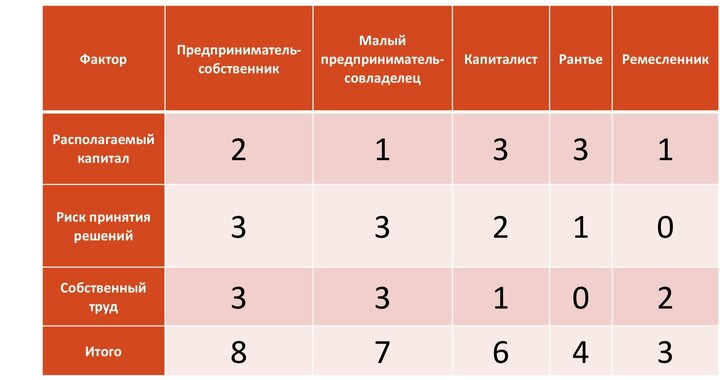
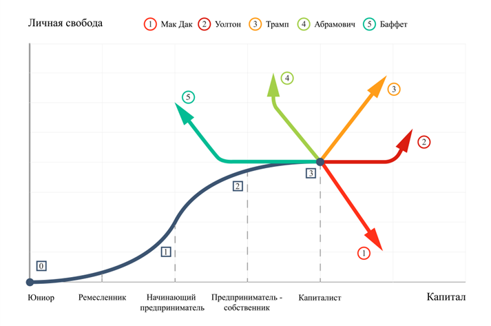

## 60+. Предпринимательское вещество, цели и аттракторы предпринимателя в новом жизненном и деловом цикле.

Говорят, что у японцев есть традиция — дарить на 60 лет игрушечный гробик и детскую распашонку и шапочку. В Японии человек в 60 лет завершает первый жизненный цикл и его обязательно поздравляют с «завершением жизни» и новым днем рождения. По древней традиции, пришедшей из Китая и известной еще в период Нара (710–794 гг.), считается, что, прожив 5 раз 12-летний цикл, человек входит в новое состояние – он снова возвращается в тот момент, когда родился. Поэтому и подарки обычно дарят детские, а гробик — это символ уже прожитой первой жизни и начала новой второй жизни.

У китайцев есть прекрасная стратагема — _**«Назначь день своей смерти».**_ Популярно интерпретируя традиционные китайские стратагемы, руководитель таллинской школы бизнеса Владимир Тарасов утверждает, что человек подсознательно рассчитывает длину жизни. При этом по мере достижения преклонного возраста целевой прогноз может динамически сдвигаться. Активный и вполне здоровый пенсионер 70-ти лет резонно планирует свою жизнь до 80-85 лет, а бодрый 80-ти летний дедушка видит своё 90-толетие. Текущие достижения медицины помогают задумываться о реальном долголетии в 100 лет. Правильное управленческое решение, а в данном случае это решение о дне смерти подразумевает плановую подготовку к этому событию. И речь не только о расчёте ресурсов необходимых для доживания, но и об особом планировании. Лётчики называют этот расчёт fly-back. Подобно тому как пилот рассчитывает топливо необходимое для возвращения на аэродром, так же обратным счётом нужно рассчитать даты рождения и количество детей и внуков, если планируется их присутствие на торжественной панихиде. Очевидно, что необходимо написать завещание о распоряжении капиталом между роднёй с учётом своих собственных ценностей и целей. Обратное планирование вообще очень эффективный инструмент. Добавляет реализма в любые целеполагания. В процессе планирования «от цели — к текущему состоянию» придётся соблюдать цепочку «событие-действие-ключевые факторы успеха», а это и есть план жизни, выраженный в конкретике.

Особенность мышления предпринимателя связана с его профессиональной способностью смотреть на явления жизни как на аналогию бизнеса, а значит — через конкретный план жизни. Профессор Людмила Мосина точно заметила, что жизнью можно управлять как проектом, в который мы вкладываем ресурсы и получаем результат в виде качества самой жизни. Lifeproject-management, по мнению Людмилы, предопределён четырьмя субъективными открытиями:

1.  Временной лимит жизни ограничен.
2.  Все повороты жизни, её качество связаны с нашим выбором, сознательным или бессознательным.
3.  Отсутствие объективного, заранее заданного смысла, цели жизни.
4.  Признание тотального одиночества перед лицом перечисленных проблем.

В какой момент возникают эти инсайты? Думаю, что в период с 50 до 60 лет всё тайное становится явным. Что в этом текущем реализме Предпринимателя 60+ связано с возрастными изменениями? С медицинской точки зрения тестостерон, дофамин и другие нейромедиаторы снижаются, переключая мозг с подвигов и экстрима на стабильность и качество. _**Мудрость**_ — _**свойство, обратно пропорциональное суетливости.**_ Мудрость — вот, что будет являться ключевым фактором успеха в новом жизненном и предпринимательском цикле. Ибо как сказано в Библии: «Приобретение мудрости — гораздо лучше золота, и приобретение разума — предпочтительнее отборного серебра» (притчи 16:16).

Как формируется мудрость? С годами резко уменьшается объём непознанного. Даже совсем новое укладывается в привычный паттерн принятия новостей и инноваций. Мышление работает в соответствии с ключевыми идеями экономиста и психолога Даниэля Канемана. Его главная книга называется «Thinking fast and slow», то есть дословно «Мышление быстрое и медленное». Непонятно почему в русском переводе «Думай медленно… решай быстро». Главная мысль книги: человек мыслит через две мыслительные системы. _Система 1:_ срабатывает автоматически и очень быстро, почти не требуя усилий и не давая ощущения намеренного контроля. Например, физиогномика на очень большой выборке становится релевантной. _Система 2:_ выделяет внимание, необходимое для сознательных умственных усилий, в том числе для сложных вычислений. Чем более впечатлителен человек, тем менее он рационален. Обучение Системы 1 в процессе жизни приводит к тому, что формируются новые устойчивые нейронные связи. Система 1 непрерывно расширяется. Во-первых, так с годами формируется «комплекс эксперта» — достаточность знаний для принятия решений. Во-вторых, непрерывное обучение и расширение Системы 1 формирует реальную интуицию. Реальную в том смысле, что бессознательно мозг значительными данными быстро работает в жёстком аналитическом алгоритме, но при этом мы его не направляем через Систему 2. Существует множество исследований, которые доказывают существование шестого чувства. Интуиция — это способность воспринимать и понимать что-то необъяснимое, неясное или эмоциональное. Такая способность может проявляться в виде мгновенного осознания или чувства подсознательного. Логично, ведь нейронка вдумчивого человека обучалась 60 лет и конечно же смогла автоматизировать анализ в том числе с помощью бессознательного.

Поговорим теперь о целях и ценностях. И это размышления о том, насколько права Людмила Мосина в тезисе «о тотальном одиночестве». Мы точно меняемся, и об этом во второй части этой статьи. В США стратификация общества давно предопределила смену круга общения по мере движения по социальной лестнице. Здесь отгадка, почему предпринимателям часто не о чём поговорить со школьным и университетскими приятелями, и здесь же причина популярности в деловых кругах гольфа. Но ценности не должны меняться с годами, однако их ранжирование, т.е. важность может быть вариабельна. Неожиданно я понял, что долгие годы дело для меня было важнее семьи и здоровья. А сейчас Дело — только на третьем месте. _**Ценности — это принципы и направления движения, а цели — это планируемые результаты движения**_ (Аркадий Пригожин). И здесь всё понятно —ценности бесконечны, сакральны, априорны, историчны, наследуемы и эмоциональны. А цели конкретны, измеримы, достижимыми и рациональны. Ценности без целей напоминают религиозный догмат, но и постановка и определение практических целей может выхолостить ценности. Цель «заработать денег на хороший дом» может на долгие годы лишить общения с детьми и здоровья. И тогда достижение цели будет противоречить ценностям. Последнее время много думаю о новых-старых целях. _**Цели обновляются, а точнее**_ — _**уточняются, проступая из тумана будущего**_. При этом я пока инерционно движусь в потоке ранее принятых решений. Большая часть этого движения является долгосрочной и мощной, как большая река. Инвестрешения принимаются на срок 10-25 лет, дети покидают дом в 18-25 лет. И я несвободен в своём текущем выборе действий с учётом своих активов. Плыву по экономическому течению и спорю сам с собой о том, как корректировать маршрут. Спорю о том, как, куда, где, и вспоминаю, что Макс Вебер утверждал, что «_**спор о средствах обычно связан с разницей целей».**_

Многие мыслители утверждают, что смысл деятельности понятен только за её пределами. И главная Цель должна быть за пределами жизни. Раньше «предел жизни» был метафорой, а теперь становится «днём смерти». Видимо и я подхожу к переходному возрасту. В экономике эта точка называется точкой бифуркации. Вспоминается тема про огонь, воду и медные трубы. В какой-то момент я осознал, что я достиг тех «медных труб», которые намечал на заре предпринимательской карьеры. И в предпринимательском, и в личном плане. Business exit? Пора на пенсию? Не про меня. Да и бизнес в нашем отечестве сложно оставлять без хозяйского глаза, особенно в условиях СВО. Продажа бизнеса или IPO — очень сложные проекты, требующие длительного обдумывания, подготовки и выбора благоприятного момента. Династическое наследование, как и передача семейного капитала — вопрос не менее сложный и зависит как от способностей и желаний наследников, так и от личных целей собственников. Значит — сплавляемся ниже по течению и определяемся с целями.

Заметил, что по мере достижения точки бифуркации (порог на реке) меняется восприятие главной материальной цели в бизнесе. Прибыль становится не самоцелью, а необходимым и плановым условием жизнедеятельности компании как ответственной части народного хозяйства. В строгом соответствии с заветами великого основателя Panasonic Коносоке Матсушита, который говорил, что _**достижение разумной (плановой) прибыли является не только задачей, но обязанностью компании.**_ Иначе она не только не сможет вознаградить инвесторов и работать на благо потребителя, но и не сможет ответственно участвовать в развитии общества.

Необходимо отметить, что по мере достижения среднего и более размера бизнеса неожиданно _**ценность Дело и цель Прибыль сращиваются в понятие Капитал.**_ Капитал корпоративный, который и является базой для расчёта личного капитала. Давно замечено (Герман Гессен 1854), что не только корпоративная прибыль и капитализация с какого-то момента перестаёт быть самоцелью предпринимателя, но и прирост личного благосостояния тоже становится простым следствием планового ведения хозяйства. В соответствии с Законом убывающей предельной полезности, который заключается в том, что с ростом потребления блага (при неизменном объёме потребления всех остальных благ) общая полезность, получаемая потребителем, возрастает, но скорость роста замедляется. Кстати, полезностью экономисты называют счастье. Каждый новый рубль радует гораздо меньше, чем первый. Я разрабатывал эту научную тему теоретически десять лет назад. 

Динамическая системная модель предпринимателя и предпринимательской деятельности. Динамическая как раз про то, что предприниматель в молодые и немолодые годы совершенно по-разному ведёт себя в бизнесе. Например, диаметрально меняется отношение к риску и труду. Однако главное, о чём следует задуматься в новой предпринимательской жизни — это счастье свободы и распоряжения своим капиталом. Ретроспективный экономический анализ поможет также подумать о карьерном пути наследников.

## Модель жизненного цикла предпринимательской деятельности

Прежде всего определимся с терминологией и типологией предпринимательства. Предприниматель предпринимателю рознь. Мы будем говорить не про «пролетариев умственного труда», и не самозанятых ремесленников, но про людей, эволюционно заработавших значимый капитал, и это для нас принципиально. Если нет капитала, то и дилеммы, как им распоряжаться, тоже нет.

Предприниматель - это бизнес-персона, стремящаяся к увеличению степени личной свободы через рост капитала собственного бизнеса, на свой страх и риск.

Модель развития предпринимателя и предпринимательской деятельности следует рассматривать в динамике, ведь с ростом собственного капитала растут и обретённые свободы, а это меняет и тип поведения предпринимателя.

Кроме того, каждый предприниматель начинал свою предпринимательскую работу с какой-то стартовой позиции, которая психологически и финансово для него может быть определена как предпринимательское детство — он является юниором. Предприниматель ещё не начинает вполне самостоятельную деятельность, а только к ней приступает, учась у других и на чужих ошибках. В это время он получает некоторые профессиональные компетенции — в университете (подобно мировым лидерам финтеха) или на производстве, работая по найму (Ф. Тейлор, основоположник научного менеджмента, был инженером). Эта стадия развития, характеризующаяся накоплением профессиональных компетенций, формирует предпринимателя как профессионала в некоторой области.

Получив профессиональные компетенции, определив с их помощью круг тех задач, которые он собирается самостоятельно на свой страх и риск решать, предприниматель начинает самостоятельную хозяйственную деятельность, пополняя ряды бизнес-персон, и делает этот первый шаг чаще всего как ремесленник. Он трудится сам, привлекая к труду друзей и товарищей — пока ещё на принципах партнёрства, но уже принимая на себя существенную часть управленческих функций.

Со временем предприниматель перестаёт заниматься ремеслом и полностью отдаётся предпринимательской стихии, зарабатывая и расширяя свой предпринимательский капитал. Он начинающий или малый предприниматель, а со временем и предприниматель-собственник.

Дальнейший этап жизненного цикла предпринимателя очевиден. Став крупным собственником и сформировав финансовый капитал, он свой интерес перемещает из сферы производства в сферу инвестиций. Деньги, прирост капитала становятся объектом его профессионального интереса — он капиталист. Закон убывающей предельной полезности начиняет доминировать.

С возрастом, устав от бесконечных тревог и суеты бизнеса, предприниматель всё больше и больше отдаляется от круга активных хозяйственников, ведя жизнь рантье. Он заканчивает свой цикл предпринимательской деятельности, полностью удалившись от дел, становясь своеобразным пенсионером, не занимаясь бизнесом, а получая плату от капитала за свои прошлые заслуги.

Это полный жизненный цикл предпринимателя. Очевидно, что далеко не каждый предприниматель проходит этот круг. Кто-то «обжёгся» на предпринимательской деятельности ещё на стадии юниора, кто-то так и не вырвался из рамок ремесленника, а кто-то не дожил до стадии рантье…

Легко заметить,что каждый из этапов жизненного цикла предпринимателя, названных этапами «юниора», «ремесленника», «начинающего малого предпринимателя», «предпринимателя-собственника», «капиталиста», «рантье» и «пенсионера», тесно связан с ростом капитала. А капитал, как это было показано выше, предпринимателю необходим для движения по направлению от одного социального слоя к другому, более высокому. Поэтому имеется возможность связать воедино эти характеристики и построить графическую модель развития предпринимателя, которую можно назвать «Жизненный цикл предпринимателя» (рис. 3.1).

По горизонтальной оси плоскости расположим ось личных накопленных доходов предпринимателя (богатства), а уровень свободы отложим по вертикальной оси как зависимый от дохода фактор.

Очевидно, что в случае, когда предпринимательский капитал равен нулю, уровень свободы предпринимателя соответствует уровню свобод окружающих его в социуме сограждан. Примем этот уровень как точку отсчёта и обозначим его числом 0. Именно с этой точки начинается модель жизненного цикла предпринимателя как юниора.

От нулевой точки с ростом дохода предпринимателя на этапе постижения ремесла растёт и уровень его свободы. Но, поскольку заработанные доходы в существенной части направляются на удовлетворение потребностей низшего уровня, на реализацию собственного стремления к свободе у предпринимателя остаётся не так уж много средств. Поэтому на этом этапе жизненного цикла предпринимателя рост доходов происходит быстрее роста уровня свободы.

Точка 1 на рисунке 3.1 обозначает тот уровень, при котором базовые потребности предпринимателя удовлетворены. Он успешно прошёл этап ремесленника и перешёл на уровень предпринимательской деятельности. Поэтому предприниматель может направить большее количество капитала на повышение уровня своей свободы. И чем больше растёт его капитал, тем увереннее он становится и тем больше дверей открываются перед ним в те социальные сферы, к которым он стремился. Здесь можно предложить линейный участок зависимости — рост уровня свободы предпринимателя прямо пропорционален росту его доходов.

Точка, обозначенная на графике жизненного цикла предпринимателя числом 2, означает уровень, когда предприниматель заработал большой капитал и достиг желанного уровня личной свободы и того социального статуса, который, по его мнению, этому уровню свободы соответствует. Дальнейший рост дохода не приводит к существенному росту уровня личной свободы — при таких доходах предприниматель обеспечил себе защиту от криминала, от конкурентов, от неправомерных действий со стороны государственных чиновников, обеспечил себе и своей семье комфорт и высокий уровень жизни. Эти составляющие личной свободы с ростом накопленного дохода (богатства) лишь незначительно увеличиваются за счёт улучшения качества факторов, обеспечивающих личную свободу. Он уже доволен своим социальным статусом и не стремится активно его изменить. Поэтому жизненный цикл предпринимателя от второй точки до точки, обозначенной числом 3, имеет нелинейный выпуклый характер.

Третья точка представляет особый интерес. Она соответствует приближению потребностей предпринимателя к высшему уровню системы потребностей, по Абрахаму Маслоу. Самоактуализация характеризует этап в жизни почти каждого успешного предпринимателя, когда его свобода, обеспеченная деньгами и капиталом, достигнута практически полностью. С помощью заработанного крупного капитала предприниматель вошёл в новую высшую страту социума, ту самую, к которому он изначально стремился, начиная свою предпринимательскую деятельность. Он удовлетворил при этом за счёт личного капитала все свои основные потребности — купил дома, автомобили, произведения искусства и т. п. И здесь наступает своеобразная точка бифуркации, когда большое личное богатство приводит к ограничению независимости предпринимателя — его свобода обременяется беспокойством и необходимостью заботы о накопленном капитале. В этой точке предприниматель выбирает тот или иной характер действий в зависимости от множества факторов внутренней и внешней природы. Анализ поведения предпринимателей-капиталистов показывает на такие типы дальнейшего поведения, которые могут быть названы аттракторами. Эту точку мы и называем Капитал 2.0.

Первый аттрактор. Продолжать копить богатства, всё более и более ограничивая себя в общении с окружающим миром. Этот стиль поведения прекрасно описан А. С. Пушкиным в образе скупого рыцаря, а в современной интерпретации отражается известным героем мультипликационного фильма «Утиные истории» в образе дядюшки Макдака. Назовём этот стиль поведения — аттрактор Макдака. Личные свободы при этом начинают уменьшаться, поскольку большие капиталы требуют больших личных усилий по их сохранению и приращению.

Второй аттрактор. Одной из важнейших переменных является субъективное восприятие зрелым предпринимателем длительности собственной полноценной жизни. Краткость жизни и обретённая личная свобода позволяют предпринимателю по достижении точки бифуркации принять решение об изменении ценностей. Конечно, далеко не всегда выход на пенсию выглядит для серьёзного предпринимателя логичным завершением карьеры. Не только предприниматели-«спортсмены», но и большинство предпринимателей вообще испытывают от бизнеса особое состояние удовольствия, где присутствует азарт, страх, риск, эйфория и другие переживания, доводящие предпринимателей до маниакального «трудоголизма» и зависимости сродни «игромании». По моему мнению, крайне важным является тот факт, что значительная часть предпринимателей этого типа сохраняет семейное дело для наследников. Это, скорее, не олигархи, но они всегда обладают особым «предпринимательским веществом», которое стремятся передать детям на генном уровне и развить в процессе обучения по принципу «делай, как я». Думается, что преемственность такого рода обеспечивает сохранение и преумножение профессионализма, а в конечном счёте – конкурентоспособность страны. Династии — это стабильность, а мы помним слова Столыпина: «Дайте государству 20 лет покоя внутреннего и внешнего, и вы не узнаете нынешнюю Россию».

Типичным примером такого поведения является жизнь основателя крупнейшей розничной сети мира «Wal-Mart» Сэма Уолтона. Выдающийся американский предприниматель долгие годы был богатейшим человеком США, крупным меценатом, образцом трудолюбия, скромности и поборником семейных ценностей. Он передал руководство компанией в руки старшего сына, а капитал разделил между всеми детьми и супругой, которые продолжают развивать бизнес. При этом Уолтон приобрёл новый уровень свободы. Назовём этот тип поведения — аттрактором Уолтона.

Третий аттрактор. Существуют различное отношение к продаже бизнеса. О. Тиньков говорил в 2015 году, что «продавать бизнес — это круто. Потому что нет ничего лучше, чем продажа: только она в деньгах оценивает твой бизнес, твои затраты, твои таланты, и продажа даёт возможность сделать новый проект, ведь появляются не только деньги, но и время на него». Технологии выхода в «кэш» могут быть разнообразными, но неизбежна либо полная остановка, либо полная «перезагрузка» предпринимателя как движущей силы. Сам по себе выход из бизнеса отца-основателя может иметь разные последствия, но в случае с креативным бизнесом (Довгань, Тиньков, Коркунов, Волож) обычно предопределяет негативный тренд. Продажа бизнеса прямо связана с оценкой предпринимательского риска. Собственно, именно необходимость принятия рисковых решений в условиях рыночной неопределённости и отличает предпринимателя от менеджера. Вне зависимости от личного типа настоящий предприниматель всегда стремится оценить и минимизировать степень и уровень риска и одновременно добиться максимизации платы за риск. Разумный предприниматель никогда не примет на себя цену риска, которая может разорить бизнес, но без здорового аппетита к риску вообще невозможны прорывы в бизнесе. Профессионализм предпринимателя выражается в выработке и реализации рисковых решений. Именно риск потери капитала, например, в форме капитализации компании является основной причиной продажи бизнеса. Назовём этот стиль поведения, когда предприниматель освобождается от страха за бизнес его продажей, аттрактором Трампа.

Четвёртый аттрактор. Яркую противоположность являет собой тип поведения, которое обычно приписывают нуворишам-рантье. Предприниматели, стремящиеся к данному стилю жизни, достигнув в бизнесе вершины, стремятся отойти от дел и направить свою энергию на сверхпотребление и разнообразные «игрушки». Психологически Фрейд объяснил это поведение детской травмой — лишённый в детстве всего, он видит ценность в том, что он тратит собственные деньги на предметы роскоши, дворцы, самолёты, мегаяхты и спортивные клубы, но проедание «отечественных» капиталов за границей порицается обществом ещё со времён купеческих загулов в Монте Карло начала XX века. Так было до 2024 года. Назовём этот стиль поведения аттрактором Абрамовича.

Пятый аттрактор. Избавиться от существенной части капитала, оставив себе накопленные богатства, а капитал отдав на благотворительные нужды. Это особый тип достижения нового уровня свободы. Подобное возможно только в условиях свободного общества, когда личные свободы граждан обеспечиваются государством, а не капиталами самих граждан. Это невозможно в авторитарных режимах, поскольку в подобных условиях предприниматель рассматривается им как «дойная корова», снабжающая авторитарную власть средствами для существования режима. Избавление от собственных средств делает его не интересным для власти, которая в любой момент может начать его преследование «в назидание» другим предпринимателям. Этот тип поведения предпринимателя характерен, например, для США, когда предприниматели, накопившие и заработавшие большие богатства, в точке бифуркации принимают решение отдать существенную часть своих личных средств на различные социально значимые проекты — создают различные фонды, строят для родных городов больницы, библиотеки и стадионы. Освобождаясь от капитала, они тем самым приобретают новую свободу — независимость от него. Назовём этот стиль поведения аттрактором филантропа, или, персонифицируя, аттрактором Баффета, по имени американского предпринимателя Уоррена Эдварда Баффетта, состояние которого оценивалось в 46,5 млрд дол. США. В июне 2010 года Баффетт объявил о безвозмездной передаче более 75 % своего состояния, или около 37 млрд, пяти благотворительным фондам. Этот поступок стал самым щедрым актом благотворительности в истории человечества.

Конечно, на практике можно встретить и промежуточные аттракторы, вмещающие в себя черты соседствующих путей. Но выделенные пять аттракторов являются типовыми, и, опираясь на эту классификацию, можно понять варианты поведения конкретного предпринимателя, когда он доходит до точки бифуркации. Вопрос о том, как и почему предприниматель делает выбор в пользу того или иного аттрактора, будет рассмотрен в дальнейшем.

Итак, положения современной теории предпринимательства и модель жизненного цикла предпринимателя дают возможность полного представления о предпринимателе, предпринимательской деятельности и особенностях предпринимателя как личности. Модель жизненного цикла предпринимателя охватывает все основные этапы становления, развития, достижения вершин пирамиды и завершение деятельности предпринимателем. В зависимости от его характера формируются и его менеджеральный тип бизнесмена и его мотиваторы, а в дальнейшем и аттракторы, также связанные с его финальными ценностями. Естественно и логично для любого предпринимателя стремление к умножению капитала, и в этом все предприниматели схожи, но распоряжение накопленным капиталом — сугубо личное дело, и в зависимости от ценностей и условий предприниматель-капиталист либо продолжит приумножать свой капитал как часть национального капитала, либо конвертирует в личное богатство.

Понимание этих механизмов важно в теории государственного регулирования предпринимательской деятельности и при формировании инвестиционного климата в России, поскольку именно в период до 2030 года большинство предпринимателей «первой волны 90-х» достигнут точки «Капитал 2.0» и будут определяться с аттракторами. Как следствие, очевидно, что задача государственных властей всех уровней состоит в том, чтобы создавать условия для сохранения и приумножения «предпринимательского вещества» и «национального капитала» как главного условия дальнейшего развития страны. Например, нам остро не хватает прогрессивных законов по наследованию и, в частности, по семейным трастам. Тем более, что санкции коллективного Запада тормозят экспорт капитала за границу.

## Заключение.

Капитал 2.0. Что это? Это уточнённые ценности и новые цели. Идеальные ценности (здоровье, семья) предопределяют аттракторы капиталиста. Так формируются новые цели с планом управления капиталом и личной свободой и счастьем. Это жизнь в настоящем. И это не последний, а новый этап жизненного цикла предпринимательского капитала. Рациональный путь на базе сильной позиции. Сильная позиция self-made лидера. Ответственное и продуманное принятие решений. Мышление выводами. Теперь всё в настоящем. Будущее с учётом адаптации к СВО (если нет читать соцсети и российские газеты) ̶ — нормальное и даже светлое. Здесь, конечно, сказывается наш предпринимательский оптимизм и закалка 90-х. Не пугливые мы. Проблемы и угрозы — это часть нашей работы. Управляем мудро. Управляющий капиталист 2.0.

Если не дискутировать о конечности или о дискретности времени, то для понимания сущности жизненных циклов мне представляется важным принять за основу несколько базовых постулатов в ЖЦ предпринимателя. Жизнь кажется длинной в молодости, но время ускоряется с годами. Мы, конечно, бываем по-булгаковски «внезапно смертны», но в большинстве случаев живём долго. _**Жизнь — это стайерский забег, а не спринт, поэтому нужно правильно рассчитывать свои силы. Как вы живёте влияет на то, сколько вы проживёте.**_ Мы помним, что для мозга безразлично — это реальность или фантазия, поэтому появляются некие экзотические и эзотерические футурологические размышления о развитии ИИ до уровня «баночников» из Transhumanism Inc. Пелевина, но в реальности план жизни предпринимателя прост:

**1 этап жизни** до 30 лет — ОБУЧЕНИЕ. Три цикла по 10 лет. Обучение жизни, наукам, делу.
**2 этап жизни** 30-60 лет — СОЗИДАНИЕ. Три цикла по 10 лет. Инновации, рост, капитализация.
**3 этап жизни** 60-90+ лет — РАСПОРЯЖЕНИЕ. Три цикла по 10 лет. Сохранение, менторство, созерцание.

## PS. Про жизнь

Цитаты по Crimson Alt.«По мере взросления (и старения) ваш покорный слуга приучил себя максимально избегать действий, которые (сразу или в перспективе) не приносят денег или удовольствия (в идеале — действия должны приносить и то, и другое), и, соответственно, навсегда потерял интерес к спорам и дебатам морального, идеологического и религиозного характера: серьёзных денег за это не платят, удовольствия от процесса я не получаю, а самоутверждаться через демонстрацию (или достижение) публичной "интеллектуальной правоты" — это развлечение для школьников у студентов, которые ещё не догадались найти себя в серьёзном деле.»

«Если вы мужчина, а ваш ребёнок НЕ разделяет вашу идеологию и ваши взгляды на жизнь, НЕ исповедует ваши ценности и НЕ готов продолжать ваше дело (необязательно по форме, но обязательно по духу), то вы, в рамках этого взгляда на жизнь, лузер, независимо от того, сколько нулей на вашем банковском счету, сколько моделей вы перетрахали в Дубае и сколько золотых табличек у вас на кабинете. Для человека с таким подходом (а он встречается ОЧЕНЬ редко, и это нормально, ибо с таким подходом очень тяжело жить) оказаться в ситуации, когда у ребёнка другие ценности, нежели ваши — это так же унизительно, как если бы вы оставили все свои деньги и достижения ребёнку, зачатого от другого мужчины».

И вот добрые мысли Лилии Град. В моём любимом фильме Алексея Балабанова "Мне не больно" герой Маковецкого произносит потрясающую фразу: "Главное — это найти своих и успокоиться"... Чем больше живу, тем больше убеждаюсь в её правоте и абсолютной честности.

Нет времени пытаться всем нравиться, никого не разочаровывать, оправдывать ожидания каждого. Равно как и смысла во всём этом тоже нет. Вебленовское демонстративное «для доказательства обладания богатством" потребление "как средство поддержания репутации" (Веблен, 1884) и все «понты» — это пустое. Это психологический наркотик. Ваш капитал должен вам обеспечить надлежащую защиту от любого шума.

Нет времени заниматься пустым (В. Тарасов), заполнять пустые бумажки, тратить время на пустые совещания и стоять в очередях в чьи-либо пустые кабинеты. Предприниматели вообще не стоят в очередях, гораздо выгоднее сидеть в засаде на мамонта, чем стоять в очереди за колбасой. Нет смысла перевоспитывать чужих взрослых людей под своё видение. Нет времени верить в то, что однажды предавший, не захочет этого повторить... Или хотя бы переобуется. Нет времени ждать медалек от тех, кто ими спекулирует.

Есть смысл воспринимать людей такими, какие они есть, оставляя за собой право на сближение или НЕсближение. Токсичные люди отравляют жизнь. Но важно не назначать врагами всех несозвучных, а учиться взаимодействовать с разностью, или просто уходить за невозможностью сделать это. Есть смысл решаться на прозрачность, чтобы не обманывать никого своими вымышленными образами, и чтобы самому не обманываться в чужих масках. Есть смысл ни перед кем не отчитываться за свой выбор. НЕТ времени, зная, что коллеги ошибаются, позволять им наступать на грабли, чтобы потом вновь сказать «ну я же говорил». Просто спокойно скажите «нет». Альтернативные издержки — это не только деньги, но и время. Время — это самый дорогой и ограниченный ресурс в предпринимательском капитале. Занимаемся только самым главным. Предприниматель никогда ни на кого никогда не перекладывает ответственность за свои решения. Поэтому НЕТ или ДА это его решение. Любая победа - общая, а любое поражение только его личное.

Да, предприниматель ведёт за собой и личную, и корпоративную семью. Направляет, обеспечивает и защищает. Он энергетический центр своего мира и эта энергия должна пронизывать весь его мир. Земля вращается вокруг Солнца и без его тепла быстро погибнет. Сохранение энергии — приоритетная задача лидера. Берегите себя.

И, да. Живём. Здесь и сейчас. Полной грудью. Со своими и с равносущностными. Будьте на диете хороших новостей.

>«Умный не пытается казаться умнее. Успешный — казаться успешнее. Сильный — сильнее. Лучшая манера – без пафоса, с иронией и самоиронией, отчасти на расслабоне. Как говорится, можем себе позволить.» (Александр Силаев).

>«Счастье — не цель, а мировоззрение и образ жизни.» (Людмила Мосина).