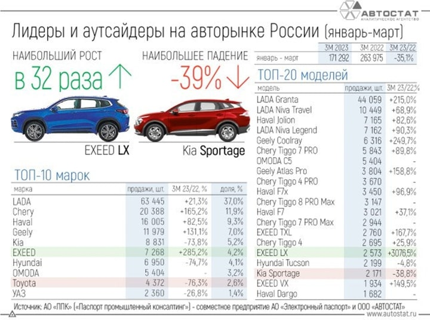
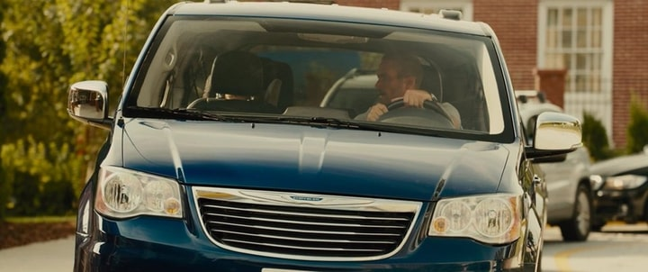
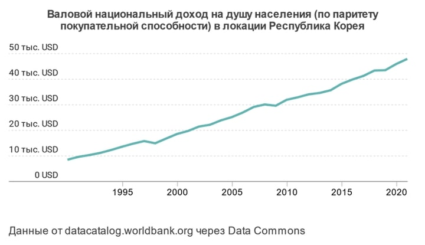
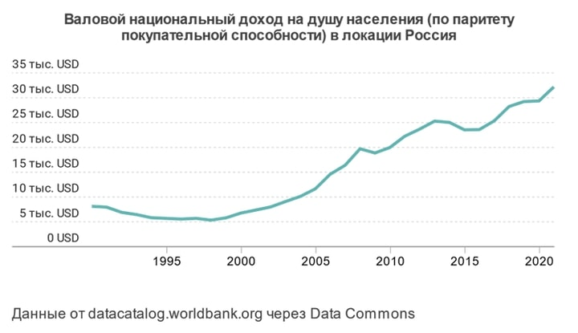
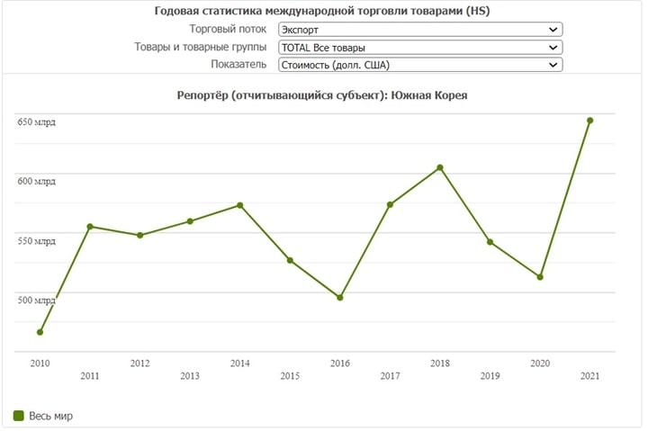
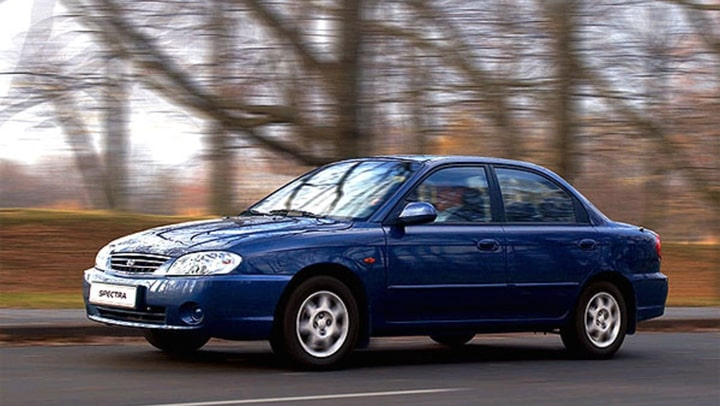
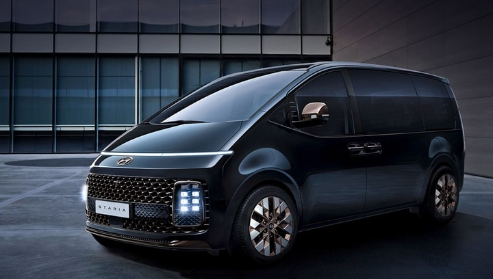
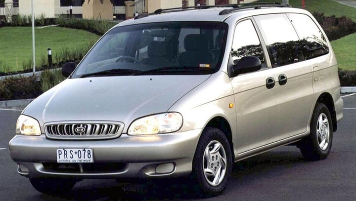
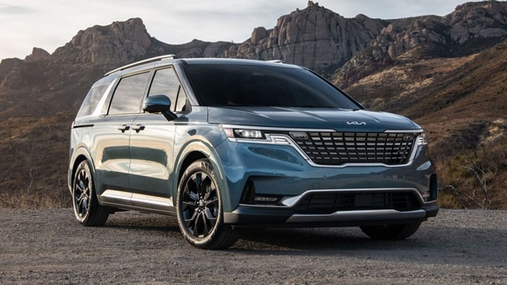

Что объединяет Южную Корею и Китай в экономическом смысле? Эти страны стали полностью технологически независимы. Они стартовали из бедности и продажи банального контрафакта. Без природной ренты они создали современную экономику и инфраструктуру. Начинали национальную автомобильную промышленность со скромных машинок снятых с производства японских платформ, а сегодня формируют новый автомобильный авангард. Мы полюбили корейцев, а теперь открываем для себя китайцев. В же чём секрет азиатского автомобильного чуда?

Год 2022 ознаменовался полным крушением развитого авторынка. Иных уж нет, а те далече. Красивые западные бренды ушли полностью или ушли в подполье. Даже корейцы по слухам продают питерский завод. «Вольво» в 90-x первым пришёл в Россию и первым ушёл, как говорится FIFO (first in first out). Из большой немецкой тройки «Мерседес» уже ушёл «навсегда» даже не по-английски, а «по-роверовски». VAG активно пытается продать свои российские активы и лишь BMW по слухам может вернуться после завершения активной фазы СВО. Можно понять: «недружественные» глобальные бренды̶ — на них оказывается беспрецедентное давление проукраинским лобби за присутствие на «токсичном» российском рынке, да и в 5-м пакете санкций ЕС прямой запрет на поставки машин дороже €50.000. Кто из западных топ-менеджеров готов рисковать мировыми продажами в странах, представляющих 47% мирового ВВП ради страны с 2%? Понять-то можно, но как принять? Видимо по-человечески т. е. эмоционально. А значит нас ждут пять стадий принятия неизбежной потери потребителем love mark (любимого бренда): отрицание, гнев, торг, депрессия и принятие (смирение).

Меня как учёного, конечно, интересуют новейшие примеры из практики поведенческой экономики. Эмпирический и самоанализ. Во-первых, про то, как абстрактный россиянин приобретал «последние» салонные машины по двойной цене в условиях крайней волатильности, неопределённости и риска (_так экономисты называют панику и СВО_). Именно для таких случаев лауреат Нобелевской премии, Герберт Саймон, разработал теорию ограниченной рациональности (_так экономисты называют глупость_), чтобы объяснить, как homo sapiens стремятся к удовлетворению вместо того, чтобы максимизировать полезность (_так экономисты называют объективное счастье_), что прямо противоречит постулатам неоклассической теории. Во-вторых, интересно проанализировать эвристику (_творческий поиск_) новой модели потребления отечественных homo economicus, а значит возврат к применению традиционных правил оптимизации пусть и на нетрадиционных уровнях с нетрадиционными объёмами и объектами. В-третьих, у нас появились яркие маркетинговые кейсы про лояльность, брендинг и инновации.

Факт: рынок продаж новых машин упал на катастрофические 80% год к году. Даже АвтоВАЗ не стал бенефициаром кризиса. Машины без АБС и кондиционеров даже в условиях паники уже не «прокатывают». Исход конкурентов позволил в марте 2023 года Ладе занять более 33% всего рынка, но это всего 24 тысячи машин, что на треть меньше 2021 года. Мы в прошлом году столкнулись с фактической остановкой отечественной автомобильной промышленности из-за разрыва цепочек поставок. Не буду анализировать глубину деградации и деиндустриализации отечественного автопрома, но судя по текущим цифрам и комплектациям - всё сложно. Удалось быстро восстановить только производство «легенд» ВАЗа и УАЗа из прошлого века и специальной техники. К счастью, к началу 2023 года КАМАЗ нашёл способы и маршруты импортозамещения и локализации «Даймлера» и «Камминса» и сегодня работает в полную смену. Приятно, что и в Калининграде есть пример успешного «еврозамещения» калининградским GRÜNVALD комплектующих для производства своих прицепов и роста продаж на освободившемся рынке. Чего очень хочется пожелать нашему «Автотору» с новыми китайскими партнёрами.

В этой бизнес-катастрофе цивильного автомобильного бизнеса много ярких деталей. Конечно, самое заметное — это разные б/у машинки в некогда монобрендовых сертифицированных салонах. Вчерашние храмы шедевров мирового автопрома ныне — просто пустые автокомиссионки. Авторынок словно откатился на 25 назад. При этом россияне как мировые лидеры по брендозависимости активно сопротивляются принудительному повороту на восток. Несмотря на отсутствие гарантий, цифровых сервисов, проблем с запчастями уже 10% продаж даёт параллельный импорт.

Мы всё ещё любим немцев и японцев, а они нас нет. Плевать им на сотрудников, партнёров, новые заводы, второй по размеру авторынок Европы и гарантийные обязательства перед покупателями. Очевидная дискриминация — гнев. Прям хочется возглавить движение Russian Lives Matter. Шутка. Мы сами решим, что и на каких условиях покупать за свои деньги - торг.

Месть падших или «как последние стали первыми». Дилеры говорят, что долгие годы в менеджмент «китайцев» шли только те, кого выгоняли у «немцев», но сегодня эти вчерашние «лузеры» вытянули джек-пот. Ходовых машин не хватает и теперь уже русско-китайский менеджмент рубит «бабло в чёрную», перепродавая квоты и лицензии. Некогда высокомерные продавцы Мерса заискивающе выпрашивают «Хунцы», а тойотовцы дружно взялись за OMODA от CHERRY. C’est la vie. А la guerre comme à la guerre. Однако клиенту для того, чтобы физически пересесть на китайские машинки, нужно ментально их полюбить. А как их принять, если для большинства россиян китайские бренды не только no brand, но и абсолютно бесхарактерные. С каждым немецким брендом связаны чёткие ассоциации. БМВ — это про спорт и брутальность, Мерс про комфорт и люкс, Ауди — интеллигентный драйв, Шкода — как Ауди, только попроще. Тойота — про олдскульную надёжность. БМВ — это фантастические М-дни на треке, Ауди — это Quattro на льду. Большие немецкие бренды — это сто лет истории, Формула 1 и мегатонны маркетинга, мерча и адреналина, а китайцы… А китайцы — никакие, да ещё и неожиданно дорогие относительно цен на их домашнем рынке. Депрессия. Где хоть немного спорта, ралли рейдов, дрифта? Антиавтомаркетинг 2023. Однако, похоже, что во всех смыслах «проехали». Принятие началось? Да, судя по текущим продажам новых машинок. Таков и наш общестрановой тренд. Вот как раз и прекрасный текст от хорошего аналитика об этом.

«Хочу поделиться ощущением: наши дорогие элитарии коллективно выдохнули. После февраля 2022 подавляющему большинству из них было непонятно, где теперь "источник престижа" (если особняк в Лондоне, а дети в Стэнфорде, а стартап сына собрал раунд в Кремниевой долине – это уже нельзя и не котируется), а также где теперь брать передовые и классные идеи для всего (от образования и до индустрии), ибо (плохо) копировать с Запада имело смысл только в условиях, когда аргумент "так делают в Самой Америке/Европе!" был убойным на любом совещании. Идея производить смыслы самостоятельно пользуется популярностью (есть исключения, но очень редкие) в основном у той части элиты, которая так и не выучила (или референтура/дети/помощники не выучили) английский язык и является по сути пещерной (в советском смысле слова: эти могут заряжать воду перед телевизором с Кашпировским), и обычно этот сегмент генерирует такую хтонь в плане экономических, или культурных, или образовательных идей, что на это больно смотреть, а имплементация этих "оригинальных разработок" была бы просто катастрофой. Моё ощущение: элита в целом чувствовала себя довольно потерянной. Сейчас инстинкты взяли своё: китайский учат едва ли не все (включая прежде всего детей), контакты (деловые) с китайской стороной выявляют поразительную похожесть интересов, характеров и местами даже понятийного аппарата (китайцы прекрасно общаются с "варварами" в терминах, которые им понятны), ну и вопрос распространения практики "возьмём китайское, переклеим шильдик, будет импортозамещение, выкуси, Америка!" с промышленности на другие сферы деятельности был, очевидно, всего лишь вопросом времени.» (CrimsonAlter по итогам встречи В. В. Путиным с РСПП в марте 2023).

Я последний год с любопытством присматривался к китайским автомобилям. Смотрел обзоры и ждал. Ждал, когда подъедут большие китайские бренды: Li auto, NIO, Zeeker и т. д. Но… Пока тихо. Не едут «большие китайцы» или едут очень осторожно и ширпотребом. Собственно, осторожный Китай осторожен. Из интересных марок дождался только Voyah. Посмотрел их у официала в Рольфе и внедорожник «Хунцы» у параллельщиков. Неплохо, но довольно дорого и совсем не понятно, как пока с ними жить в Кд? Где сервис и 5 лет гарантии?

Будущее нашего рынка очевидно. И стратегия китайцев очевидна. Они не стали цепляться за последний вагон уходящего поезда ДВС и сконцентрировались сразу на решениях завтрашнего дня. Электромобили безусловно победят. Они проще, дешевле, быстрее и экологичнее. Догнать мировых лидеров в классическом двигателестроении в принципе нереально, да и бессмысленно. Какие перспективы у механических часов в борьбе со смартчасами? Вопрос риторический. То же самое с автомобилями. Современные ДВС — это сложнейшие инженерные произведения, выдерживающее огромные температуры и перегрузки, а «электрички» настолько простые и эффективные, что «Тесла» обходится без салонов и сервисов. Опять же новый технологический переход связан с автопилотом и это тоже про электромобили. Дело за малым ̶͞— нужны зарядки. Правда, много, очень много зарядок. «Тесла» это про гибрид софта и машины. «Тесла» уже изменила привычный мир и открыла Китаю путь к экспансии на новые рынки. Войны электрокаров уже начались. Тесла уже дважды снижала цены в Китае на свою продукцию. Ждём начала массовой автоэлектрификации в России.

С нашим электрическим будущим всё понятно. Однако прямо сегодня, если нужна новая машина, то выбор невелик. А если нужна машина из блокбастера «Форсаж»? Помните, в одной из серий голливудского «Форсажа» герой Пола Уокера на крупном плане сосредоточенно сжимает баранку, представляя старт гонки, а через секунду камера отъезжает, и мы видим, что наш гонщик смиренно движется в очереди на высадку детей возле школы за рулём семейного минивэна «Крайслер Пасифика»?

Говорят, что какую бы машину ты не покупал в молодости в зрелости ты купишь бусик? Помните, этот термин «бусик» из мультика «Тачки»? Бусики. В общем после полугодовых колебаний между ушедшим немецким «Мерседес Виано», не пришедшим американским «Тойота Секвойа» и приходящим китайским «Войа Дрим» в марте 2023 года я неожиданно для всех окружающих купил корейский бусик «Киа Карнивал». Прагматизм, возрастные изменения, гнев на немцев, время антилакшери? Думаю, что победила рациональность, а принятие отложим на попозже.

Однообъёмник. Любопытная машина и необычный класс для России. Чистая победа клиентоцентрического маркетинга. Собственно, придумали этот класс во Франции. И довольно долго RENAULT Espace был первопроходцем этого класса, но в Европе и в России он так и не прижился, а в Америке стал лидером потребительских предпочтений. Для Европы семейные бусики — слишком большие на узких улицах, а для США в самый раз. Японцы и корейцы в полной мере освоили этот сегмент, и дали мне повод разобраться в эволюции сегмента и производителей. Лет 15 назад корейцы были для нас нынешними китайцами, а к началу 2022 года стали «почти японцами». Похоже, что мы ближайшие годы будем также постепенно открывать для себя китайцев и мечтать о собственных отечественных машинах. И ещё сожалеть об отсутствии привычных и добротных корейцев. На языке маркетинга этот процесс называется brand downgrade.

Давно ли корейцы были для нас no brand китайцами? Как вообще появился корейский «экономический дракон»? Есть повод поговорить о промышленной эволюции. Развитии страны, настойчивости производителя, работе над ошибками, автомобильном дизайне, силе бренда, гендерности автомашины, личных эмоциях против рациональности и санкциях. Санкциях, объявленных и необъявленных, их прямых и косвенных последствиях. И через Корею посмотреть на наш рынок и оценить перспективы нашей автопромышленности.

Сначала несколько малоизвестных штрихов к портрету Южной Кореи от, пожалуй, самого популярного корейского экономиста Чанг Ха-Джуна из его книги «Злые самаритяне».

«В 1961 году, через восемь лет после братоубийственной войны с Северной Кореей, годовой доход в Южной Корее составлял 82 доллара на душу населения. Средний кореец зарабатывал вполовину меньше, чем житель Ганы (179 долларов). Корейская война была одной из самых кровопролитных в истории человечества. Всего за три года (1950–1953) она унесла четыре миллиона жизней. Половина производственной базы страны и более 75% железных дорог были уничтожены. Корейцы жили впроголодь, без элементарных удобств.

Придя к власти в 1961 году в результате военного переворота, генерал Пак сменил военную форму на штатский костюм и выиграл трижды подряд выборы. Его победы были связаны с успехами в создании государственного «экономического чуда» при помощи пятилетних планов. В 1972 году генерал совершил то, что в «латиноамериканских странах называют «автопереворотом»: распустил парламент и установил фактически мошенническую систему выборов, которая должна была гарантировать ему пожизненное президентство. В оправдание он заявлял, что страна не могла позволить себе демократический хаос. Всем рассказывали, что нужно защищаться от северокорейского коммунизма и ускорять экономическое развитие. Пак провозгласил своей целью повышение среднедушевого дохода в Южной Корее до 1000 долларов к 1981 году, что было сочтено «слишком честолюбивым, почти фантастическим заявлением.» Какие любопытные параллели с Россией напрашиваются сами собой.

Президент в 1973 году развернул амбициозную программу индустриализации тяжелой и химической промышленности. В эксплуатацию вступили сталелитейный завод и современная верфь, а со сборочных линий сошли «первые местные автомобили (собранные, впрочем, в основном из импортных запчастей типа нашего нового «Москвича»). Появились новые компании, работающие в области электроники, машиностроения, химической промышленности и в других развитых производственных отраслях. За этот период среднедушевой доход вырос феноменальным образом — более чем в пять раз с 1972 по 1979 год (в долларах США). Казавшаяся фантастической цель — доход в 1000 долларов — на самом деле была достигнута на четыре года ранее установленного срока. Еще быстрее рос экспорт: с 1972 по 1979 год он увеличился в девять раз (в долларах США).

Какой ценой, какими инструментами в условиях полувоенного капитализма были достигнуты такие результаты? Фанатичная экономия и концентрация на производстве и заработке валюты. «Трата валюты на что-то, несвязанное с промышленным развитием, была запрещена или, по крайней мере, затруднена запретами на ввоз, высокими пошлинами и акцизными сборами (которые именовались «налогом на потребление роскоши»). Под категорию роскоши попадали даже совершенно обычные вещи: модели машин, виски, печенье. «Хорошо помню эйфорию национального масштаба, когда по специальному правительственному разрешению в конце 1970-х была ввезена партия датского печенья». По тем же причинам запрещался и выезд за границу тех, кто не имел прямого разрешения правительства на ведение бизнеса или обучение.

«Нас учили, что священный долг каждого сообщать о курильщике, который предпочитает иностранные сигареты. Стране нужен был каждый доллар, заработанный на экспорте, чтобы импортировать машины и другое технологическое оборудование и развивать собственную промышленность. Ценная зарубежная валюта была необходима для «индустриальных солдат», ведущих экспортную войну на предприятиях. Те, кто тратил ее на всякую ерунду, например на нелегально поступавшие иностранные сигареты, считались «предателями».

Современная Корея — одна из самых «изобретательных» стран: она входит в первую пятерку государств по количеству патентов, ежегодно выдаваемых Патентным бюро США. Но до 1980-х годов здесь доминировала «обратная инженерия». Мои друзья покупали «копии», в небольших мастерских разбирали машины IBM, копировали их составляющие и собирали свои компьютеры. В то время Корея была одной из «пиратских столиц» мира, в огромных количествах производя липовые кроссовки Nike и сумки Louis Vuitton. Те, кто не желал идти на сделку с совестью, поступали иначе. В продажу шли кроссовки, которые выглядели как Nike, но назывались Nice, или на них был логотип Nike с каким-нибудь дополнительным штрихом. Так было. Черкизон и все российские рынки 90-х имели широкие линейки китайского и корейского «Adibas». Китай идёт тем же путём. Зарабатывал на всём на чём мог чтобы накопив ресурсы перейти к автомобилям - продуктам с максимальной локализацией и добавленной стоимостью.

Вот и все секреты корейского чуда — «трудолюбие, голод, индустриальные солдаты и госкапитализм». «Неолиберальная элита хочет заставить нас поверить, что в годы «экономического чуда» (1960–1980) Корея следовала неолиберальной экономической стратегии развития. В реальности все было иначе. «Корейское «экономическое чудо» было результатом разумной и прагматичной смеси рыночных стимулов и государственного управления. Правительство не собиралось подавлять рынок, как это делали в коммунистических государствах. Однако и слепой верой в свободный рынок оно не обладало. Хотя корейцы серьезно относились к рыночной системе, они понимали, что часто необходима и государственная корректировка.»Никакого либертарианства и международного фритредерства, а протекционизм и опора на собственные силы. Санкции России в помощь или всё же не справимся без китайцев?

Сдаётся мне, что именно такой подход называется потребительским патриотизмом. Канули в лету все ограничения по импорту. Корея страна со стабильным профицитом счёта текущих операций. Экспорт в 2021 году составил $645 млрд. Корея по уровню жизни занимает 30 место. Рядовому корейцу давно доступны любые иномарки, но доля продаж своих брендов на местном рынке по-прежнему составляет внушительные 86%.

История Корпорации КИА в общем достаточно типична для страны утренней свежести. 15 мая 1944 г. ̶͞— дата основания компании Kyungѕung Precision Industries Ltd., первого в Корее производителя велосипедов, а позже мотоциклов. Тогда зародилась мечта о том, чтобы стать первым корейским автопроизводителем. В 1974 году стартовало производство первого полноразмерного автомобиля марки Kia. Седан Brisa снискал популярность у потребителей и приобрел статус народного автомобиля. Он стал первым корейским автомобилем, преодолевшим отметку в 1 миллион проданных экземпляров. Последние десятилетие 20-го века стало поворотным моментом в истории Kia. Дебютирует Sephia — первый автомобиль, полностью разработанный внутри компании. Его сборка была налажена на калининградском Автоторе.

Тогда корейцы были в диковинку. Производство стартовало в 1992 году, и за 5 лет было выпущено почти полмиллиона экземпляров. 1993-й стал годом рождения для модели, которая по сей день является визитной карточкой Kia — кроссовера Sportage. 1998 г. — Kia присоединяется к Hyundai Motor Group. В чём разница между «Хёндэ» и «Киа»?

За последнее десятилетие корейские марки смогли обойти многие японские корпорации по объемам производства и качеству сборки. К примеру, Kia и Hyundai в настоящий момент по количеству выпускаемых моделей превосходят Honda, Mitsubishi и Mazda вместе взятые. Сегодня оба автопроизводителя входят в одну группу компаний, что объясняет сходство их некоторых продуктов. Многие автомобили каждой марки разрабатываются на одинаковых платформах и имеют своих братьев-близнецов (с некоторыми оговорками) в продуктовой линейке второго бренда. Значит ли это, что они одинаковы? Вовсе нет, в этом вы можете убедиться, если сравните ассортимент актуальных моделей каждой компании. В модельном ряду KIA намного больше автомобилей. У них есть представители во всех классах. Например, они предлагают внедорожник Mohave и премиум-седан Quoris. Плюс KIA более комфортабельные. У них чуть лучше материалы отделки и больше возможностей для индивидуализации. Так в чем разница между KIA и Hyundai? По большому счету, только в дизайне. Каждый выбирает машину на свой вкус. Такое ощущение, что корейский собственник двух брендов просто аккуратно разводит покупателей по разным дизайнам. Успех обоих брендов говорит о том, что это работает. «Карнивал» — это минивэн повышенной проходимости позиционируется как идеальное семейное транспортное средство для езды по городу и за его пределами. С этим спорить трудно — автомобиль действительно очень вместителен, практичен и удобен по множеству критериев. Напомним, у «Хёндэ» до последнего времени минивэнов не было вообще. Пожалуй, только с появлением футуристического соплатформенного Hyundai Staria «Карнивалу» пришлось потесниться. Собственно, разница в дизайне и концепции стремительно-брутального «Карнивала» и зализанно-аквариумной «Старии» и есть то, ради чего развели две марки. Платформа и двигатели одинаковые, кресла одинаковые, но приборы отличаются и высота 175 cм против 199см. Кому бусик-мальчик, а кому девочку? И правда, «Стария» ведь такая как анимешная восточная машинка, а «Карнивал» — надёжный помощник большой семьи с чёрным поясом по тхэквондо и рубленными чертами лица. Хорошая маркетинговая стратегия, не так ли?

В 2020 году впервые в истории конкурса «Всемирный автомобиль» (World Car Awards) главный приз был вручен корейской компании. Полноразмерный внедорожник Kia Tellurіdе признан лучшим в абсолютном зачете, а электрическая версия городского кроссовера Kia Soul EV стала победителем в категории «Лучший городской автомобиль».

К концу 1990-х в Kia Motors сложилось четкое убеждение, что в их модельной линейке не хватает семейного минивэна. Особенно остро отсутствие такой модели ощущалось на американском рынке, где Kia стремилась завоевать прочную репутацию производителя недорогих, но в то же время надежных автомобилей. После нескольких лет разработок в 1997 году компания представила прототип семиместного минивэна, который должен был составить конкуренцию таким автомобилям, как Toyota Sienna, Ford Freestar, Honda Odyssey. Минивэн Kia Carnival первого поколения, выпуск которого начался в 1998 году, имел в салоне три ряда сидений. Базовым двигателем для этой модели был бензиновый V6 2.5 (150–177 л. с.), топ-версия оснащалась «шестеркой» объемом 3,5 литра и мощностью 195 сил. В Америке этот минивэн был известен под названием [Sedona](https://dzen.ru/away?to=http%3A%2F%2Fwroom.ru%2Fcars%2Fkia%2Fsedona), а машины для российского рынка собирали на калининградском «Автоторе». Судьба первого поколения оказалась не очень гладкой. Достаточно сказать, что в Великобритании пучеглазый минивэн был признан самым уродливым автомобилем года. На российском рынке машины второго поколения продавались тоже штучно. Но корейцы не сдались и продолжили настойчиво работать над следующим поколением.

Моё личное знакомство с КИА «Карнивалом» в третьем поколении состоялось года четыре назад в отпуске. Отдых в том месте — это кайтсёрфинг и гольф. Под кайт традиционно использовались разнообразные пикапы, потому что в них хорошо помещается снаряга, но были проблемы с комфортом второго ряда и нужен чистый багажник под гольф инвентарь. Поиск подходящих внедорожников не увенчался успехом, но неожиданно мне в прокате попался на глаза «Карнивал». В живую достаточно большая машина комфортно вмещала 6 человек, да ещё оставался приличный багажник. Отдельного упоминания заслуживают множественные подстаканники и порты. Эксплуатация и в семейном формате, и с друзьями-гольфистами и кайтерами показала, что машина близка к идеальной. После того, как привыкаешь к сдвижным дверям и к посадке в бусик, все остальные классы автомобилей представляются неудобными. Седаны — слишком низкие, а внедорожники — слишком высокие. Удивительная золотая середина. В какой-то момент я даже подумал, что видимо так и должна выглядеть функционально идеальная машина. Смущала простота отделки, скромный интерфейс прокатной версии и неказистый овальный значок. Вот если бы условно на ту же машину да шильдик BMW, но… баварцы бусики пока не выпускают. А «Карнивал» я запомнил и стал ждать возврата модели на отечественный рынок.

Бинго. Премьера минивэна Kia Carnival четвертого поколения состоялась летом 2020 года. Смело. Ведь доля всего сегмента бусиков в России — 1,5%. В феврале 2021 года было объявлено, что производство нового Kia Carnival стартовало на заводе «Автотор» в Калининграде. Создан в соответствии с концепцией Grand Utility Vehicle («Большой утилитарный автомобиль»). Что это означает? То, что новый «Карнивал» по оснащенности даст владельцу больше возможностей, чем традиционный MPV. Видимо поэтому в некоторых СМИ его называют «кроссвэном», приспособленным как для выполнения деловых задач, так и для семейных поездок. Одна из особенностей нового Kia Carnival – увеличенная до 5155 мм длина. Это позволило разработчикам создать более просторный салон. Автомобиль был доступен на российском рынке в двух вариантах компоновки — в семи- и восьмиместном исполнении. Возможность использовать кроссвэн как в городе, так и за его пределами обеспечивает высокий дорожный просвет, который равен 182 мм. Мне сразу понравился «американский» атмосферник V6 3.5, выдающий у нас 249 л.с. и 332 Н•м, доступный в версии Prestige. Тяга только на переднюю ось идёт через «восьмиступенчатый» автомат. Приятным дополнением апгрейда модели стал новый фирменный стиль и новый логотип. На мой взгляд действительно современный и технологичный. Без овала. Согласно корпоративной легенде, «новый логотип включает в себя элементы симметрии, ритма и подъема», которые «воплощают уверенность Kia и приверженность интересам клиентов». Одновременно объявлен и новый девиз марки: Movement that inspires, то есть «Движение, которое вдохновляет».

В общем всё сложилось. «Карнивал» — это много автомобиля за рациональные деньги. По причине отсутствия гарантийных машин я после анализа предложений я решился на новый параллельный корейский «Карнивал». Благо в феврале на фоне низкого спроса и приемлемого курса цены прилично припали. Русификация интерфейса заняла всего час и вот новенькая машинка из нефирменного салона в плёнке уже едет из Москвы на трейлере в Калининград. Впрочем уверен, что риски управляемы и проблем с сервисом и запчастями на «КИЮ» не будет даже при ужесточении санкций. Теперь все семейство и пёс очень рады простору, а я неспешно размышляю над «электричками». Тем более пищи в мире параллельного импорта появилось хоть отбавляй. Один друг приобрёл фантастическую TESLA model S plaid (2,1с до сотни), а другой — прекрасный китайский кроссовер Li 9. Машины разные, но обе по-своему революционные. Первая с 1005 лошадок заставляет всякий европейский автогламур типа Феррари и Бентли униженно и громко глотать пыль. Вторая же, пожалуй, впервые составляет конкуренцию немцам в сегменте больших кроссоверов типа МB GLS и BMW Х7, но… У них нет «электричек» такого размера и функционала. В этом году ждём много китайских новинок, и я всё ещё надеюсь, что трудолюбивые корейцы однажды вернутся в Россию с прямыми поставками и локальным производством отличных машин. А мы сами изучим и повторим корейский путь, скопируем и научимся делать свои отечественные машины. Совсем свои машины. С продуктами же справились — значит и с машинками сможем.

Дорогу осилит едущий.