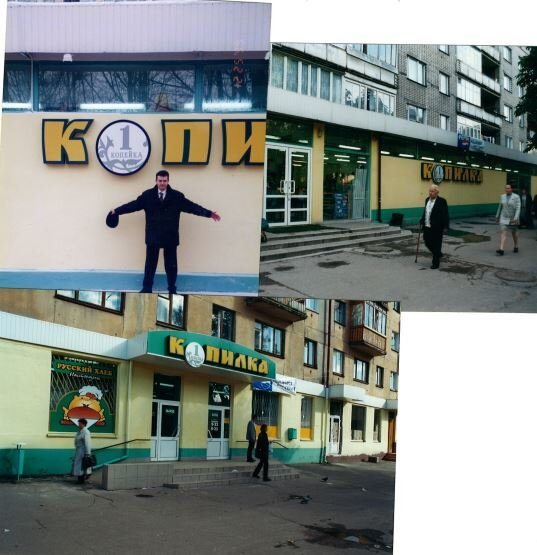
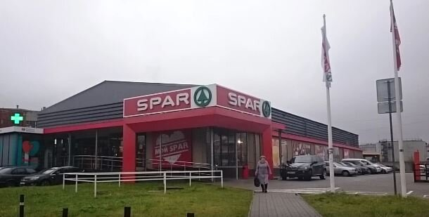
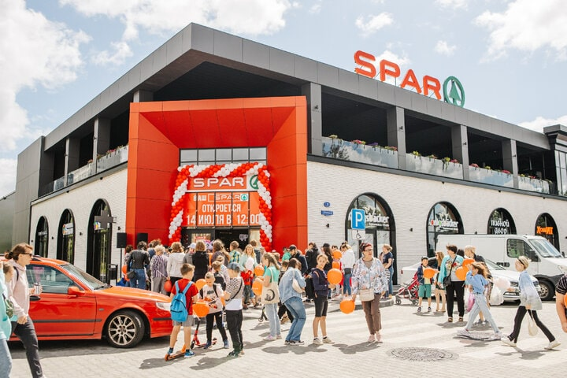
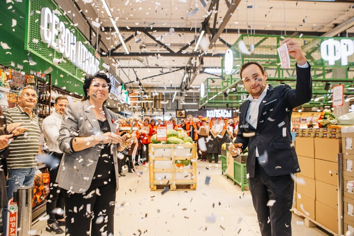
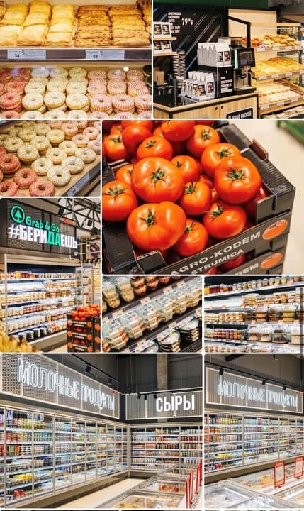

Этот текст мог носить много разных названий. Например, «Сказка о Гастрономе», и её можно было бы рассказать детям. А можно было бы назвать «Справка об истории развития и вкладе современных форматов розничной торговли в социально-экономическое развитие Калининградской области.» Такой текст мог бы лечь на стол губернатора. Креативные журналисты написали бы текст «Качество жизни региона в зеркале витрины супермаркета». Лекция для студентов-экономистов называлась бы «Адаптация формата, покупательских миссий и CVP в соответствии с флуктуациями спроса в формате convenience store в период с 1998 по 2021 годы в КО РФ». Я же просто расскажу историю одного магазина и одной компании нашей большой страны.
В общем жил-торговал типовой советский гастроном, каких было десятки тысяч по всей нашей Родине. Не 3-я улица строителей, а наша калининградская улица Генерала Черняховского. Простой такой магазин, расположенный на 1 этаже обычной хрущёвки 1965 года постройки. И всё у него было хорошо и стабильно. Как и во всей большой советской стране. Строго по плану привозили только отечественные продукты. Гастроном ̶̶̶̶̶ — это про нашу еду. Обычные и дефицитные. Обычные красиво выкладывали пирамидками и стопками, а дефицитные —частью «выкидывали», а частью припрятывали «для блатных». Блат был разный, но какими-то путями работяги и номенклатура — все находили пути снабжения собственного семейства. Поэтому при отсутствии сервелата в регулярной продаже на праздник он был у всех на столах.

## Эпоха приятного брежневского застоя сменилась бардаком перестройки

В 1989 году начался первый современный экономический кризис. Резкий рост инфляции и сокращение импорта привели к усилению традиционного дефицита. Кризис предложения в условиях деградации традиционной модели управления привёл к глубоким социально-экономическим проблемам. Дефицит сигарет вызвал небывалые доселе табачные бунты, а дефицит водки привёл сначала к появлению сначала спецотделов, а потом и вообще к продаже алкоголя по талонам через «амбразуры». Страна разваливалась на глазах.
Первое личное знакомство с этим магазином у меня состоялось в 1990 году. Будучи студентом БФУ, я скупал талоны на водку у девчонок всех курсов нашего иняза, а после пар вместе с другом штурмом брал пару-тройку ящиков беленькой. Далее мы обеспечивали круглосуточный сервис по продаже и доставке из комнаты №25 в общежитии будущего БФУ на ул. Чернышевского. Тогда мне и в голову не могло прийти, что с этим магазином будет связана вся моя профессиональная жизнь.Волею предпринимательских судеб в январе 1998 года наша команда выкупила остатки упавшего торга «Гастроном». Одним из шести арендованных у Мэрии гастрономов и был как раз наш герой. Засучив рукава, мы, молодые директора, бросились приводить в порядок наше «убитое» хозяйство. После тотального запрета распития алкогольных напитков на рабочих местах, генеральной уборки и выстраивания регулярного менеджмента мы занялись разработкой нового розничного формата. Странная экономика ельцинской России того времени с долларом за 6 рублей жила по заветам монетарных властей наших западных кредиторов. Вся страна выживала, но искренне верила, что скоро заживёт как в Европе. Молодой российский ритейл тоже искал технологии за рубежом. Мы искали у соседей, ведь Польша и Литва для нас до ковида не были заграницей.

> Мы тоже рванули изучать лучшие практики иностранных соседей. Скопировали технологии, выполнили проект на ватмане, с карандашом и ластиком. Придумали добрый бренд «СеМьЯ».
> Сделали евроремонт, привезли евроассортимент продуктов. И главное, несмотря на сопротивление всех старших сотрудников, — внедрили самообслуживание на тогда ещё диковинных штрих-кодах.

Заматеревшие товароведы уверенно говорили, что и в советские годы «забывчивость покупателей» приносила до 3% убытков в самообслуживании, но мы верили в то, что к нам будут ходить европокупатели с высокой сознательностью.

## Новеньким евромагазином стал наш старенький советский гастроном

Сегодня нам самим кажутся более чем скромными и ассортимент, и технологии торговли, которые мы представили на суд наших неизбалованных покупателей 14 августа 1998 г.
> Это был третий магазин самообслуживания в области, а раздвижные двери были «чудом враждебной техники».
Любой новый проект — это маленький трудовой подвиг. Всё получилось. Безумные по тем временам инвестиции в $160.000 пришлись по душе нашему покупателю. О ужас! Пришлось пару часов ограничивать доступ в магазин первым покупателям. Выручка превзошла наши ожидания.
Окрылённые первым успехом, мы вынашивали планы по ускоренному развитию бренда «СеМьЯ» целых... три дня. 17 августа всё изменила новость об объявлении Россией дефолта по государственным казначейским облигациям. Это был шок. Понятно, что правительство «хотело как лучше, а получилось как всегда». Магазины опустели за три дня. Переоценки каждый вечер. Продавалось всё, но и купить что-либо можно было только в деньги и лучше за зелёные. Деньги-товар-деньги. Половина выручки ежедневно превращалась в наличные доллары. Всю осень мы гоняли в Литву и скупали за валюту крупы и любую дешёвую еду, что могли найти. Карета российской экономики превратилась в тыкву. Доллар уже в сентябре завалился за двадцатку рублей. Пятьсот баксов зарплаты сотрудников превратились в сто тридцать. Потребительская корзина превратилась в хлеб, молоко и картофель, да ещё и дешёвые серые макароны. Деликатесы и вкусняшки стали не по карману большинству калининградцев. Евросупермаркет превратился в бакалейную лавку времён поздней Перестройки.
Осень прошла быстро, а вместе с ней пришло понимание новой реальности. Стало понятно, что всю страну опять как и в 1991 году «развели как сельских и кинули». Было обидно, ведь кто-то успел скинуть все ГКОшки и купить доллар по шесть рублей, и поднять денег на кэрри-трейде. Недолгая жизнь с твёрдым рублём закончилась и нужно было адаптировать бизнес-модель под разбитое экономическое корыто. Тем более, что плюсы в этой ситуации были, и немалые. Кризис кризисом, а кушать хочется три раза в день. Нужно было быстро придумать адекватную бизнес-модель.
В 1999 году стало понятно, что коль денег на долгосрочные инвестиции нет и взять их негде, то нужно жить по средствам. Да, спрос преимущественно на базовые продукты, но ведь последние десять лет новые магазины не строились, а, следовательно, оставшийся от советских времён дефицит торговых площадей сохранялся. Значит нужно открывать простые магазины самообслуживания с низкими ценами - дискаунтеры.

## Литовская maxima подсказала путь

Старые гастрономы нуждались в срочном ремонте и переходе на самообслуживание. Литовская Maxima подсказала путь: экономичный дискаунтер. У них как раз была похожая ситуация с доходами, да и советское торговое наследие было таким же.
> Литовцы назвали свой формат Taupa, а мы просто перевели — «Копилка». Однако, одно дело подсмотреть, другое —решиться, а третье — сделать.
В условиях жёстких инвестиционных ограничений мы принимали простые и дешёвые решения. Мы хозспособом закладывали блоками старые стеклянные витрины, заливали пол мраморной крошкой и рыскали по Германии в поисках б/у оборудования. Главная задача была уложиться в бюджет — миллион с небольшим рублей. И получалось. Быстро все наши семь гастрономов превратились в «Копилки». Простые народные магазины самообслуживания. И евросупермаркет «СеМьЯ» тоже стал экономичным универсамом «Копилка».

К счастью, животворящая девальвация спровоцировала небывалый рост экономики. Чудесным образом этот подъём совпал и с обновлением власти, и с феноменальным циклом повышения стоимости энергоносителей. На глазах и наша область начала «вставать с колен». Уровень жизни за 9 лет вырос в 5–6 раз.
> В Калининграде летом 2008 года средняя зарплата составляла 23 тыс. рублей, т. е. равнялась $1000 по текущему курсу. Покупатель с такими доходами уже не хотел минималистского ассортимента и скромного ремонта. Потребление вновь сдвинулось в сторону качественных импортных продуктов.
Даже молоко в те годы на наших прилавках было на половину польским и литовским. Нужно было догонять потребности потребителя, неожиданно поднявшегося «из грязи в князи». Не мудрствуя лукаво, мы решили оживить нашу первую марку, осовременив брендбук.

## 50 оттенков салатового...

Мы разработали апгрейд формата «Семья» с новым стандартом дизайна, новым оборудованием, расширенным ассортиментом свежей продукции. Основным цветом в интерьере был выбран светло-зелёный. Помню, как наш художник Сергей Борисович Перетокин нарисовал новый логотип, а мы выбирали 50 оттенков салатового. Победил цвет яблока Гренни Смит. Дальше нужен был символ, и в качестве символа выбрали ромашку — русский символ семьи. По иронии судьбы первый магазин, попавший под ребрендинг в 2006 году, оказался бывшей «Семьёй» №15 на ул. Черняховского. Той самой, с которой всё начиналось. Таким образом, это оказался обратный ребрендинг. Магазинчик и правда получился весёленьким, как говорят «западники», refurbishment удался. Так наш гастроном пережил третью реинкарнацию.

## Баста, карапузики! "кончилися танцы"

Всероссийская нетрудовая гулянка закончилась вместе с наступлением мирового экономического кризиса 2008 года. Россия не долго была «островом стабильности в мировом океане экономического кризиса». Вслед за обрушением цен на «матушку нашу Углеводородицу» традиционно посыпался и рубль. Прямым следствием стали проблемы банковского сектора и шоковое падение реальных доходов. Страшное слово «секвестр» вернулось в обиход всех финансистов. На практике это означало сокращение расходов домашних хозяйств примерно на 15%, а в валюте, соответственно, на 75%. К счастью, потребительский рынок быстро адаптировался к новым условиям. Сам кризис оказался V-образным, т. е. рынок «упал-отжался». Уже в 2010 году потребление начало восстанавливаться.
Новый этап роста доходов наших покупателей подтолкнул нас в 2012 году к очередному обновлению формата. Модные иностранные ретейл-тренды в этот момент подразумевали дальнейшее расширение предложения овощей, фруктов и молочки. В дизайне мы опирались на «крафтовые» решения ещё одной литовской сети IKI, которая на самом деле являлась частью немецкой REVE Group. Так появилась «графитовая» «СеМьЯ».

## Дизайн — это язык, на котором мы разговариваем с покупателем

Дизайн — это язык, на котором мы разговариваем с покупателем, это форма предложения, а ведь 70% наших покупателей — дамы. Для них красота имеет значение. Потребитель вообще покупает глазами. Цена и промо — это содержание и наше предложение дружить. А улыбка — это часть благодарности. Ровные, чистые, современные магазины с понятным ассортиментом и с акцентом на фреш понравились клиентам. На открытии новой «СеМьИ» на Киевской ко мне с вопросом подошла бабушка божий одуванчик. После её слов «Ты, сынок, здесь главный?», я приготовился услышать традиционную просьбу о скидках для пенсионеров. Но бабуля меня сразила наповал: «Спасибо, сынок, за чудесный магазин. Я живу напротив и в него теперь буду каждый день ходить. Вы мне жизнь изменили». Прямо бальзам на душу.

> Новый проект понравился покупателям, но мы уже понимали, что нужно бежать дальше. Жизнь в ритейле, как путешествие на велике: остановился — упал, заснул — тебя съели конкуренты.

Понимая, что конкурируем с польскими и литовскими сетями, мы решили стать европейско-российской сетью в Калининграде. Наш капитал — ум, «руки», западные технологии и бренд.

> Мы долго не понимали реальную силу бренда SPAR, а покупка за деньги иностранной вывески или, как мы говорим, участия в «символьной группе» и правда выглядела неочевидной. Однако наше корпоративное развитие ставило вопрос уже не о том, как стать вторым игроком на рынке. Нам хотелось стать лидером.

Стало понятно, что даже если мы будем расти в рамках формата «у дома» мы всё равно останемся только вторыми-третьими. Нужно было предложить что-то совсем новое, нужна была настоящая инновация. Сгенерить новую премиальную марку — не проблема, но что даёт ноу-бренд-вывеска? Нужны были технологии, бенчмарки, лучшие практики и международный независимый бренд, по потенциалу близкий к «МакДональдс», «Рэдиссон». Важную роль сыграли встречи с топ-менеджерами SPAR Int. B. V., которые убедили меня в том, что SPAR — это проверенный временем альянс независимых ритейлеров из 40 стран мира с открытым доступом к лучшим технологиям, практикам и закупочным союзом. Неожиданно всё встало на свои места. SPAR — это возможность. Уникальная возможность, поскольку на рынке ритейла была только одна качественная международная франшиза.

> В ноябре 2013 мы получили подписанную генеральную эксклюзивную лицензию на Калининградскую область. Так начался новый этап в жизни компании. Этап большого прорыва. Этап больших инвестиций.

Стратегический анализ указывал на то, что мы имеем ограниченный временной ресурс и поэтому мы выбрали агрессивную стратегию. Для концентрации всех ресурсов на направлении главного прорыва было принято решение не развивать бренд «СеМьЯ», но и не заниматься ребрендингом на первом этапе в целях баланса между инвестициями и доходностью. Полгода мы учились и стажировались у австрийских и ирландских коллег. Параллельно провели большую рекламную кампанию с тизерами и рассказом о всеевропейской крутизне SPAR.

## Мы очень волновались, но покупатель оценил

И вот — в июле-августе 2014 года торжественно открыли сразу три СПАРа: в Калининграде на Сибирякова, в Балтийске и в Гурьевске. Магазины были в оригинальном европейском дизайне, удалось чётко сформулировать наше ключевое CVP (customer value proposition — ценностное предложение) в области свежих продуктов. Гибридный формат, в котором много фреша и много лучших цен. Мы очень волновались, но покупатель оценил. Мы с первого дня перевыполняли план по выручке. Успех был столь велик, что даже мои хорошие знакомые звонили мне со словами: «Олег, при всём уважении к вашей «Семье» посмотри, как европейцы делают правильные супермаркеты SPAR». Объекты получились классными и выстрелили.

В этом же 2014 году у нас в России случился «Крым наш» и новый российский кризис накрыл наш новый проевропейский проект. Прямо déja vu. Шок как говорится — это по-нашему, причём касающийся нас напрямую.

> Наша модель была построена на растущем тренде потребления и предполагала концентрацию на крепком среднем сегменте потребителей за счёт широкого ассортимента европейских товаров под спаровскими СТМ (собственными марками) *.

Мы планировали поставки австрийской молочки, а остались без польской. Экстренный анализ показал, что наш новый антисанкционный мир вновь несёт с собой не только операционные угрозы, но и стратегические возможности. При ближайшем рассмотрении «большая экономическая ж... 2014 года» оказалась маленьким голубым океаном*. Мы, конечно, остались без импортной молочки, но иностранные конкуренты в условиях санкций тоже не торопились с экспансией на российскую территорию, да и наша пищёвка ожила.

> Как известно, любой предприниматель — оптимист, а российский предприниматель, по сути, неисправимый оптимист.

Собственно, трудно представить себе иной логику человека который на падающем рынке продолжает активные инвестиции. Наша компания за 8 последних лет инвестировала более 8 млрд рублей в логистику и в открытие новых магазинов «SPAR”. В 2020 году наконец-то мы добрались и до ребрендинга старых «СеМеЙ».
В феврале 2021 года очередь дошла и до нашего старичка-гастронома. Делать реконструкцию в жилом доме — себе дороже. Мы приняли решение ограничиться «мягким ребрендингом». Задача — оптимальными средствами дизайна добиться изменения магазина до неузнаваемости. Вот, что написали наши маркетологи в официальном пресс-релизе про пятую жизнь нашего магазинчика:
«В самом центре города — на ул. Черняховского, между Центральным рынком и Музеем Янтаря — 12 января распахнул свои двери очередной магазин нового для нашего города формата SPAR Express. Новый формат рассчитан как для жителей близлежащих домов, так и для стрит-трафика по одной из самых оживленных артерий города – улицы Черняховского. Для первых в новом SPAR Expressпредставлен широкий выбор фруктов и овощей, хлеба, в том числе и свежей выпечки собственного производства, а также охлажденное и замороженное мясо, и традиционно широкий выбор из категории напитков и бакалейных групп. Для пешего трафика мы приготовили экспресс-кассы и кассы самообслуживания, чтобы не задерживать вас по пути на работу или учёбу, готовые решения для перекуса в отделе БериДаЕшь и Food To Go в прикассовой зоне, а также кофе-станцию с лучшим бодрящим напитком области от Porto Manufactura и всегда свежую выпечку из пекарни при магазине».
Что еще делает новый магазин экспрессом? Режим работы с 8 до 23. Новые технологии? Помимо уже упомянутых экспресс-касс и КСО — это энергосберегающие решения и LED-освещение.

> Новые времена требуют новых сервисов и услуг. Темп, рост города и числа туристов отражаются в новых магазинах его центра и жилых кварталов. Spar Express — формат нового времени, времени быстрой и целевой покупки.

## Уже 24 года стараемся быть лучшими каждый день

Подводя итог, скажем, что мы, **Торговый дом «Семья»,** уже 24 года стараемся быть лучшими каждый день, всегда идти в ногу со временем и со своим гостями, со своими покупателями.

> Better togetherили «Лучше вместе» — это девиз компании SPAR во всём мире.

Для нас это значит быть не просто вместе, а быть каждый день своим магазином для своих. Наш новый магазин на старом месте — это лучшие традиции отечественной торговли и самые современные технологии. В добрый путь SPAR-express №15! Так было год назад, когда я закончил этот текст. В другой жизни, в другом мире.
А сегодня 14 июля 2022 мы открываем новый супермаркет на улице Крымской.

> Такой же свежий и технологичный, как и все предыдущие. Даже лучше. Открываем с небольшим опозданием, но зато в новых реалиях. Открываем, когда многие закрываются.

Открываем вопреки текущему кризису спроса. Открываем, понимая, что этот кризис надолго. И внутренний, и международный, и особенный калининградский. Окна в Европу не будет и особая экономическая зона станет островной. Открываем мы импортозамещённый, точнее, еврозамещённый супермаркет. Без всякой помощи отвернувшихся от нас бывших западных партнёров.

## Мы гордимся своим делом и областью. нам не привыкать к кризисам!

За короткое время наша профессиональная команда смогла адаптироваться к западным санкциям. Отказ в поставке оборудования, материалов и продуктов поставщиками ЕС, сложная логистика, волатильные рынки. Полублокада полуэксклава. Нас она тоже касается. Впереди ещё много новых испытаний и проблем. Много санкционных пакетов. Много потерь. Наша страна тоже меняется на глазах. Военный капитализм не за горами. Но мы за эти 24 года стали крепкими и умными. Мы многому научились. Например, 10 июля 2022 года мы встретили с рекордным запасом продуктов. Который позволит бесперебойно выполнять нашу работу много месяцев. Мы видим не только риски и угрозы, но и возможности. LIDL и Bedronka при нашей жизни не появятся в России. Трудности с логистикой - трудности для всех. Нужно быть быстрее и гибче. Отлив опускает все лодки, но не все останутся на мели.
> Продолжим эволюционное развитие. Будем идти за покупателем. Продолжим развитие нашей цифровой экосистемы «Клуб друзей». Впереди у нас трансформация суперсторов в гастромаркеты.
История циклична. Из гастрономов в гастромаркеты. В любых условиях мы сделаем всё, чтобы наши магазины были лучшей калининградской витриной. Мы — лидеры. Лучшая команда ритейла в области. Dream team! Мы коммерсанты и часть агропромышленного комплекса нашей области. Мы гордимся своим делом и областью. Нам не привыкать к кризисам. Бывало и похуже. Прорвёмся и станем ещё сильнее.

С праздником, Семья! Ура!