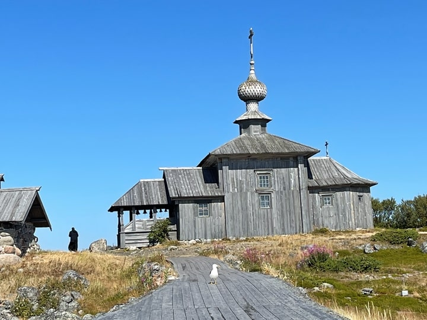
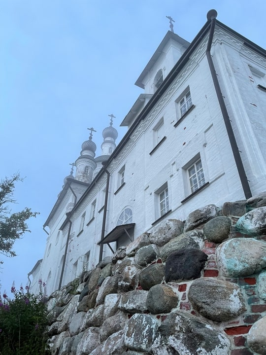
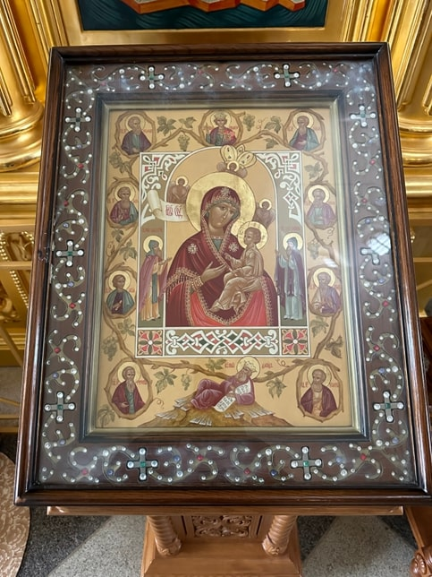

> Соловки 2023 в тумане, как и вся Россия.

Вера — это глубоко личная ценность, поэтому эта статья, а, точнее, большой разговор исключительно для тех, кто уважает Православие и РПЦ. Статья и состоит из двух больших взаимосвязанных частей: сначала размышления об экономике, предпринимательстве и христианстве с применением исторического метода, а в конце, собственно, путевые заметки очарованного Соловками паломника. Две части надписаны мною в двух разных ипостасях. Первая часть — это анализ учёного, а вторая часть вышла из-под пера православного мирянина. В этой беседе много вопросов и не все имеют ответы. Это просто морфологический срез времени. Словография.

На развилках истории перед людьми часто встают вечные вопросы. Что первично — материальное бытие или духовное сознание? «В чём сила, брат?». «Кто виноват и что делать?» Мой текст — о настоящем, о прошлом и грядущем. О столетиях служения России, исторических развилках и параллелях. О Православии, предпринимательстве и человеке.

## Экономика и вера.

### Политэкономия и христианство.

Мне, как и многим предпринимателям, по мере взросления бизнеса пришло понимание, что не бизнес-модель, а вопрос миссии компании и корпоративная культура являются ключевыми для бизнеса. Мне очень нравится мысль Питера Друкера: «Результаты деятельности любой организации лежат за пределами этой организации». Организация для общества, а общество для организации. Помнится создатель менеджмента качества Эдвардс Дёминг говорил, что «корпоративная культура поедает стратегию на завтрак». Любой бизнес — это люди. Давно известно, что не сложно преуспевать в бизнесе. Ведь для этого просто нужно чтобы в твоей компании трудились лучшие профессионалы, обеспеченные ресурсами. Организация — организм. Собственник организации — это мозг, и он формирует видение, стратегию и команду топов. Ключевые руководители — сердце и другие жизненно важные органы компании. А миссия и корпоративная культура — это кровь и плоть бизнеса. Кровь связывает весь организм воедино. Токсичная кровь быстро погубит даже самый крепкий организм. Рядовой сотрудник не может мотивироваться исключительно деньгами, ибо «не хлебом единым жив человек». Исследования показывают, что при прочих равных нематериальные факторы являются доминирующими при выборе места работы. Миссия и корпоративная культура формируют особую лакмусовую среду «хорошо и плохо» в соответствии с базовыми принципами и ценностями компании. Этот уровень развития организационного строительства носит разные названия. Это и эволюционные «бирюзовые компании» Фредерика Лалу и 5-ый уровень племенной корпоративной культуры Дейва Логана, но всех их объединяет переход от жёстких иерархических систем к саморазвивающимся и самомотивирующимся живым организмам. К организмам, построенным на Вере. Вера!

Вера — это есть миссия и корпоративная культура, которые не только мотивируют и вдохновляют сотрудников внутри организации, но и предопределяют лояльность клиента во внешнем мире. Лояльность — это ведь преданность (loyal — по-английски «верный») и она сродни вере. Вера в качество, приобщение и дружбу, а в абсолюте — в love-mark. Бренды, поднимающиеся до уровня love-mark, являются чем-то гораздо большим нежели торговая марка. The Coca-Cola — это часть американского образа жизни, а давно технически устаревшие байки Harley Davidson — это символ американской свободы и простора. Этим супер-брендам лояльный потребитель прощает и крайний вред для здоровья и банальный дискомфорт и премиальную цену. Амбассадоров компании Apple и Tesla называют «евангелистами». Неслучайно говорят, что великие бренды подобны религии.

Экономисты более чем серьёзно относятся к вопросам религии. Великий шотландец Адам Смит — не только экономист, но выдающийся этик и философ. Основатель политической экономии и общей теории рынка видел неразрывную связь между экономикой и «Теорией нравственных чувств». Политэкономия после Смита в 19 веке много спорила о классовом характере капитализма, но к началу 20 века учёные заметили, что религиозное сознание связано с характером странового и регионального развития предпринимательства.

Британский философ и экономист Джон Стюарт Милль в 1848 году заметил, что стремление к накоплению капитала характерно для особого класса людей: «У весьма многочисленной части общества — представителей свободных профессий, промышленников и торговцев, составляющих те классы, у которых, вообще говоря, обладание крупными средствами сочетается с более вескими мотивами к сбережению в большей мере, чем у любого другого класса, — дух накопления настолько силён, что признаки возрастающего богатства заметны всякому». Ещё одна причина, по которой у некоторых людей возникает желание к накоплению капитала, это влияние религии: «В Англии действию перечисленных причин в огромной степени способствует та крайняя неспособность народа к личным наслаждениям, что составляет характерную особенность стран, по которым прошёл пуританизм».

Основополагающая работа немца Макса Вебера, «Протестантская этика и дух капитализма», в 1905 году положила начало научному спору о роли религии с цифрами в руках. Вот постановка проблемы: «При ознакомлении с профессиональной статистикой любой страны со смешанным вероисповедным составом населения неизменно обращает на себя внимание одно явление, неоднократно обсуждавшееся в католической печати и литературе и на католических съездах Германии. Мы имеем в виду несомненное преобладание протестантов среди владельцев капитала и предпринимателей, а равно среди высших квалифицированных слоев рабочих, и прежде всего среди высшего технического и коммерческого персонала современных предприятий». При этом «принадлежность к определенному вероисповеданию выступает не как причина экономических явлений, а до известной степени — как их следствие. Выполнение определенных экономических функций предполагает либо обладание капиталом, либо наличие дорогостоящего образования, а большей частью — то и другое; в настоящее время эти функции связаны с наследственным богатством или, во всяком случае, с известным достатком.» В качестве причины этих экономических фактов Вебер видит «склад психики, привитый воспитанием, в частности тем направлением воспитания, которое было обусловлено религиозной атмосферой родины и семьи, определяет выбор профессии и дальнейшее направление профессиональной деятельности».

Итак, Вебер не одинок в своих предположениях и его анализ влияния религии на успех в бизнесе опирается и на исследования других учёных. Однако именно лютеранство является особенно важным в развитии немецкого промышленного капитализма. «Лютер подчеркивает противоположность своего учения «евангельским советам» католического монашества, которые «продиктованы дьяволом», тем большее значение получает у него профессиональное призвание (Beruf по-немецки). С точки зрения Лютера монашеский образ жизни не только бессмыслен для оправдания перед Богом, но и являет собой лишь порождение эгоизма и холодного равнодушия, пренебрегающего мирскими обязанностями человека. Мирская же деятельность, напротив, характеризуется им как проявление христианской любви к ближнему, причем обоснования Лютера весьма далеки от мирских понятий и находятся едва ли не в гротескном противоречии с известным утверждением Адама Смита». То самое фундаментальное о естественной природе капитализма и благотворной силе стяжательства: «Не на благосклонность мясника, булочника или земледельца рассчитываем мы, а на их собственную заинтересованность; мы апеллируем не к их любви к ближнему, а к их эгоизму, говорим не о наших потребностях, а всегда лишь об их выгоде». Спор выдающихся мыслителей на самом деле восходит к Библии, и мы найдём различное отношение к богатству и бедности в Ветхом и Новом Заветах.

### Священное писание о труде и богатстве.

Первая часть Святого Писания является священным текстом и для христиан, и для иудеев. Отношение к бедности в Ветхом завете, в отличие от Нового завета, менее благожелательно. В Притчах Соломона прямо говорится: «Имущество богатого — крепкий город его, беда для бедных — скудость их»; «Ленивцы бывают скудны, а трудолюбивые приобретают богатство»; «Богатством своим человек выкупает жизнь свою_,_ а бедный и угрозы не слышит»; «Бедный ненавидим бывает даже близким своим, а у богатого много друзей»; «Богатый господствует над бедным, и должник делается рабом заимодавца» и т.п.

В Новом завете, напротив, Спаситель неоднократно повторял мысль о том, что нищий лучше, чем богатый. Например, в книге «От Луки святое благовествование» говорится так: «Блаженны нищие духом, ибо ваше есть Царствие Божие. Блаженны алчущие ныне, ибо насытитесь. Блаженны плачущие ныне, ибо воссмеетесь… Или: «Иисус сказал ему: еще одного недостает тебе: все, что имеешь, продай и раздай нищим, и будешь иметь сокровище на небесах, и приходи, следуй за Мною. Он же, услышав сие, опечалился, потому что был очень богат. Иисус, видя, что он опечалился, сказал: как трудно имеющим богатство войти в Царствие Божие! Ибо удобнее верблюду пройти сквозь игольные уши, нежели богатому войти в Царствие Божие».

Господь наш Иисус Христос говорит ученикам, что «трудно богатому войти в Царство Небесное» (Мф. 19:23). Отсюда богатство является не абсолютным препятствием для спасения души, но лишь относительным, иначе Спаситель сказал бы, что богатому невозможно войти в Царствие Небесное. Другое дело, что из себя представляют трудности, связанные с богатством.

О том, что само по себе богатство не несет никакой моральной оценки, можно заключить из следующих слов святителя Иоанна Златоуста: «Говорю, и не перестану говорить это, хотя многие и упрекают меня (говоря): всегда он говорит, докучает богатым. Однако ведь и те всегда докучают бедным. А я докучаю богатым, вернее же сказать, не богатым, а тем, кто худо пользуется богатством. Всегда говорю, обвиняя не богатого, а хищника. Иное дело – богатый, иное – хищник; различай эти две вещи, не сливай несоединимого. Богат ты? Не запрещаю. Похищаешь? Обвиняю. Имеешь свое? Пользуйся. Берешь чужое? Не смолчу» (Слово 11. О богатстве и бедности).

Святитель различает среди богатых тех, кто пользуется богатством худо, и кто пользуется им с благоразумием. В том же русле Климент Александрийский разделяет два типа владения богатством и показывает, какое отношение к богатству является верным с позиции христианского мировоззрения:

«Посему, кто владеет собственностью: и золотом, и серебром, и домами, – как даром Божиим, и своими богатствами подателю всех благ Богу служит ко спасению душ, и кто знает, что этим он владеет более из-за собратий, нежели ради себя, кто господином состоит над своей собственностью, а не рабом ее, и своими богатствами своей души не загромождает и чрез это своей жизни не суживает и не замыкает, и постоянно занят какими-нибудь добрыми и Божественными делами, а если должен бывает этих вещей лишиться, то со спокойным духом и равнодушно расстается с ними, подобно тому как хладнокровен он был и к обладанию ими, того прославляет Господь как блаженного и называет нищим в духе (Мф. 5:3), достойным наследником Царства Небесного» (Кто из богатых спасется? Глава 16).

Уместно также вспомнить о двух наиболее известных ветхозаветных праведниках Аврааме и Иове многострадальном, которые были богатыми людьми, но в то же время они смогли угодить своей верой Богу. Пример праведных Авраама и Иова также свидетельствует о том, о чем писали святитель Иоанн Златоуст и Климент Александрийский, что само по себе богатство – ни хорошее, ни плохое, а все дело в отношении человека к своему богатству, и в том, как он распоряжается своим имуществом.

Сложную дилемму между священными текстами, особенно в современном контексте, я оставлю для разбора учёным теологам, а сам вернусь к Веберу, прочтение Библии которым мне наиболее интересно. Гипотезу о влиянии религии на тип этоса (духа капитализма) Вебер объяснил так. В традиционном христианстве труд рассматривается как проклятие, как плата человечества за тот «первородный грех», который совершили Ева и Адам. Слова Библии о том, что человек «в поте лица» своего будет есть хлеб, конечно же, звучат как наказание. Протестанты же стали рассматривать труд не как наказание, а наоборот — как высшую ценность существования человека, как его священное призвание, как божественное предназначение. Протестантская форма христианства рассматривает хозяйственный труд и получение прибыли законным путём как основную связь между человеком и Богом. Она придаёт осмысленность существованию человека, дарит ему веру в свои силы. Связь между человеком и Богом выступает основным мотивом к неустанному труду.

Но это отнюдь не простая связь типа «работай и зачтётся». Связь человека с Богом имеет сложный характер: человек религиозный может понять свою избранность Богом в том случае, если ему сопутствует успех, пусть даже временный, в хозяйственной деятельности. Значит, Бог наставил человека на путь истинный. А раз это так, то надо непрерывно верить в свою избранность и завоёвывать в тяжёлой повседневной изнурительной борьбе уверенность в этом — будущее вечное спасение души человека лежит через труд в рамках выбранной профессии. «Развитие концепции призвания вскоре одарило современного предпринимателя кристально чистой совестью, а также трудолюбивыми работниками; он же, взамен на их аскетическую преданность призванию и непротивление беспощадной капиталистической эксплуатации, давал им перспективу вечного спасения».

Логика лютеранства уже 500 лет предписывает человеку верующему не роскошествовать. Нужно сторониться многих благ «мира сего» и придерживаться аскетического стиля жизни. А поскольку заработанные средства, которые не тратятся на роскошь, не должны лежать мёртвым грузом, то неиспользованную прибыль следует вновь инвестировать в бизнес. Помню, как я удивился, обнаружив на стене у немецкого друга картину с цитатой Лютера: «Даже если завтра будет потоп — сегодня я посажу яблоню». Так я понял почему они с мылом моют тротуар перед домом.

### Религиозные маргиналы и успех в делах.

Вернёмся к Веберу. «Еще более поразительна связь (о которой также достаточно упомянуть) между религиозной регламентацией жизни и интенсивным развитием деловых способностей у целого ряда сект, чье «неприятие мира» в такой же степени вошло в поговорку, как и богатство; это прежде всего относится к квакерам и меннонитам. Роль, которую Англии и Северной Америке играли квакеры, в Нидерландах и Германии досталась меннонитам. Тот факт, что даже Фридрих Вильгельм I мирился с пребыванием меннонитов в Восточной Пруссии, несмотря на их категорический отказ от военной службы (меннониты были главной опорой прусской промышленности), является лишь одной из общеизвестных и многочисленных иллюстраций этого положения (правда, имея в виду характер названного короля, одной из наиболее ярких). Достаточно известно, наконец, что и пиетистов характеризует то же сочетание самого ревностного благочестия с очевидными практическими способностями и успехом в делах». Замечу, что в моей практике иногда встречались преданные сторонники сект и именно они отличались особым трудолюбием. Таким, я бы сказал, по-японски фанатичным сужением делу. В дореволюционной истории России столь же яркая страница — это деловой успех староверов.

В экономической истории России есть железная дорога старовера Ивана Мамонтова, нефтеперерабатывающее производство Василия Кокорева, впервые в стране внедренный в производство Кузнецовых конвейер. Свидетельством абсолютного успеха являются биографии миллионщиков — Владимира Павловича Рябушинского и семьи ткачей Саввы Морозова, начинавшего с того, что он выкупил себя и детей из неволи. «Хлебный король», нижегородец Николай Бугров обладал разными коммерческими талантами: хлебо- и лесопромышленник, финансист, домовладелец, меценат. В числе первых стал производить паровые машины, потеснив иностранных конкурентов. В 1896 году фирма Бугрова получила право поставлять хлеб для всей русской армии. Богатство текстильного магната Павла Шелапутина вошло в поговорки: «Я тебе не Шелапутин», — говорили купцы, отказываясь от покупки. Производство на фабриках Шелапутина постоянно модернизировалось, выписывались мастера из Европы, рабочие повышали квалификацию на курсах при фабриках. Талантливые мастеровые отправлялись учиться за границу. Открытый всему новому, Шелапутин помог появиться в России перспективному направлению медицины — на его деньги основатель российской гинекологии Владимир Снегирев смог оборудовать отделение радиологии для лечения онкологических пациентов. Сами староверы видят секрет успеха в личностных качествах предпринимателей, их фундаментальном подходе к своему делу от «сохи и станка», неразрывной связи с общиной, прогрессивном мышлении, в абсолюте деловой репутации и неотъемлемой части их жизни — служении Богу, благотворительности и меценатстве. Похоже, что Богу нравится, когда люди много молятся об успехе в делах, даже если они это делают не канонически.

### Параллели.

Говорят, что из истории народов можно сделать лишь один вывод, что эти народы не делают никаких выводов из своей истории. Давайте постараемся в будущем доказать обратное. Почему я уделил такое большое внимание ретроспективе европейской философской мысли? Потому что многое говорит о том, что Россия нуждается в крепкой религиозной основе для своего корневого русского народа. Представляется, что сегодня страна проходит через риски похожие на ситуацию Российской империи 1915 года. А ведь до 17 года церковь была частью Российской государственной машины и многие важные аспекты влияния христианства на деловую среду не обсуждались в принципе. Почему тогда церковь не спасла страну от крушения?

После смерти патриарха Адриана в 1700 году царь Пётр I запретил избрание нового патриарха, а по прошествии 20 лет учредил Духовную Коллегию, вскоре переименованную в Святейший Правительствующий Синод, который, являясь одним из государственных органов, исполнял функции общецерковного управления с 1721 по январь 1918 года, — с императором всероссийским (до 2 марта 1917 года) в качестве «крайнего Судии сей Коллегии». В этот период, в историографии именуемый синодальным, правительственные учреждения Церкви (например, Синод с его канцелярией) рассматривались как учреждения государственного управления. Верховным правителем в церкви, согласно закону, был император: «Император, яко христианский Государь, есть верховный защитник и хранитель догматов господствующей веры и блюститель правоверия и всякого в церкви святой благочиния; устанавливалось, что «в управлении церковном Самодержавная Власть действует посредством Святейшего Правительствующего Синода, Ею учрежденного». Статистика свидетельствует, что в 1917 году более 70% жителей Российской империи были православными, но трагедия начавшейся через год Гражданской войны свидетельствует о том, что сама церковь как гражданский институт была в глубоком кризисе. Первая мировая война вскрыла все нарывы.

Революционеры левого толка на стыке столетий грезили не столько «призраком коммунизма», но стремились полностью уничтожить буржуазию как экономическую опору, и церковь как «опиум для народа», и идеологический институт самодержавия. Отсутствие демократических институтов порождало вакуум власти. Интеллектуальное большинство и элита огромной страны просто не осознавали масштаб угрозы для общества в тот момент, когда человек на войне привыкает убивать. Изучение трудов выдающихся учёных, мыслителей русской религиозной философии — Владимира Сергеевича Соловьёва, Николая Бердяева, Сергея Булгакова, даёт возможность насладиться слогом и возвышенными идеями гуманизма, добра, зла, проведения, но они оказались традиционно «страшно далеки от народа». Врождённые пороки сословного имперского общества, деградация элит, национальный вопрос, земельный вопрос, еврейский вопрос, необразованность крестьянского большинства, противоречие «между общественным характером производства и частнокапиталистический характером присвоения результатов труда» неизбежно привели к системному кризису. Полномасштабный экономический кризис как следствие тяжёлой войны неизбежно привёл к крушению Самодержавия. Но продолжающаяся Первая Мировая война и гибель значительного числа офицеров и патриотической элиты страны предопределила дальнейший разрыв «верхов и низов» экономическое, классовое, идеологическое, понятийное размежевание общества в котором простой народ принял сторону Большевиков. Призыв «За Веру, Царя и Отечество» был отвернут. Популистский лозунг «Земля - крестьянам» оказался гораздо ближе крестьянской России. Земля в итоге досталась государственным колхозам, но было уже поздно.

Октябрьская революция, поражение в Первой мировой, кровавая Гражданская война завершились потерей исторических территорий и установлением Диктатуры пролетариата в рамках Советского Союза. Советская власть не допускала инакомыслия: и РПЦ, и православие были уничтожено физически вместе с храмами и монашеством. Христианство было заменено диктатурой пролетариата. Возрождение интереса и уважения к церкви было связано с оттепелью 60-х и появлением фильмов подобных «Андрею Рублёву» Тарковского. Но это были лишь искры веры. После крушения Союза советская идеология исчезла, а новой не возникло. Одномоментный превращение власть имущих коммунистов в верующих вряд ли вызывало доверие. Потребительское общество породило потребительское отношение к Вере. Демонстративное потребление — демонстративная религиозность. Это когда за огромным нательным золотым крестам из 90-х и другими за атрибутами набожности скрывается профанация веры. В этом идеологическом противоречии Россия с потерями и кровью продолжает искать свой путь и веру. Одновременно наши мусульманские братья быстро и искренне вернулись к своим историческим корням и своей Вере, а стержневой русский народ России в большинстве своём по-прежнему находится в духовной пустыне и вымирает физически (демографическая катастрофа умножается СВО). Кто будет жить на 1/7 планеты через 50 лет? Это зависит. Зависит от того, какой путь выберет сегодня Россия.

Фактически уже 32 года как РПЦ официально с нами. Но, к глубокому моему сожалению, православная вера до сих пор не стала духовной основой для большинства россиян. Институт социологии РАН несколько лет назад попытался замерить уровень религиозности соотечественников и выяснил, что 75% относят себя к православным, 11% — к мусульманам, а 9% "верят в некую высшую силу". Число атеистов, констатировали ученые, уменьшается. Однако, социологи считают, что в лучшем случае под каноническое, можно даже сказать, церковное понимание религиозности подпадает не более 4% населения России, кто, в частности, соблюдает посты, ходит в церковь и причащается. Хорошо, что храмы и монастыри строятся по всей стране, но мне лично не хватает ярко выраженной позиции РПЦ в благословении предпринимательства и любого созидательного труда. Чувствую, что пришло время вновь сделать молитву неотъемлемой частью деловой и мирской жизни. «Если Бога нет - то всё можно» (Братья Карамазовы). Слишком много вокруг зла, грязи и нарушения заповедей Господа и слишком болезненной может быть расплата за безбожие. Ибо уверен, что покорного Бог ведёт, а не покорного тащит и глобально судьбу (суд божий) не изменить, а значит русские неизбежно вернутся к православию в его каноническом виде.

## Соловки — дорога к валунам веры.

С глубокими размышлениями о связи Веры и дела я направился с калининградскими друзьями паломнический визит на эту русскую Голгофу и русский Афон. Пятница 21 июня 2023г. Мы пришли на катере из карельской Кеми. Та самая «Кемска волость», которую у шведов отбивали новгородцы при Иване Грозном и Пётре Первом. Шли на старом советском катере «Святитель Филипп» через шторм и это добавило ярких переживаний женской части нашей группы. Картина очень суровая: низкое серое небо и ледяное Белое море цвета стали с белой стружкой пены. Температура воздуха около 12 градусов, ветер и дождик. Первый вопрос, который приходит на ум — а как здесь пять веков живут монахи? Как Соловецкий монастырь на крайнем севере мог стать одним из центров русской духовной культуры? Как человеку подняться до такой высоты любви к Богу чтобы не только уходить как можно дальше от мирского, но и с радостью жить в скитах отшельниками годами? Как понять, что монашеская аскеза есть средство, а не цель. Цель через уединённую или коллективную молитву приблизится к Богу. Коллективная молитва с братией, где братья монахи после пострига становятся духовно ближе родных братьев.

Спасо-Преображенский Соловецкий ставропигиальный мужской монастырь. Сильные слова. Строй русского языка, семантика и фонетика все говорят сами за себя. _Ставропигиальными_ монастырями называются обители, которые находятся под непосредственным управлением Патриарха. Название _ставропигиальный_ (греч. _stavros_ – крест и _pegnymi_ – утверждаю, вбиваю) указывает, что в этих монастырях крест водружен собственноручно патриархом.

Я на островах второй раз. Два года назад нам очень повезло. Тогда мы прибыли на остров вместе с нашим Владыкой Серафимом, и это предопределило статус делегации и внимание местного настоятеля Порфирия. Долго размышлял о Соловках и не торопился в эти места зная о большом количестве погибших в Соловецких лагерях. Мне было гораздо приятнее бывать на тёплом греческом Афоне. Но сегодня не до Греции. Духовный и исторический центр в России практически всегда это и центр исторической боли. Ступив на эту суровую землю, я сразу почувствовал, что Соловки — это своего рода духовная ойкумена. Мы тогда в 2021 провели очень насыщенные 3 дня на Соловках. Экскурсии по монастырю и музею. Ночная служба в Голгофо-распятском ските на Анзере. В ночь на Серафима Саровского, т.е. на 1 августа. Служба в главном соборе и молитва в деревянной церкви на Большом Заяцком острове. Самолёты, лодки, машины, поезд. Каждый день ­— новое место. Трапезы с монахами. Сосредоточенно и точно, как расписание богослужений. Удивительно, но никуда не спеша мы везде успели. Служение Господу не терпит суеты. Так и в делах — суета до добра не доводит.

Пять сотен лет назад сюда пришли подвижники: преподобные Савватий, Герман и Зосима, чтобы поставить крест и начать строить храм. Христианские проповедники спешили построить зимовьё за короткое серверное лето. А потом восемь месяцев зимы и сотни дней борьбы за жизнь, и уединённые молитвы во время приполярной ночи. Так начиналась история. История провидения и служения. История монастыря и история самой России в миниатюре.

Потом в 15 веке усилиями будущего митрополита Филиппа явился каменный монастырь с удивительными валунами в стенах и полутораметровыми стенами храмов. Крепость неприступная для неприятеля обозначавшая северные границы Русского царства. Большое предприятие, которое варило соль и добывало рыбу и зверя. Потом пришёл Пётр Первый. Здесь он учился мореходному делу, молился в монастыре и в построенной им самим деревянной церкви Андрея Первозванного 1702 года постройки. Отсюда он начал свой морской и сухопутный путь к крепости Орешек, заложению Санкт-Петербурга и Российской империи. За пятьсот лет до Мурманска Соловки стали северным форпостом России.

До 1917 года монастырь был очень богат. За счёт промыслов и пожертвований. Собственный флот возил сотни паломников, которые щедро одаривали северный русский Афон. Трагедия революции и гражданской войны пришла сюда с опозданием и достаточно мягко, но потом стала одной из самых кровавых страниц нашей истории. Кемский ГУЛАГ. Пересылка. Пароход. Лагерь. Тюрьма. Формально — исправительно-трудовое учреждение, де-факто — лагерь уничтожения инакомыслия. Лагерь смерти тысяч разных людей. Священнослужителей, свободолюбивых интеллигентов, бывших дворян и уголовников. Страшная правда Соловецкой власти — всевластие карателей. На Соловках была власть не советская, а соловецкая. Мне и сегодня становится страшно от одной мысли, что граждане СССР могли так просто уничтожать своих сограждан. На фоне недавнего громкого мятежа Вагнера эта историческая параллель не может не тревожить ум любого думающего человека. Как можно было в христианской стране дойти до точки в которой жизнь осуждённого (чаще всего невинного) ничего не стоит? И вновь вопрос о том, как в набожной Российской империи всего за 4 года террор стал неотъемлемым содержанием жизни?

Соловки — это очень много красок и сгустков энергии. По сравнению с тёплым, греческим, мифологизированным Афоном на Соловках всё суровое, холодное, русское, как здоровенные гранитные валуны в основании крепостной стены. Некоторые из них 4-5 метров в длину и весом до 10 тонн. Эти эрратические (ледникового происхождения) валуны для меня резко контрастируют с их роднёй на Афоне. Потому что камни в греческих воротах преимущественно из песчаника, а гранит в фундаментах и стенах кратно меньше и по-европейски аккуратен. Зато наши неотёсанные валуны выдержали в 1855 году прямые попадания английских ядер, а афонские монастыри способны защититься лишь от набега хулиганов. Удивительные параллели видятся у наших диких валунов и камней египетских пирамид. Высока вероятность, что строители и там и на Соловках использовали похожие технологии, а именно: лебёдки, лошадей, насыпные пандусы. Но масштаб строительства на краю русской земли особенно впечатляет крайней ограниченностью временных, человеческих и технологических ресурсов так что без божьего провидения здесь не обошлось. А если искать близкий аналог Афону в России, то это Валаам. Чистенький, цветочный, туристический, обласканный вниманием властей остров в карельской части Ладоги.

На Афоне я видел чудеса, а на Соловках я открыл для себя особый путь русского православия. Второй раз я здесь думаю о боге, о смысле жизни и о жизни вообще. В монастырском катере рядом с нашей вип-делегацией были простые паломники. Женщины и дети. Молчали, боялись, страдали и верили. И когда причалили, то все были тихо счастливы. «Кто в море не ходил — тот богу не молился». Ибо путь к Богу тернист.

Малый Заяцкий остров. Вообще-то правильнее Заяицкий, потому что монахи плавали на него за яйцами гагар и других перелётных птиц. Из строений прежде всего впечатляет старенькая деревянная церковь имени Андрея Первозванного. Церковь была построена ещё по приказу и во время пребывания Петра Великого на островах и говорят, в основном сохранила не только оригинальную трёхсотлетнюю архитектуру, но и тот самый петровский сруб. Рядом скромный каменный скит — палата настоятеля монастыря Филиппа. Который после успехов в деле строительства монастыря стал митрополитом Филиппом Московским, а позднее был задушен Малютой Скуратовым по приказу Ивана Грозного и канонизирован РПЦ.

В ста метрах от этих исторических памятников 15 и 18 веков я испытал археологический шок. Древние круговые лабиринты из небольших валунов и крупной гальки слишком аккуратны для сооружений времён египетских пирамид. Историки датируют эти круги на островах архипелага пятым тысячелетием до нашей эры. Кто и зачем их построил? На данный момент исследователи сходится на том, что лабиринты — культово-религиозные сооружения, используемые для проведения первобытных обрядов, тотемов и призывания духов. Также часто приводится версия, что лабиринты использовались для похоронного ритуала — как последний путь для души умершего человека. Кто-то говорит, что это своеобразный культ рыбаков, развлекательно-танцевальная территория или поклонение морю, рыбам и зверям. Однако отсутствие масштабных захоронений под лабиринтами оставляет большой простор для эзотерики. Ведь самое интригующее заключается в том, что Соловецкие лабиринты не уникальны, по миру их нашли не меньше 500 — в Скандинавии, Англии и даже в Новой Зеландии. В России их около 50. Мистики, поклонники шаманских культов и сторонники инопланетных теорий возникновения лабиринтов частые гости на острове.

## Остров Анзер.

На протяжении веков у подножия высокой горы (64 метра), расположенной примерно в четырех верстах от Свято-Троицкого скита, в центре острова, селились отшельники. Главным сооружением на этом и по ныне закрытом для посещения женщин в ночное время острове является Соборный храм в честь Распятия Господня на горе Голгофа. В начале XVIII века здесь находилась келья иеродиакона Свято-Троицкого скита Паисия, куда он часто удалялся для богомыслия. Иногда его навещал строитель скита преподобный Иов, один из самых деятельных и образованных руководителей в его истории. В свое время он был духовником Петра I и членов царской семьи, но по доносу попал в опалу, в 1701 году был сослан в Соловецкий монастырь, где принял пострижение, в 1702 году перешел в скит на Анзер. В одно из таких посещений, в среду 18 июня 1712 года, совершилось чудесное событие. В келье Паисия преподобному Иову «в тонком сне» явилась Пресвятая Богородица с преподобным Елеазаром и сказала, что «сия гора нарекается Голгофою. На ней же «имать быти великая церковь Распятия Господня на верху горы и скитом Распятским назовется». Вскоре преподобный Иов переселился на гору Голгофу с намерением построить здесь храм. Это удалось осуществить в 1715 году. С помощью соловецких монахов за одно лето была построена деревянная церковь в честь Распятия Господня. Царица Параскева Феодоровна от себя и дочерей пожертвовала для храма книги, облачения, церковную утварь. С божьей помощью за три лета был построен и 13 сентября 1830 года был освящен каменный храм, названный по велению преподобного Иова. В начале двадцатого века остров разделил трагическую судьбу всего монастыря и стал последним пристанищем для почти тысячи узников.

В это святое место мы и попали аккурат на преподобного Серафима Саровского, моего небесного покровителя. Тишина, море, озёра, разнотравье с полосками Иван-чая, леса и красивый белый двухъярусный, пятиглавый храм на горе. Тихо, тихо. Светлая северная ночь смешалась с мягким прохладным туманом, поднимающимся из низин. Круглый паззл булыжной мостовой — как немой свидетель трудов монахов прошлых веков. Трава и мох мягко ограняют гранитные валуны причудливых форм. Тёмные маковки храма, как антенны, устремлены в бесконечное северное небо. Голубые балясины двухмаршевой лестницы ведут в таинственный мир древнего храма. Всенощная служба это шесть с половиной часов уединённой молитвы. Помню тогда ночью в тёплом храме мне вдруг пришло ощущение, что храм, как пирамида, собирает Божественную энергию из космоса и рассевает её среди нас десятерых молящихся. Монахи Анзера молились как-то особенно торжественно в колеблющейся свете свечей. Однажды на Пасху на монашеской горе Афон в храме Успения Богородицы я увидел, как свечки в Храме стали гореть крестом, а здесь впервые увидел, как от человека исходит особый свет. Усталость пришла только после службы, с рассветом. Утренняя монастырская трапеза запомнилась блинами с икрой местного пинагора, селёдкой и треской. Один из монахов после быстрой трапезы вновь пошёл молиться. Один. Нет — один на один с Богом.

Усталые и тихо счастливые, мы покинули этот такой маленький и такой бескрайний остров православной Веры. Именно он у меня теперь навсегда ассоциируется с Северным краем православной ойкумены.

Я долгое время молился в храме только за здоровье детей, родителей и близких, и за упокой ушедших, но однажды, будучи в глубокой задумчивости по поводу непростых экономических решений я спросил у батюшки: «А можно ли попросить у Спасителя совета?». И монах вразумил меня словами из Послания ап. Иакова гл.1, стих 5: «Если же у кого из вас не достаёт мудрости, да просит у Бога, дающего всем просто и без упрёков, и дастся ему». Так просто, как всё гениальное. Только подумайте — «мудрости», а не ума. Ведь ум — понятие относительное, как и образование, а мудрость — понятие абсолютное. Так я понял, что Сила — в молитве.

Со временем у меня появились деловые обереги. Сначала в Оптиной мне открылась икона «Спорительница хлебов», а затем на Соловках я увидел «Хлебенную». Если точно, то это «Чудотворная икона Божией матери, явленная Святителю Филиппу во время службы его в хлебопекарне». Молюсь им, когда нужна поддержка в бизнесе.

## Заключение.

Православное предпринимательство — тема очень большая и очень сложная, особенно в сегодняшнем контексте нашей многонациональной и многоконфессиональной страны. В этом тексте я привёл ряд примеров из истории. В статье о Дубае на Дзене охарактеризовал мусульманский банкинг и особенности арабского бизнеса. В новейшей истории России на моей памяти нет ярких примеров искреннего православного предпринимательства среди олигархов. Хорошо, что «на земле» всё значительно ярче. Мне известны десятки калининградских предпринимателей, искренне следующих канонам Православия, строящих храмы и активно помогающих общине. Однако очевидно, что это движение православных предпринимателей как объединение людей Труда не оформлено как самостоятельная общественно-политическая сила. Национально-ориентированная элита должна продвигать новую систему ценностей: «Отечество, Вера, Дело, Дом, Семья» на смену знаменитой уваровской триаде «Православие, Самодержавие, Народность». Вижу и девиз этого союза: «Перед прошлым склоняя колени, я, помолясь, перед будущим засучу рукава».

Потому что: «Быть русским значит верить в Россию так, как верили в неё все русские великие люди, все её гении и её строители. Только на этой вере мы сможем утвердить нашу борьбу за нее и нашу победу.» Может быть, и неправ Тютчев, что «в Россию можно только верить», ибо ведь и разуму можно многое сказать о России, и сила воображения должна увидать ее земное величие и ее духовную красоту, и воле надлежит совершить и утвердить в России многое. Но и вера необходима: без веры в Россию нам и самим не прожить, и ее не возродить. Мы верим в это не потому, что желаем этого, но потому, что знаем русскую душу, видим путь, пройденный нашим народом, и, говоря о России, мысленно обращаемся к Божьему замыслу, положенному в основание русской истории, русского национального бытия» (Иван Ильин,1942г).