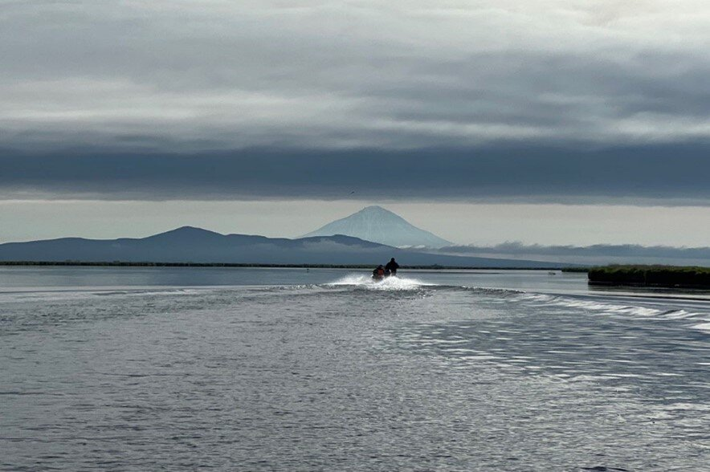
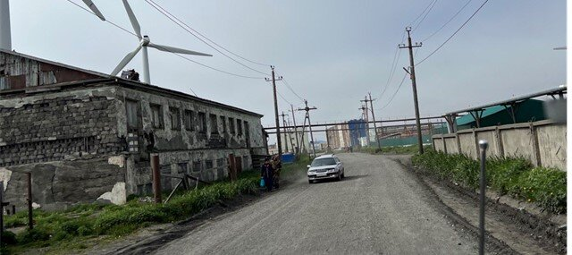
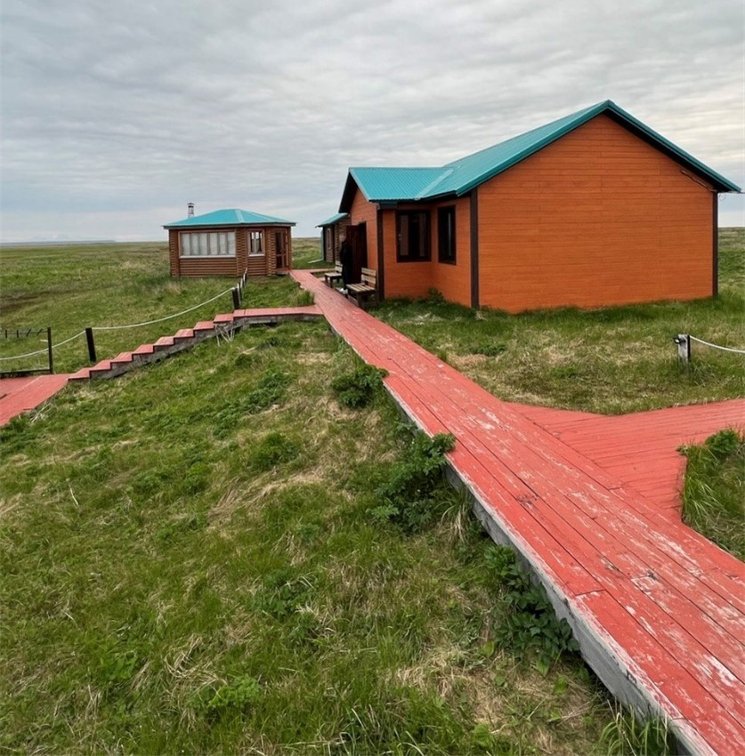
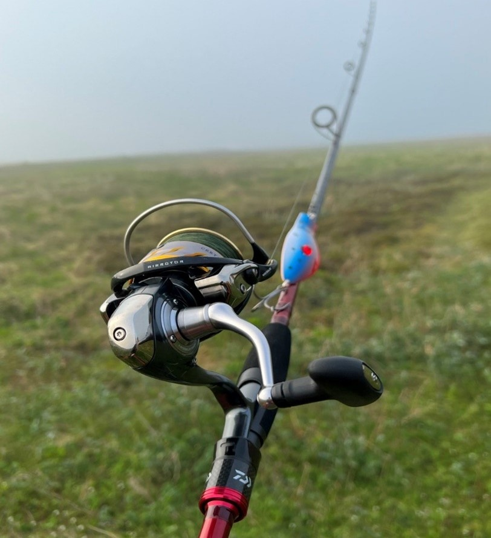
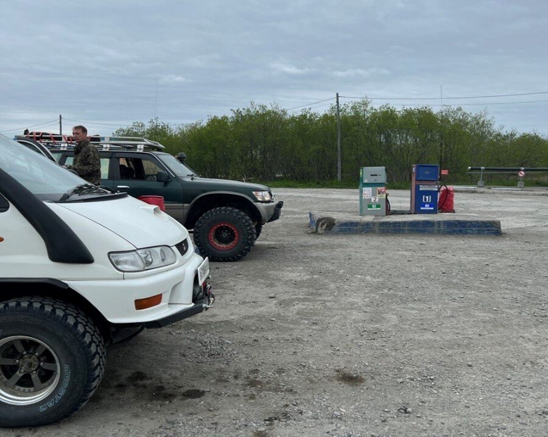
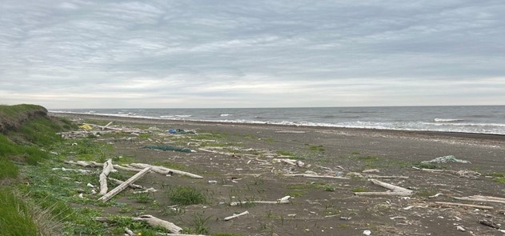
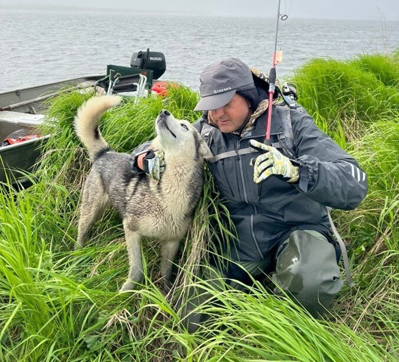
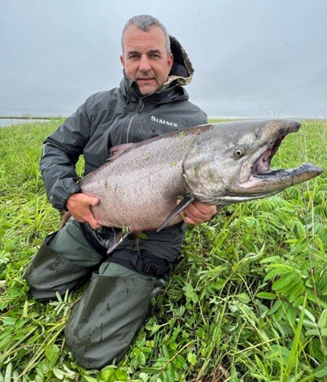

> Камчатка - полуостров в северо-восточной части Евразии на территории России. Омывается с запада Охот-ским морем, с востока - Беринговым морем и Тихим океаном

> Раздел из будущей книги «Самоучитель предпринимателя» с цитатами из нашего, с проф. Светуньковым С., толкового словаря «Общенаучная терминология современной экономики».

***АНАЛОГИЯ*** – метод научного познания, основанный на том, что из сходства некоторых признаков двух или нескольких объектов делается вывод о сходстве других признаков этих объектов. Это индуктивный вывод, а потому не является полностью достоверным.

Аналогия эффективна, если общие признаки сравниваемых предметов разнообразны и существенны и есть основания считать, что они обеспечат сходство и по интересующему исследователя признаку. В научной аналогии общие признаки у сравниваемых предметов должны быть в точности одинаковыми, связь признаков не должна зависеть от обстоятельств и специфики сравниваемых предметов. Кроме того, для повышения вероятности выводов по аналогии необходимо учитывать сходства внутренних, а не внешних свойств сопоставляемых объектов.

Приёмы аналогии широко используются в тех случаях, когда выдвинутые теоретические положения не удаётся доказать с помощью имеющихся знаний об объекте. К аналогии прибегают также в процессе творческого поиска новых идей, в методах математического моделирования, в прикладных исследованиях и др.

Почему это возможно? Потому что, в процессе многократных итераций (попыток) на пути к успеху любой человек проходит четыре основных этапа. Первый этап неосознанная некомпетентность - «вы умеете играть на рояле? Не знаю не пробовал». Второй этап - осознанная некомпетентность - это разочарование и отторжение которое испытывает человек первый раз попробовав извлечь звуки из музыкального инструмента. Третий этап - осознанная компетентность - это когда человек играет по нотам. Медленно, старательно, тяжело, но играет. И четвёртый этап, как вы уже догадались - неосознанная компетентность. Это способность музыканта виртуозно исполнять произведение на автоматизированном уровне. Играть с закрытыми глазами, импровизировать и вносить личное настроение в гармонию музыкального произведения без единой ноты фальши. Предположу, что путь познания и путь достижения результата в музыке, в предпринимательстве и в ловле трофейной рыбы очень схожи. Доказательства ниже.

***ДОКАЗАТЕЛЬСТВО*** – процедура обоснования истинности некоторого утверждения путём приведения тех утверждений, истинность которых уже установлена. По способу проведения доказательство делится на два вида: прямое доказательство и косвенное доказательство.

Задача прямого доказательства заключается в эмпирическом доказательстве (например, с помощью результатов наблюдения, экспериментов, демонстрации и т.д.) или в нахождении таких аргументов, из которых со всей очевидностью вытекает доказываемое положение.

В известном детском стихотворении говорится: «…а для настоящего для рыбака удочка только нужна и река» … Так ли это? И да и нет. Для проекта стадии MVP* (расслабленная ловля карасиков в пруду), наверное, да, но для трофейной рыбалки на Камчатке в тундре такая абстракция недопустима. И вот почему:

***АБСТРАКЦИЯ*** – одна из форм процесса познания, заключающаяся в мысленном отвлечении от частных и несущественных сторон рассматриваемого объекта в целях сосредоточения на наиболее существенных, основных чертах. В результате этого формируется некоторый упрощённый образ рассматриваемого объекта, который является его моделью. Научного познания нет без абстракции, поскольку учесть все свойства и взаимосвязи реального объекта невозможно. При абстрагировании очень важно не упустить из рассмотрения те свойства и отношения, которые являются сущностными для решения рассматриваемой задачи.

> *MVP (от англ. Minimum Viable Product, минимально жизнеспособный продукт) — это самая ранняя стадия продукта или проекта, которая нуждается в обкатке и последующей доработке.

## Пишу потому, что счастлив...

Пишу я эти строки по пути домой с Камчатки. Пишу потому, что счастлив и по тому, что то, что написано пером, не вырубишь и топором.

Мужское рыболовное счастье кратковременно. Уже завтра дома в Калининграде дела накроют меня с головой, но 9,5 часов в двух самолётах достаточны для трёх страниц запланированного текста. Мы с друзьями возвращаемся с трофейной рыбалки на чавычу.

Я отвечал за организацию этого мероприятия. Подготовка заняла 5 месяцев. Сначала принятие календарного плана как главного элемента проекта. Потом много развилок, связанных с уточнением состава. Организационная составляющая. Конкордация сроков со всеми членами команды с учётом обратной связи. Составление рекомендаций по обмундированию, инвентарю и оборудованию. Формирование резервного и подменного фонда снаряжения. План действий в экстремальной и внештатной обстановке. Программа встреч и план получения ценных конечных результатов вне зависимости от результатов рыбалки. Помним, что отсутствие плана — это план поражения!

## Исторический метод записан в дневниках

Про рыбака и удочку. Исторический метод. Опыт двух ранее осуществлённых экспедиций был мною записан в дневниках и проанализирован. Год 2008. Вот отрывки о главном из тех двух рыбалок. Река Большая. Хорошая, цивильная база Big river, еда, лодки, егеря. Дружный коллектив во главе с генералом Геннадьевичем, в группе мои закадычные Андреи и Сергей. Вот только с рыбой не очень повезло. Шесть дней по 10 часов на воде. Триста забросов в день и только двух-трёхкилограммовые экземпляры. Сима и мелкая чавыча. Был один трофейный сход. Рыбка играла на перекате и удалось положить блесну идеально. Секунда и мощная остановка! Пару свечек и чава умчалась вверх по течению с бешеной скоростью вращая фрикцион. С трудом остановил. Пауза и вдруг шнур провисает, и рыба несётся вниз ко мне. Примчалась и начинает делать свечки и наматывать на себя флюоресцентный шнур. Я лишь судорожно пытаюсь амортизировать удилищем бешеные броски. Очередной прыжок и всё... обрыв. И пустота, и слёзы где-то в глубине рыболовной души. И только в последний шестой день за час до окончания рыбалки сначала Андрей вытаскивает на девятку, а потом и я чуть больше. Андрей всегда говорил, что я умею собираться. Эти десять минут, собственно, и стоили недели рыболовного труда. И дни рыбацких молитв «ловись рыбка большая и маленькая» и маленького отчаяния где-то глубоко внутри сменяются большим рыбацким счастьем. Это абсолютно нереально, ведь вот ты лузер с набором дорогих прибамбасов, а вот настоящий профессиональный рыбак! Лучше, чем в чукотской поговорке и не скажешь: «охотник возвращается с охоты с добычей или без неё». Мой трофейный лосось, king salmon! Много раз замечал, что если очень-очень сильно захотеть и очень сильно поработать, то с божьей помощью можно и маловозможное!

Вторая экспедиция за чавычей на Камчатку 8 июня 2012 года. Подобно тому как театр начинается с вешалки и рыбалка начинается с рыболовного магазина. Будучи уже хорошо экипированным: St.Croix 2,8 метра с тестом 10*40 и пара дополнительных спиннингов с меньшими и большими тестами, пару Shimano 3000 и 4000, шнуры от 0,25 до 0,32 я тем не менее в Москве поехал в огромный ТЦ Экстрим на Речном вокзале и накупил ещё кучу блёсен. Уж, сколько раз сам себе говорил - покупай только проверенные блёсны естественных цветов. Но опять набрал всякой разноцветной всячины - типа для тёмной воды, для светлой воды и тд. Но как говорится запас карман не тянет. В тундре доставка не работает.

Восемь часов и Аэрофлот доставил нас с Сергеичем в Петропавловск-Камчатский. Дорога на традиционном камчатском двухсотом крузаке до базы на реке Опала уже сама по себе приключение. Шесть часов лесов, сопок, тундры. Большей частью гравийная, местами по песку и гальке.

Бедные, заброшенные богом и людьми городки и посёлки несут на себе какую-то печать временщичества. Видно, что люди пришли сюда просто «поднять денег» на рыбе и уехать в благополучный Калининград или тёплый Сочи. Тяжёлое низкое серое небо, бескрайние просторы тундры, величественные силуэты вулканов — всё это картинки крайнего севера. Тем более удивительно, что южная Камчатка на широте Курска. Десятки километров тундры и ни одного человека. Тишина, редкие крики птиц: чайки, кулики. Тундра, дышащие мхи и тишина. Середина июня, а ощущение, что начало апреля. Снег в оврагах, голые деревья и почти нет комара. Только к 15 июня появились первые цветы, а лист так и не раскрылся.

База рыбака Камчатка

Гостеприимный хозяин базы лихо доставил нас до Опалы по пути продемонстрировав удивительные возможности крузера двухсотки который легко справлялся с галькой, песком, дюнами и прибойкой (линией моря). На Охотском море много рыбаков ловило навагу, вальяжные орланы гуляли по берегу как обычные чайки. Тридцать пять минут на лодках по реке и мы на базе. Традиционно тепло и комфортно. Вкусно и гостеприимно. Мы с Сергеевичем вдвоём, а все остальные гости на базу прилетают после 15 июня. На гарантированный ход. Нам же повезло, что попали на пустую базу и на пустую реку. Всё - банька и спать. Проснулись в пять, потому что организм вообще ничего не понимает и пытается жить по калининградскому времени. Светает. Утром очень холодно +5 и моросит, но это не важно, а важно чтобы клевало! Термоса с чаем и коньяком и по лодкам. Утром подмерзаем, а днём когда выходит солнце перегреваемся. В ощущениях температура меняется на 15-20 градусов за три часа. Промокшие перчатки приходится убирать и резать указательный и средний палец шнуром замерзающей правой руки.

Первый день рыбалки удался на славу. Три хвоста чавы из них два на 6.5 кг, были поклёвки микижи, но без подсечек. Второй день: полдня пустую. Очень грустно до отупения и до безнадёги. Слава богу Сергеевич взял четырёх до десятки. Я взял парочку на всё туже бело-жёлтую-в-чёрную-точку bluefox Inkoo 35gr. А потом, всё же не зря говорят, что тому кто умеет ждать достаётся лучшее. Я дождался и уже под вечер добыл чаву на 11,5 - это личный рекорд. Третий день не задался - один сход и одна на пятёрочку. Товарищ мой обловился - 12,650! Самки, а это значит, что начинаем есть икру пятиминутку ложками. Четвёртый день подарил мне лучшую рыбалку. Семь штук, из которых четыре отпустил. Одна на восемь, одна на 9,5 и повторение на 11,5. При этом четыре взял за час с одного места. Практически с первого-второго заброса. Пятый день сложился также замечательно. Семь хвостов. Один на десять, ещё три на 6-8 и это за 5 часов. Научились. Обычно удавалось брать на всплеск. Проводка в полводы с остановками и белый с голубыми bluefox lusing на 28 гр. На каждом месте 5 забросов веером и вниз на 15 метров. Из выводов: брать основной шнур 0,32 и возможно ставить металлический поводок. Иначе можно опять упустить главную рыбу.

Но… поводок резко увеличивает количество захлёстов и снижает возможное количество забросов. За пять дней рыбалки у меня был один серьёзный сход. Сам виноват: не перевязывал с утра шнур. Ударная поклёвка и дельфиньи прыжки сразу показали, что бой будет трудным, но я боролся... шёл по берегу за рыбой, компенсируя удары. Но упёрся в мыс и осознавая, что шнур заканчивается, пробовал остановить бешено визжащий фрикцион рукой... обрыв и бело-голубой Professor ушёл вместе с добычей. А может всё же слишком мягкое удилище? Всё как в бизнесе: ТОС - теория ограничений системы Эллияху Голдрата. И так понятно - рвётся там, где тонко! В итоге я не взял трофей, но получил бесценный опыт. Мы тем временем привыкли к мишкам, которые реально бродят по реке, переплывают реку, но нас боятся и увидев убегают. Попрощались с нашими егерями Михалычем и Жекой и выехали домой. В устье Большой много нерпы охотится на навагу. Организм слегка привык к смене времени, приятно болят суставы пальцев правой руки. Тешу себя мыслей, что это от борьбы с рыбой, а не просто от того, что по 10 часов держал спиннинг в руке. За пятнадцатикилограммовой чавычей придётся вернуться! На обратном пути успели заскочить в Паратунку и прогреться в местных термах.

## Вернулись на то же место спустя десять лет

Вот с таким бэкграундом мы в шестером вернулись на то же место спустя десять лет. Пятеро из нас уже были здесь и вообще опытные рыбаки. Ошибки учтены. Основные средства и расходники прошли значительный апгрейд. Новая непромокаемая одежда с мембраной от SIMMS. А вот на ногах проверенные отечественные болотники. Лучшее соотношение практичности и цены. В них удобно и по высокой мокрой осоке и стоя на коленях перевязывать блёсны. Одежда и снаряжение должны быть удобными и соответствовать критериям Антихрупкости Нассима Талеба. Погода и условия рыбалки будут меняться, но мы должны быть адаптивными.

***АДАПТИВНОСТЬ*** – системное свойство, которое заключается в способности системы приспосабливаться к изменившимся условиям с целью сохранения оптимального (или близкого к нему) состояния.

Адаптивность проявляется во взаимодействии с другими системными свойствами, важнейшими из которых являются свойства инерционности, самоорганизации и самообучения. Обладая этим свойством, системы способны приспосабливаться к внешним изменениям (адаптируются).

Впервые со мной на Камчатке очки для чтения в аккуратной «карманной» версии. Новый облегчённый спиннинг DAIWA NINJA с тестом 15-50гр. неожиданно найденный в калининградском «Охотактиве». Test&learn - учимся на своих ошибках. Теперь будет легче «кипятить» воду сотнями закросов, а при поклёвке удилище будет оптимально амортизировать рывки и достаточно жёстко чтобы пробить клюв рыбы при подсечке, но и позволит сделать заброс на необходимые 60 метров. Проверенные блёсны для разных проводок. Базовый зелёный японский шнур 0,26 который тоже должен обеспечить и комфорт и надёжность при вываживании. Егеря скромно упоминают о всего нескольких нетрофейных чавычах пойманных предыдущей групппой на нашей базе. Прошу справку от ихтиологов и запрашиваю, что у промысловиков и на соседних базах, что в прилове и на входе в реку? Маркетинговый анализ не утешительный. Эксперты и любители указывают, что заход ещё не начался. На море был шторм. Не начался или уже не будет? По многолетнему календарю захода нерки и температуре воды - самое время. Или клюёт всегда вчера и завтра? Ну, мы то эксперты мы сможем. Верим в данные анализа.

***АНАЛИЗ*** – метод научного исследования, предполагающий воображаемое или реальное расчленение объекта на составные элементы, признаки, части в целях выявления их системных свойств и отношений между собой и с другими предметами. Реальные экономические объекты отличаются большим многообразием составляющих их элементов и свойств. Поэтому использование анализа в данном случае требует предварительного определения принципов анализа и критериев разбиения объекта на составляющие его элементы.

## Тундра в начале лета прекрасна, но ... где же чавыча?

***Первый день исследуем*** все перспективные места - ноль. У остальных десятков рыбаков на нашем участке около нуля.

Второй, третий день - ноль. Погода меняется, но тучи и дождь редко сменяются солнцем. Тундра в начале лета по своему прекрасна, но… где же чавыча?

Похоже, что информация о катастрофическом сокращении стада в процессе массового вылова подтверждается.

Местные камчадалы на реке тоже почти без рыбы. Может поставить средние блёсны и половить на мелководье симу и микижу? Нет не за мелочью мы сюда прилетели. Зачем есть чайной ложкой из общего котла если есть большая. Самая тёмная ночь перед рассветом.

## Только не дать слабину

Новое место. Ухожу подальше от лодки. Лайка Грей страхует от мишек. Пробиваю дно тяжёлой 45 граммовой ложкой … ОСТАНОВКА и сразу паровозная тяга. Чавыча! Большая! Это она!!! Шнур режет воду, треск фрикциона 10 метров, 20 метров, 30 метров, 40 метров. Опаньки… рыба остановилась. Включаем бизнес-процесс «вываживание». Первое: Собран на контроле работы удилища. Порядок. Всё, как и было спланировано. Второе: стою удобно. Рюкзак за спиной. Под ногами ничего нет - не упаду. Площадка удобная для манёвра влево и вправо. Третье: анализ рисков. Дно ровное, галечное. Коряг под водой на проводке не было. Четвёртое: подготовить смежные «логистические» операции. Ору егерю: Подсак! Вижу бежит. Метров двести. Ок. Время есть. Пятое: операционное совершенство. Начинаю осторожно качать. Здоровый!!! Опять убегает. Аммортизация. Без перегрузки. Смотрю куда подводить под подсачек. И вдруг с ужасом пониманию, что не обсудил с егерем как принимать рыбу. Шнур идёт в вверх, прыжок! Здоровенный! Самка?! Ещё пару минут борьбы и начинаю бережно подводить к берегу. Полностью сконцентрирован на главном критерии успеха - не дать слабину! Пытаюсь обсудить с егерем как работать с подсадом. Ворчит. Не время беседовать о принципах и методах подсачивания крупных рыб. Я - «бритва Оккама». Только не дать слабину.

«Бритва Оккама» – методологический принцип, требующий отсекать лишние теоретические допущения. Принцип, сформулированный английским философом, монахом У.Оккамом в ХIVвеке, сегодня представляют так: «Не следует умножать сущности сверх необходимости». Фактически же Оккам сформулировал такой принцип: «Frustra fit per plura quod potest fieri per pauciora», то есть - «Излишне объяснять через многое то, что можно через меньшее».

По сути, данное гносеологическое правило предписывает стремиться к строгости мышления, конкретности, «экономии» исходных допущений, отказаться от излишнего теоретизирования в пользу эмпирического познания как более фундаментального. Логика Оккама требует также необходимости уточнения терминов, прояснения их смысла в зависимости от места и характера суждения.

## Вот оно большое рыбацкое счастье!

Пятнадцать минут на грани. Это как перед запуском нового большого проекта. Как перед самой важной бизнес-встречей. Все инвестиции сделаны. Другого шанса в этот раз точно не будет. Добываю добычу. Борьба закончилась, когда рыба нахлебалась воздуха и легла на бок. К слову, егерь ошибся и чуть не сбил блесну подсачеком, но рыбацкий бог был ко мне милостив! Стандартный тройник был своевременно заменён на усиленный и вероятно это стало страховкой. Рыба моей мечты на берегу. Самец чавычи он же king salmon - главный лосось наших вод. Уже красноватый значит несколько дней в реке. Взвешивание показало 16,3. Ааа, Ура! Вот оно большое рыбацкое счастье.

Повезло ли мне? - Безусловно. Я в принципе делал почти всё как все наши. Но мы взяли только 2 рыбы на 6 человек за 4 дня рыбалки и имели 6 сходов. Интуиция помогла выбрать правильное место. А опыт помог с правильным типом заброса, правильной блесной, правильной проводкой. Но интуиция это не про фантазии и случайность. Это свойство экспертизы. Это про неосознанную компетентность.

Интуиция (в переводе с лат. «пристальное всматривание») – прямое внелогическое синтезирующее усмотрение истины не только при установлении аксиоматического базиса, но и при формулировке основных определений, понятий, используемых в теории.

Интуитивная аргументация представляет собой ссылку на непосредственную, интуитивную очевидность выдвигаемого положения. Основой интуиции является взаимодействие наглядных образов и абстрактных понятий, проявляющееся особенным образом на уровне подсознания. Внезапность и неожиданность появления интуитивной догадки объясняется психологами скачкообразными переходами от ассоциативных образов к логическим понятиям.

Способность интуитивного озарения возникает в результате целенаправленной деятельности человека. Любая интуитивная догадка требует тщательной проверки. В экономике интуитивная аргументация применяется только в том случае, когда нет возможности использования эмпирических методов обоснования.

Чаще всего это происходит в ситуации малоформализуемых задач или в ситуации, когда необходимо быстрое принятие решения. Интуиция является просто плодом хорошего знания темы. Кроме того, реально исследователь работает не в одной, а в нескольких научных программах, точки пересечения которых представляют пункты кристаллизации нового знания. Интуиция является непосредственным знанием только в том отношении, что в момент выражения нового положения оно не следует с логической необходимостью из существующего чувственного опыта и теоретических построений.

Если ты всё делаешь правильно, то просто получаешь максимальные шансы на успех. Интуиция и профессионализм. Трофейная рыбалка не терпит мелочей. Retail is detail. Успех в профессиональном управлении деталями. Рыбак занимается всеми основными функциями и бизнес-процессами. Планирование, организация, исполнение, контроль. Снабжение, финансирование, производство, логистика, переработка. Отцы, учите детей рыбалке, матери отпускайте мужиков на рыбалку. Это тренажёр для бизнеса! И да сопутствует вам рыбацкая удача!

***P.S. Записывайте свои мысли и события. Это полезно.***