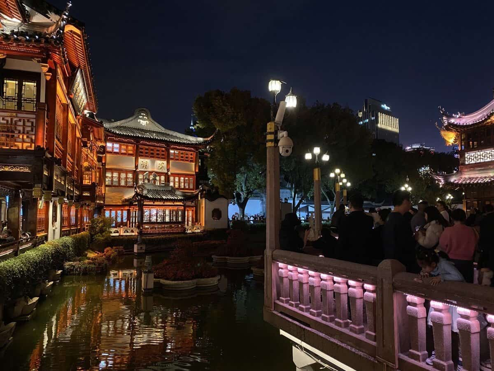
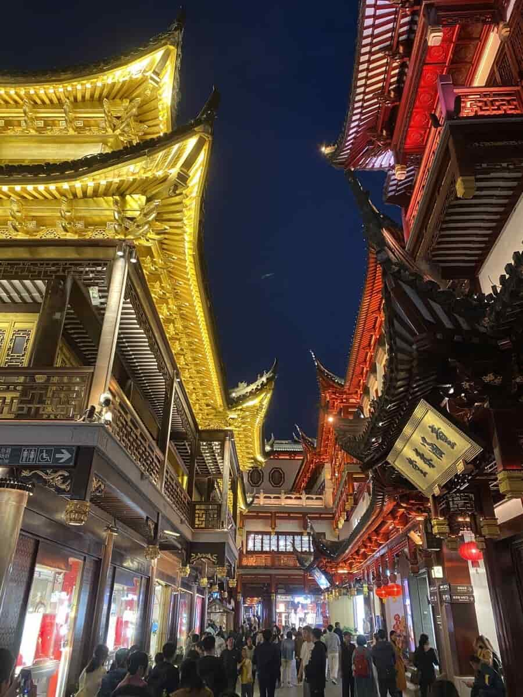
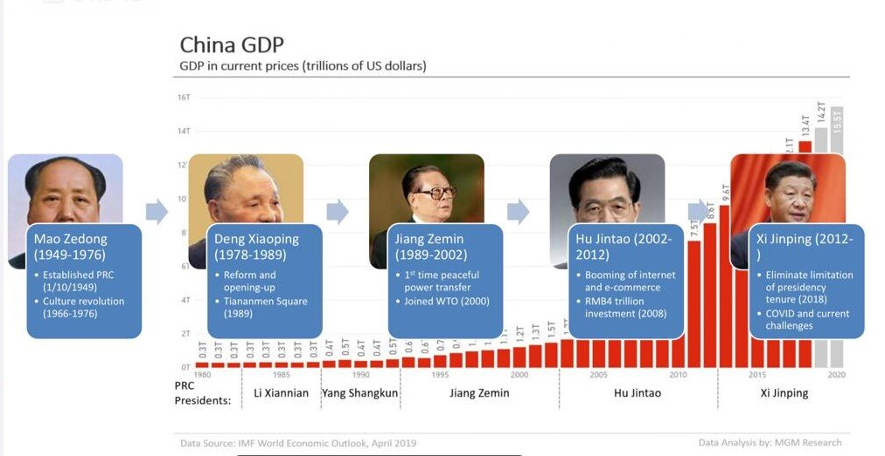
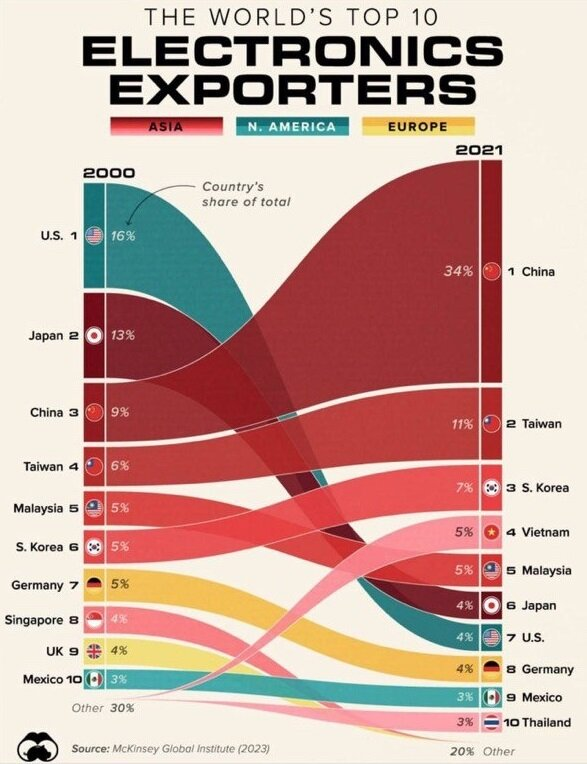
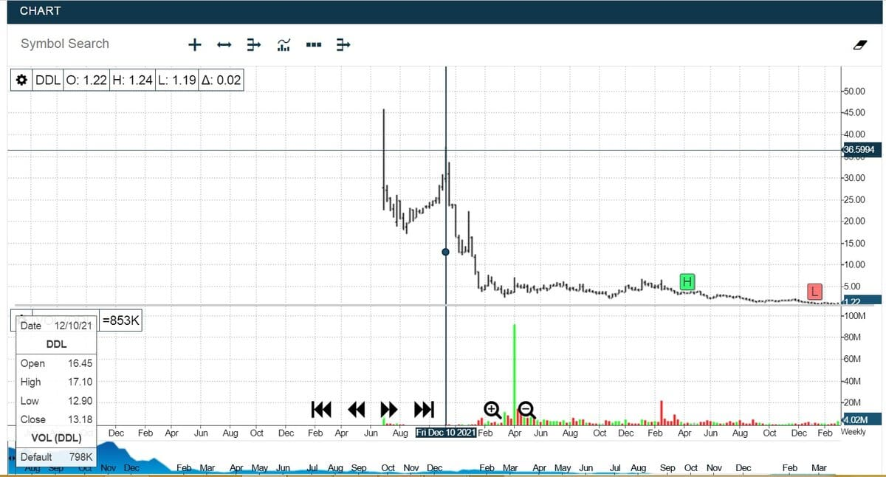
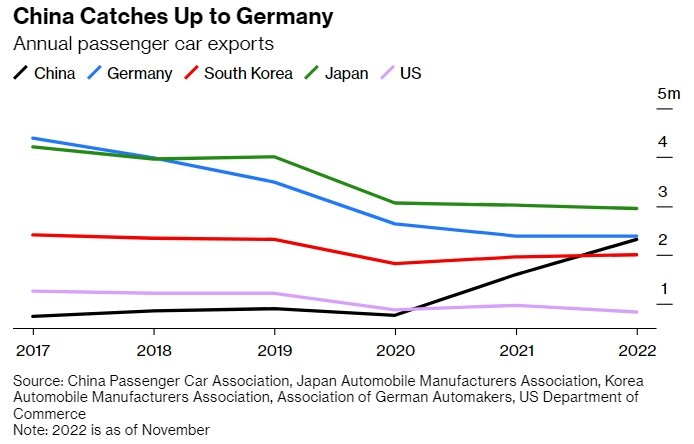
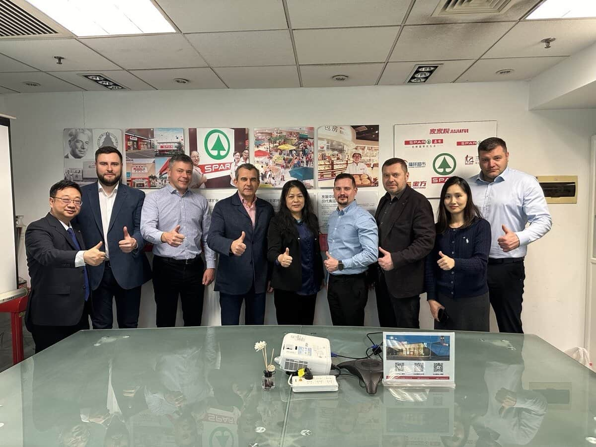
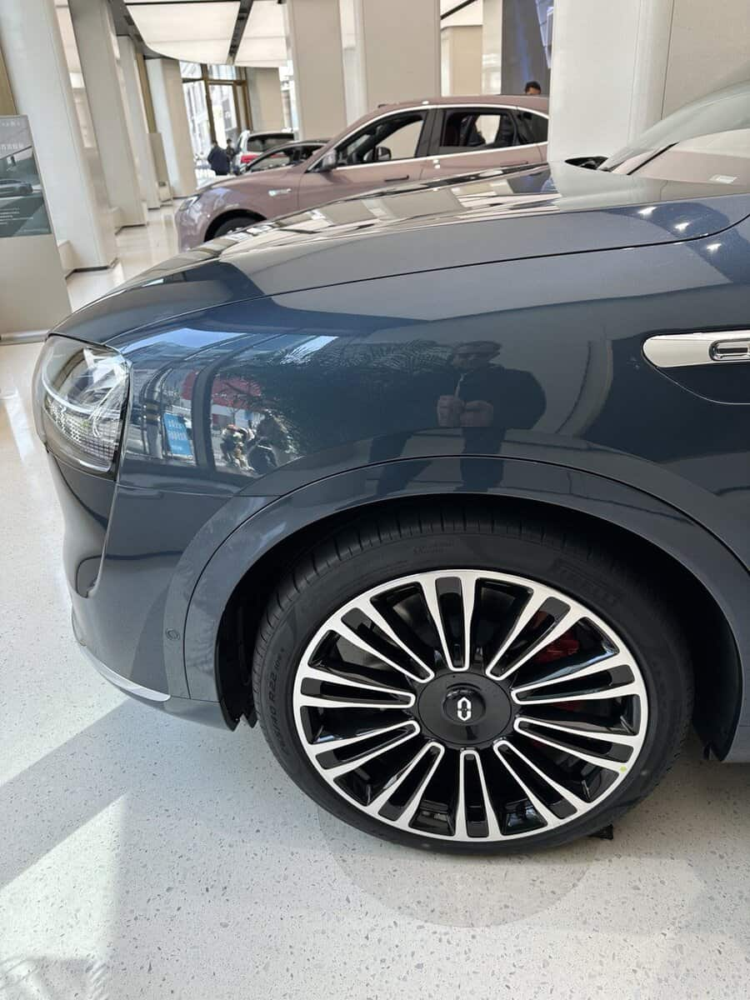

Новая экономическая реальность. Сегодня Китай — это наша новая Германия и наша Силиконовая долина. Индустриальный парк, где мы покупаем оборудование и изучаем лучшие практики. После введения западных санкций Дубай заместил Лондон и Париж, и стал для россиян международным финансовым и развлекательным центром, а Шанхай стал Франкфуртом и Нью-Йорком в одном лице. Китай незаметно разрушил экономическую монополию западного мира и стал вторым лидером в новом двуполярном мире, вернувшись на место СССР. Поэтому хоть Китай и называет Россию старшим братом (по коммунистическому летоисчислению), но теперь всем понятно, кто старший. Я насчитал 6 рейсов только из Шереметьево в Китай за 4 вечерних часа. И это Боинг 777 на 300 пассажиров, потому что лететь 9,5 часов.

Шанхай уже не «шанхай». Я не был в этом городе 15 лет. Вроде похож, но на уровне ощущений совсем другой. В том Шанхае ещё было много бедности, серости и «шанхайщины». Она проявлялась в смоге, пробках, паутине воздушных кабелей, разбитых тротуарах, бардаке и мусоре. Казалось, что все китайцы курят и плюются. Этот город справился с болезнями роста.  

Спокойный порядок, полная безопасность и какая-то прямо удивительная размеренность и чистота. Китайцы в Шанхае какие-то очень организованные и законопослушные, как роботы. Здесь нет дубайских чудес, но здесь в 6 раз больше людей и всё работает. Пробок нет, а в Дубае они есть. За этой размеренной организацией выдающиеся цифровые технологии и ведущая роль КПК. Любопытно, но китайских коммунистов туристам не видно и не слышно. Мне было интересно понять, что происходит в Китае, к которому мы недавно повернулись всем нашим лицом. А происходит очень много интересного. Итак, гости точно не видят внутреннюю политическую кухню. Ни гигантских красных флагов, ни плакатов вождя — ничего патриотического не видно. Но история с исчезновением Джека Ма и падением капитализации его группы на $850 млрд, а также другие подобные случаи хорошо иллюстрируют, кто в Поднебесной хозяин. Нам все китайцы говорили про глубокую рецессию, но её не видно глазам. Многие местные нам называли зарплаты в своих компаниях и они существенно выше наших аналогов. Пожалуй только замороженные стройки высоток, видимо связанных с обанкротившимся девелопером Evergrande, наглядно свидетельствуют о проблемах.

Китай остаётся главной фабрикой мира. Вторая после США экономика по размеру номинального ВВП с 17 триллионами долларов и первая по паритету. Видно, что ключевая концентрация общества — это экономический рост. Они росли много десятилетий, иногда и двузначными темпами, и вот сейчас, после ковида, они затормозили и никак не могут перезапуститься. Избыточный человеческий и промышленный ресурс приводит к перепроизводству. Юань за десять последних лет девальвировался всего на 20%, и это хорошая альтернатива доллару. Но в отличие от крупнейших экономик мира Китай не лечит проблемы перепроизводства денег инфляцией. Ключевая ставка по-прежнему около 3%. Растёт безработица, а среди молодёжи она уже дошла до 20%. Внутренний долг — более 300% ВВП. Для нас ситуация крайне необычная, а релевантной информации мало. Сложность анализа текущей ситуации в том, что такого кризиса ещё не было в крупнейшей экономике мира. Немного напоминает Японию 90-х, но Китай — это страна в 12 раз больше. История пишется прямо на наших глазах. Несмотря на то, что экономисты не понимают до конца реальную ситуацию в экономике страны и спорят о «дне рецессии», важно, что Китай уже прошёл болезненную коррекцию, а Западу ещё только предстоит испить горькие пилюли большого кризиса.  

Сталкиваясь с ростом международной конкуренции, Китай отвечает ей зелёным переходом и масштабным стимулированием внутреннего потребления. И как мы видим на примере недвижимости — это сложная задача. Всё тяжелее становится в отношениях с крупнейшими западными партнёрами и инвесторами. Свидетельством коррекции является тот факт, что фондовый рынок за последние 3 года уже упал на 40%. Заметно, что многие иностранные инвесторы сворачивают свои прямые инвестиции в Китай. Идёт перенос производств и технологий ведущими мировыми брендами как на домашние рынки, так и на соседние, более дешёвые рынки рабочей силы в ЮВА. С Индией, которая бурно урбанизируется, отношения у Китая имплицитно сложные по разным причинам. Проблема Тайваня отравляет отношения с США. Северная Корея — младший брат, но как следствие — с Южной сложности. Огромное внимание Китай уделяет Африке и Южной Америке — и там есть большие, но отдалённые перспективы. Россия, конечно, важный союзник и стратегический поставщик ресурсов, но весьма скромный рынок сбыта, поэтому осторожные китайцы осторожны. Оборот с США — более 760 млрд долларов, с ЕС 555 млрд долларов, а с Россией — всего 240 млрд.  

Сразу заметно, что Китае всё отлично с информационными технологиями. Вообще айтишники здесь вовсе не офисная элита, а обычные работяги. Их так много, что я серьёзно задумался о том, что вот в принципе правильный путь импорта квалифицированной рабочей силы. B компьютеры и смартфоны и собственные экосистемы крупнейших айти-гигантов. Китай точно не уступает США и Южной Корее в своих решениях. Гигантский рынок и неограниченные ресурсы позволяют реализовывать самые амбициозные проекты. Эпоха американской гегемонии в АйТи закончилась. Сегодня Тим Кук, глава Apple, в Шанхае открывает флагманский салон яблочной компании, но поезд уже ушёл. Китайцы остаются в своих телефонах и на своём софте. Даже с перебором. Нам сложно коммуницировать с китайцами. У них запрещены американские мессенджеры, а WeChat сложная и интерактивная среда с лидирующим платёжным приложением WePay. Для нас удивительно, что даже китайский UnionPay принимают не везде, а WeChat везде. И так во всём. У китайцев вся АйТи среда выстроена вокруг национальных экосистем. Там зачастую круче и интереснее, чем в американских решениях. Ставка на развитие наукоемких отраслей сопровождается ускоренным развитием науки и образования. По уровню образования Китай поднялся на 22 место в мире и обогнал Россию. По числу новых патентов Китай уже обгоняет США, а на науку тратит 2,4% ВВП, что в номинале в 12 раз больше чем в РФ.  

Мы с калининградской командой и коллегами из российского ритейла благодаря замечательной Ирине Ратиной посмотрели все самые интересные розничные проекты. Нас интересовало 2 направления. Во-первых, складская логистика. Здесь всё оказалось рутинно и знакомо. Роботы-штабелёры, сортировочные конвейеры и роботы-сборщики. Посетили склад крупного онлайн торговца и второго логиста Китая — JDL. Работают быстро и по всему миру. Для нашего OZON много что делают. Складик — небольшой, всего… 72000 квадратов. Говорят, есть на двести тысяч метров. Человекоподобных роботов не увидели. Все мелкие операции выполняют люди. Как и у нас. Думают о доставке дронами и роверами. Всё очень спокойно и сосредоточенно:

 

<video width=100% controls>
    <source src="/videos/snanhaj.mp4" type="video/mp4">
    Your browser does not support the video tag.  
</video>



Самое интересное, конечно, нас ожидало в онлайне. В Китае невероятная доля онлайна. Всего уже 44%, а продукты до 20%. Нам удалось посмотреть две disruption компании. Компании, бросившие вызов традиционному ритейлеру. DingDong (что означает «Дзынь-дзынь» в смысле звонок в дверь). Компания с редиской в логотипе, основанная в 2017 году бывшим военным айтишником, совершила невероятный взлёт в пандемию. Она выросла до 1000 дарксторов. Мы посмотрели их ПСЗ (пункт сбора заказов). Всё чётко, логично и бегом. Метров 400 складик на 3000SKU с полным фрешем, в т. ч. морепродукты, и даже черепахи и лягушки (значит — едят!). Зелёные люди, зелёная философия. В ультрасовременном офисе мы раскланялись и обменялись подарками с фаундером Mr.C.Liang, и вышколенные сотрудники много нам рассказывали о цепочке поставок, непрерывных инновациях и algoritmic brain. Попробовали много разных их собственных продуктов. Преимущественно консервированного типа, но были и прекрасные ягоды. В конце презентации собственник скромно сказал, что недавно компания смогла выйти из убытков, но впереди большие изменения. Я из любопытства заглянул на сайт компании и обнаружил, что акция сегодня на NYSE стоит $1,3, а на пике стоила $30. Ого! В компании 800 айтишников. Что они там делают? Сопровождающие мягко сказали нам, что это следствие проблем в отношениях с американским фондовым рынком, но… что-то не очень верится.

Вторая компания из сектора new retail оказалась ещё любопытнее. Продуктовая дочка интернет-гиганта Alibaba. Компания Hema c симпатичным маскотом-бегемотиком была в ковидные годы «любимым ребёнком» великого Джека Ма.

В этом симпатичном гибриде компактного гипермаркета и даркстора мы обнаружили много симпатичных товаров в традиционных для Китая больших упаковках и прямо-таки шикарный фреш. Пообщались с менеджментом где-то в подземной части гипермаркета. Посмотрели, как бедненько в подсобках. Разительный контраст с нарядным магазином. Вообще не очень заметно зарплат в $700-1000. А в центральный офис нас не пригласили, потому что компания проходит «аудит в связи со сменой собственника» … И да, в компании аж тысяча айтишников. Ого-го. Что-то точно не так с этим прекрасным «новым ритейлом».

В последний день провели три часа с коллегами из китайского SPAR. Обменялись подарками: янтарь на чай. Обсудили поставки в обе стороны. От них нон-фуд и консервы, а от нас ждут замороженный хлеб и кондитерку. В очень скромном, и даже «ушатанном», офисе представители «старого ритейла» нам рассказали о том, как развиваются их региональные партнёры и поставили крест на «новом ритейле». По их мнению, доля онлайна в продуктах будет снижаться, “new retail is fake”, а вышеупомянутые разрушители, «единороги», фактически банкроты и уже активно закрывают объекты. По их словам спасти эту цифровую еду может только государство. Во как! После китайских спаровцев мы заглянули в гипер китайской дочки Wall Mart, и именно там нашли толпы покупателей. Офлайн с развитым онлайном. Старый ритейл стал современным и победил новейших выскочек:)

Едем в аэропорт на электрическом минивэне ROEVE. Тихо, мягко, комфортно. Похоже, что все такси только электрические. Шанхай за 15 лет стал совершенно другим, во многом в связи с развитием электротранспорта. В мегаполисе вполне чистый воздух. Это удивительно. Китайцы говорят, что на 24 миллиона в Шанхае всего 5 миллионов автомобилей. Сорок процентов машин электрические. Причём китайцы говорят не electric car, а electronic car. И это большая разница.  

Масштабное государственное регулирование прямо на глазах съедает долю рынка европейских производителей. Вот, что нам рассказали наши сопровождающие. Одна семья — одна машина или очень большие деньги. При этом регистрация машины с ДВС при получении синих номеров — это $15000 экологического налога, а зелёные номера на электричку выдаются бесплатно. Дальше больше - при покупке электрички китайское государство обеспечивает твоё парковочное место зарядным устройством. Результат налицо — из 10 самых продаваемых автомашин в 2023 году 6 — это гибриды или чистые электрички, а на первом месте Tesla Model Y, более 600 тысяч проданных. В Шанхае как раз находится китайская гигафабрика Tesla. Само собой разумеется, что в рейтинге все машинки исключительно китайского производства. Вот и понятная практика для Правительства РФ по решению проблемы воссоздания производства полного цикла собственных национальных автомобилей.

В целом удивило нас даже не пришествие электричек, а именно визуальное отсутствие зарядок. По парковкам мы понятное дело не гуляли, но глазам их не видно. Самое яркое впечатление нас ждало в одном из модных торговых центров. Вся галерея европейских модных брендов и три деловых башни сверху позволили оценить автопарк шанхайских мажоров. Видели за двадцать минут и Роллс, и Майбахи, и много Порше, но это точно уходящая натура. Большинство китайских поклонников лухари уже на китайском автолюксе. И это не столько уже привычные нам Зикер и Лисян, а Икспенг, Нио, ХайФай, БиВайДи. В общем Китай рулит «китаем». И многим моим друзьям ещё придётся открыть китайцев и забыть немцев. Немцы и японцы — уже не главные автоэкспортёры планеты. Лавина уже пошла, ведь за прошлый год Китай впервые экспортировал более 5 млн автомобилей. За немцами — мегатонны маркетинга и автоспорт, и они old marks, а новые китайцы вместе с Тесла —это новый тип машины: электронная машина с перспективой полного автопилота за совсем другие деньги. Немцы, как «тарелки Шрёдингера», — ещё в топе, но, на мой взгляд, неизбежно их мировые рынки будут съедены Китаем. Немцы на глазах превращаются в автоювелирку, а большинству людей на планете нужны не «шашечки-шильдики» и красивый маркетинг, а безопасно и экономично ехать. Соотношение цена-качество — за Китаем.

Мне удалось в фирменном салоне Huawey, среди планшетов и смартфонов, познакомиться с машиной, которую я планирую покупать на замену большому семейному БМВ Х7. Среди «белых и гарантийных» больших кроссоверов сейчас рациональный выбор вообще отсутствует, и AITO M9 может стать новым лидером в верхнем сегменте. Размером он даже чуть больше своих немецких конкурентов он предлагает электрическую и гибридную версии и превосходный уровень комфорта. Сиденья с «нулевой гравитацией» вообще никто из немцев не производит. За платформу в машине отвечает крупный производитель, а за электронику — Huawey. И видно, машина будет развивать технологические решения Tesla. Будет смартфоном на колёсах который будет так же как американский собрат обновляться и улучшаться, как смартфон. А будучи официально в России, не превратится в «кирпич», как некоторые из Лисянов без китайской симки после аварии. Для полноты автосервисов желательно перейти и на смартфон Хуавей. Это, конечно, не самый комфортный сценарий, но прощание с яблочной продукцией может итак произойти в любой момент, причём как по решению американской, так и российской сторон.

В машине, помимо традиционной тьмы мониторов, ещё и проектор для задних пассажиров, и дисплеи спереди и сзади. Они слегка «полнят» оптику, но не портят традиционный мерседовский GLS-ный силуэт. Это чудо с мая должно появиться в России, и к осени наш калининградский дилер МБ обещает его выкатить на тест-драйв. Думаю о чистой электричке, всё-таки 4,3 секунды до сотни — и никаких тебе ДВС. На нашем острове — то, что надо. Ждём Китай порулить.

_Ключевое преимущество электронных автомобилей заключается в их связи с глобальной экосистемой Хуавей. Благодаря этому, вы сможете использовать свой смартфоном Хуавей, домашнюю колонку Хуавей или даже умного робота-пылесоса Хуавей, чтобы просить автомобиль прогреться зимой или охладиться летом. Однако самое важное - можно попросить машину голосом подъехать к дому с места зарядки или, напротив, - отъехать куда-нибудь, где её могут помыть, зарядить, и т. д. Электронные автомобили - это часть глобальной цифровой экосистемы. В данном случае, экосистемы Хуавей. На этом фоне машины с ДВС уже выглядят, как паровозы. Они и есть, собственно говоря, паровозы. Только усовершенствованные. Будущее уже с нами. И это будущее уже ездит по нашим дорогам, под китайскими брендами. Ну и, в принципе, под американскими тоже, поскольку начиналось всё с Tesla. Но у Теслы нет своей экосистемы, которая есть у Хуавей или у других производителей из Китая._

PS. По прилёте в Москву меня ожидали трагические новости про теракт в Крокусе. Бешеный таксист в Яндексе лишь подчеркнул контраст с аккуратным китайским водителем. Право слово, нам есть, чему поучиться у большого восточного соседа. Вспомнилось, что в Китае выносят до 1000 смертных приговоров в год. Прежде всего за терроризм...