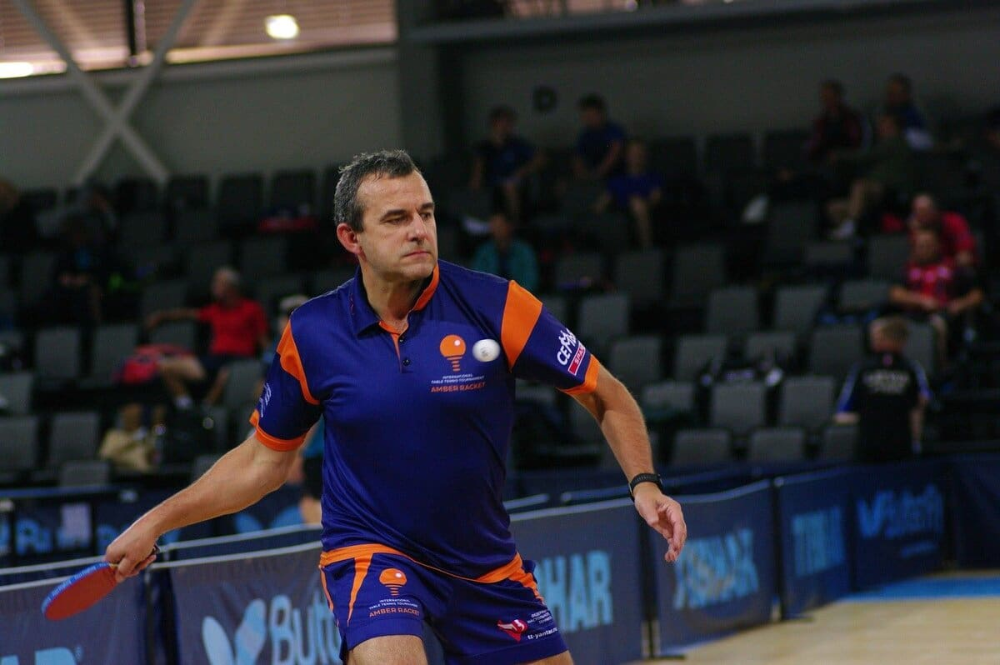
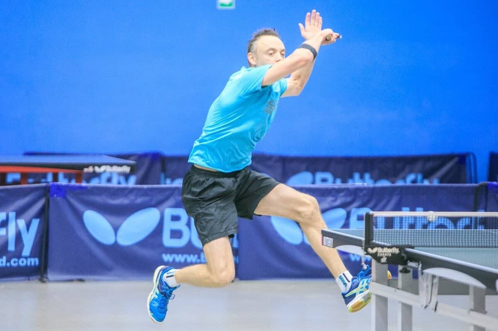

>Дорогие друзья, я продолжаю публикации разделов из будущего «Самоучителя предпринимателя». Чтение большое (longread) и предназначено для вдумчивого читателя, имеющего время и желание поразмышлять о деле и о подходах к воспитанию молодёжи, а также почитать о приятном. По сути, то, что я предполагаю, это ваше вдумчивое размышление. В некотором смысле мини-лекция. Формат изложения — научно-популярный.

Все знают, что спорт полезен, но все ли задумывались о том, что он может быть своего рода тренажёром по «прокачке» собственного предпринимательского вещества? Давайте попробуем вместе понять, что такое предпринимательское вещество. Упрощённо — это предпринимательский талант. Но нас интересует декомпозиция таланта, т.е. разбор на составные части, чтобы было понятно, что это такое. Это генетически врождённое качество или приобретённое? Если приобретённое, то как его развивать, ему учиться, можно ли его тренировать?

> Если будет доказано, что предпринимателями рождаются (генетики найдут соответствующий ген), а не становятся, соответствующее образование потеряет смысл.

Впрочем, колледж Бабсон в Массачусетсе встал на защиту бизнес-образования. Там изучили 4000 своих студентов с 1985 по 2009 год и выяснили, что те, кто выбирал более одного курса по предпринимательству, чаще открывали свой бизнес, чем те, кто брал только один курс. Это исследование расширяет работа Уши Бакес-Гельнер из Цюрихского университета и Петры Моог из Зигенского. Изучив 2000 студентов, они выявили разницу между предпринимателями и работающими по найму. По их мнению, более склонны к ведению бизнеса те, кто не погружается в одну конкретную сферу знаний, а обладает поверхностным представлением обо всём. Узкие специалисты становятся их подчинёнными. Они подтвердили теорию стэнфордского экономиста Эдварда Лейзира о предпринимателе как «мастере на все руки». Он считал, что студенты, которые изучают больше предметов и работают в разных сферах, скорее станут предпринимателями, чем остальные.

## Предпринимательское вещество можно тренировать?

Нам повезло: современная наука показывает, что несмотря на разницу во врождённом таланте предпринимательское вещество можно тренировать. Американский нейробиолог Келли Макгонигал на большой выборке эмпирических исследований в книге «Сила воли» доказывает ряд важных для нас постулатов. «Сила воли превратилась из того, что отличает людей от других животных, в то, что отличает людей друг от друга. Возможно, все мы родились со способностью к самоконтролю, но некоторые используют ее чаще других. Люди, которые лучше управляют своим вниманием, чувствами и действиями, успешней, как ни взгляни. Они здоровее и счастливее. Близкие отношения приносят им больше радости и длятся дольше. Они больше зарабатывают и добиваются большего в карьере. Они лучше справляются со стрессом, разрешают конфликты и преодолевают невзгоды. Они даже живут дольше.

> Если сравнить силу воли с прочими добродетелями, она окажется наивысшей.

Самоконтроль в большей степени, чем интеллект, предопределяет успехи в университете, он вносит больший вклад в эффективное руководство, чем харизма (прости, Тони Роббинс), и важнее для семейного счастья, чем чуткость (да, секрет долгого брака зависит от того, научились ли вы держать язык за зубами)».
Крайне важно то, что Келли установила, что «тренировки укрепляют биологические основы самоконтроля, увеличивая базовую вариабельность сердечного ритма. Когда нейробиологи исследовали мозг новоиспеченных спортсменов, то обнаружили, что у них увеличился объем как серого вещества (самих нервных клеток), так и белого (клеток нейроглии, которые позволяют нейронам быстро и эффективно обмениваться информацией). Физические упражнения, как и медитация, увеличивают и ускоряют мозг и в первую очередь префронтальную кору».

> Самоконтроль похож на мышцу. После упражнений он устает, но его можно тренировать как мышцу.

Именно этот вывод мы положим в основу нашей аналогии достижений в области спорта и бизнеса.

## Задача победы — это просто улучшение времени круга на 2 секунды...

Сложность нашего изучения успешности человека заключается в том, что объектом исследования является живой человек. Точнее поведение человека во взаимодействии с другими людьми. Динамическая модель. Мой экономический гуру профессор Сергей Геннадьевич Светуньков справедливо утверждает:

> «Для живой природы, а экономика относится именно к этому типу явления, характерна необратимость многих процессов, вызванная эволюционным характером развития объектов живой природы». (с)Светуньков С.Г.

В мире же физики, в мире вещей и в любом материальном бизнесе всё сравнительно просто. Мир цифр складывается из цифр. Например, вы автогонщик. И для победы прежде всего необходимо железо. Материальная машина, не уступающая конкурентам по основным характеристикам: разгон, максимальная скорость, дистанция торможения, расход топлива и т.д. Но кроме основных технических характеристик, важны также вторичные: удельная мощность, коэффициент аэродинамического сопротивления и многие другие. Упрощая, мы придём к выводу, что задача победы — это просто улучшение времени круга на 2 секунды. Она решается с помощью каскадирования генеральной цели до уровня конкретных проектов и задач: снизить время пит-стопа на 0,5 секунды, снизить вес болида на 2 кг, повысить прижимную силу на задней оси на 100 ньютонов. Всё вместе агрегируется с помощью компьютеров в сводном плане скажем на основе методики OKR компании Intel и Джона Дорра.
А вот со автоспортсменом всё сложнее. Что улучшать? Зрение, скорость реакции, выносливость или талант гонщика? Чем вообще спорт отличается от бизнеса? Именно спорт, а не физкультура или хобби на свежем воздухе. Думаю, что аналогии спорта высоких достижений и бизнеса прямые. Рассмотрим конкретный вид спорта. Как Президент Калининградской областной федерации настольного тенниса я сконцентрируюсь на анализе моего любимого спорта и бизнеса. Что же нам нужно для успеха в настольном теннисе?

> Первое — техника. Логично. Без техники играть не получится априори. Игра состоит из определённых ударов, а вернее — из определённых приёмов, навыков. Подача, приём, атака, защита

Удары справа, слева, накаты, топ-спины, подрезки, запилы, свечи, блоки, срезки, скидки, скрутки и т.д. Точно наносить удары. Просто один лишний раз перебить мяч на сторону противника. Быть сильнее, быстрее. Вот простой пример от чемпиона мира по настольному теннису Вернера Шлагера: «Игра открывается подачей. Это единственный удар, который не зависит от соперника. Ни одна другая техника не может так сильно меняться относительно поворота, расположения и скорости. Несмотря на всю важность, любители редко уделяют большое внимание отработке подающих ударов. Тем не менее именно техника подачи во многом решает исход игры». Точность.

> Второе — воля к победе. Нужно бороться с противником за очки. За каждое очко. Бесконтактно, но биться. Своей техникой, умением, энергией, волей к победе. Не бояться и не сдаваться, когда проигрываешь мячи. Воля.
> Третье — тактика. Каждый играет в своём собственном стиле — и противник тоже. Нужно проводить очень большую теоретическую работу с тренером над анализом игры противника. Выявлению его слабых и сильных сторон.

Задача тактического плана на каждый сет своя. Разведка, тестирование домашних заготовок, подстройка под подачи и тактику соперника. Мой друг, девятнадцатикратный чемпион России по настольному теннису Максим Шмырёв: «Настольный теннис для меня — это шахматы в движении в состоянии стресса и цейтнота.

Максим Шмырёв - девятнадцатикратный чемпион России по настольному теннису
При всей моей «шмырёвщине» — кажущейся сумбурности стиля, спонтанности в принятии решений… — всю игру я раскладывал на схемы и закономерные логические ходы».
Методологически тактика игры сильно напоминает работу с классическим SWOT-анализом. Играем из сильного в возможности (слабости соперника) и избегаем рисков в собственных слабостях. Анализ. Внимательный, вдумчивый, любопытный. Любопытство.

> Четвёртое — собранность. Быть серьёзным. Помнить всё, что необходимо. Быть профессионалом. Ответственно бороться за каждый мяч.

Помнить о тренере, родителях, команде, флаге. Соблюдать режим и т.д. Ответственность.

> Пятое — непобедимость. Все спортсмены знают, как часто встречаются «чемпионы мира» на разминке. Люди которые на тренировке играют как боги, но в решающей игре превращаются мальчиков для битья.

И это не просто про волю. И это не про кураж и самоуверенность. Это нечто большее, как в притче про боевого петуха.
«Старый наставник тренировал хорошую птицу. Царь все время спрашивал, готова ли птица для боя.
— Еще нет, — сказал тренер. — Он полон огня. Он готов вступать в бой с любой другой птицей. Он полон самомнения и самоуверен от своей силы.
Через 10 дней он ответил снова: "Еще нет, он вспыхивает, когда слышит клич другой птицы".
Через 20 дней: "Еще нет. У него все еще гневный взгляд, и он топорщит свои перья".
Еще через 10 дней тренер сказал:
— Теперь он почти готов: когда крикнет другой петух, он и глазом не моргнет. Он стоит неподвижно, как петух из дерева. Он готовый боец. Другие птицы, лишь глянут на него, сразу убегут».
Каждый спортсмен знает, что в какой-то момент он становится непобедимым. Количество тренировок, соревнований, подготовки переходит в качество. В абсолют. В случае с настольным теннисом это не только качество всех игровых характеристик, но и особенное состояние «матрицы». Матрица — способность переходить в высший автоматический режим игры. Не просто автоматизированный навык размена ударами, а выход на секретные высшие уровни проникновения в игру. Состояние, в котором спортсмен начинает играть по законам идеальных движений и траекторий в матрице. Проснувшийся инстинкт победителя.

Кирилл Скачков. Чемпион России 2021 на "Янтарной ракетке"
Мы вместе с вами определили то, над чем необходимо работать для достижения победы в спорте, а что же бизнес?

## Что нужно предпринимателю для успеха?

**Во-первых**, нужно понимать как зарабатываются деньги в вашем бизнесе. В широком смысле необходимо знать все основные разделы экономической науки: финансы, менеджмент, маркетинг и т.д. В узком смысле не обойтись без точного знания ИТП — исключительного торгового предложения в вашем ремесле. И чем точнее ваше позиционирование, ценообразование, учёт, just-in-time-логистика, тем вы успешнее.

> Дополнительно отмечу, что вы обязаны точно знать, как именно по шагам вы достигаете успеха. Основатель теории качества Эдвардс Деминг утверждал: «Если вы не способны описать то, что делаете как процесс, вы не знаете, что делаете». Точность.

**Во-вторых**, бизнес — это про цикл денежного обращения. Инвестиции, создание, развитие, получение прибыли. Динамический процесс. Бизнес — про терпение и веру в успех своего дела. Одна из теорией кризиса утверждает, что любой выход на новый уровень возможен только через кризисное обновление. Создание бизнеса сродни появлению ребёнка. И это такие же риски. Даже гораздо большие. Согласно мировой и российский статистикам, до своего десятого дня рождения доживает лишь 10% стартапов. Самый богатый человек Земли Илон Маск множество раз был на грани банкротства своих стартапов и так образно описал процесс создания бизнес: «Делать стартап — это как жевать стекло и таращится в бездну. Со временем вы перестанете таращиться, но жевать стекло никогда не перестанете». В общем, бизнес — это про слёзы и упорство. Воля к победе.
**В-третьих**, вы должны быть открыты бизнесу, миру. «Любопытство — единственное качество личности, которое определяет успех человека», — утверждает CEO Microsoft Саття Наделла. Любопытство — это инструмент, ведущий в будущее. Это тот самый волшебный бинокль, который позволит увидеть контуры будущего через helicopter view. Это бодрствование и вынюхивание, которое позволит не быть съеденным конкурентом. Это — любопытство.
**В-четвёртых**, в бизнесе необходимо быть лучшим. Быть лучшим — значит руководить лучшей командой в области, стране, мире. "Нет смысла нанимать толковых людей, а затем указывать, что им делать. Мы нанимаем людей, чтобы они говорили, что делать нам» - Стив Джобс. А лучшие люди доверят время своей жизни только человеку слова.

> Мне близки идеи создателя Panasonic Коносоке Мацушиты, который в «Миссии бизнеса» отстаивает право бизнесмена на прибыль: «Для любого бизнеса очень важно получать достаточную прибыль. Только благодаря прибыли, не слишком маленькой и не слишком большой, предприятие может расширяться и быть полезным для всё большего количества людей. Более того, предприятие вносит свой вклад в развитие общества путем уплаты значительной части прибыли в виде налогов. В том числе и поэтому ответственность бизнесмена как гражданина состоит в получении разумной прибыли». Ответственность.

**В-пятых**, должен быть «секрет» успеха. Выдающиеся предприниматели называют его по-разному. Мацушита настаивает на том, что талант бизнесмена ничем не отличается от таланта художника и артиста. Предпринимательство — это талант создавать новые товары и услуги, создавать новое качество жизни. Это труд, талант, ум.
Очевидно, что далеко не каждый человек, обладающий деловыми способностями, может стать предпринимателем. Более того Основатель неоклассической школы экономики Альфред Маршалл утверждал, что «_рента на редкие природные способности_ может рассматриваться в качестве особо важного элемента в доходах коммерческих предпринимателей».
Деловые качества были у многих людей и в предыдущие века, но по-настоящему раскрыться они смогли лишь в определённых условиях. В 1905 году выдающийся немецкий социолог и экономист Макс Вебер написал книгу «Протестантская этика и дух капитализма». Именно дух капитализма, по его мнению, породил бурный рост предпринимательства в лютеранских общинах.
Сэр Ричард Брэнмон тоже говорит, что это «дух»: «В долгосрочной перспективе, когда вы ввяжетесь в авантюру, пытаясь стать предпринимателем, поддержка и совет родителей станут вашим главным достоянием. Это куда более ценная вещь, чем любые учебные занятия; предпринимателями рождаются, а не становятся в школах. И те, кто идет вперед и зарабатывает себе этим на жизнь, полагаются на такие навыки, которые у них всегда были. Вспомните себя в детстве – вы когда-нибудь меняли свой бутерброд на что-нибудь получше? Приходилось ли вам продавать что-нибудь друзьям и получать прибыль? Если так, то в вас живет дух предпринимательства».

> Один из российских миллиардеров Олег Бойко называет главным секретом успеха врожденного «внутреннего дятла, - последовательную, настойчивую тягу к достижению целей, постоянную неуспокоенность».

Давайте обобщённо назовём секрет успеха инстинктом миллионера. Инстинкт миллионера — не дух и может быть описан и даже оцифрован, и мы займёмся этим в одной из последующих работ.
Итак, всё сошлось и в спорте, и в экономике. Нам для успеха нужны 5 сил: _**точность, воля, любознательность, ответственность и инстинкт победителя/миллионера**_. Как к ним двигаться? Принципы: последовательно, профессионально, постоянно и универсально (мастер на все руки), развивая эти качества вы точно добьётесь успеха!